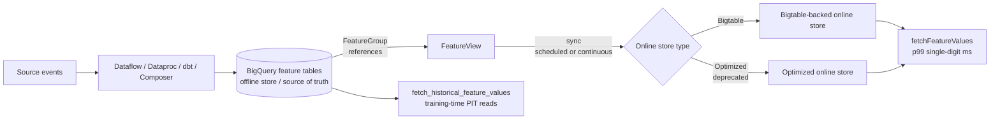

# Vertex AI Feature Store

**Audience:** PMLE v3.1 candidates (math-strong, no GCP production experience)
**Exam sections:** §2 — Collaborating across teams (~14%); §4 — Serving and scaling (~20%)
**Last updated:** 2026-04-26

The Feature Store is on a knife-edge between two architectures right now. The legacy product is on a sunset clock; the new BigQuery-backed product replaces it; and even the new product's "Optimized" online serving tier was deprecated last quarter. The exam guide (April 2025) was written before some of these moves, so questions can refer to either generation. **Translate function-first, then map to whichever product name appears in the option.**

---

## 1. Why a feature store exists at all

A feature store is the operational answer to four problems that show up the moment more than one model — or more than one team — touches the same data.

| Problem | Symptom without a feature store | What a feature store does |
|---|---|---|
| Train/serve skew | Training pipeline computes `log(income)` in BigQuery; the prediction service forgets the log. Day-1 production accuracy collapses. | One canonical feature definition; the same materialized values are read at training time and at serving time. |
| Feature reuse | Three teams independently rebuild "user 30-day rolling spend"; three definitions, three bugs. | A shared registry keyed by feature name; teams discover and consume the existing definition. |
| Point-in-time correctness | Training query joins "current" feature values to old labels; the model sees the future. Offline accuracy is great; production accuracy is terrible. | Time-aware historical reads: each training row joins the feature value as of the label's timestamp, not as of "now". |
| Online lookup latency | Re-deriving a feature from raw events at serving time costs hundreds of ms and burns BigQuery slots per request. | Pre-materialized values served from a low-latency key/value layer, p99 in single-digit ms. |

These four problems together are the reason "just use BigQuery" is sometimes wrong on the exam. (Source: "About Vertex AI Feature Store", https://docs.cloud.google.com/vertex-ai/docs/featurestore/latest/overview, fetched 2026-04-26.)

---

## 2. Current architecture (April 2026)

The current Vertex AI Feature Store — sometimes called **Feature Store on BigQuery** or **V2** — uses BigQuery as the source of truth and a separate online store for low-latency reads. Public Preview was announced **October 9, 2023** (Google Cloud blog "New Vertex AI Feature Store: BigQuery-Powered, GenAI-Ready", https://cloud.google.com/blog/products/ai-machine-learning/new-vertex-ai-feature-store-bigquery-powered-genai-ready, fetched 2026-04-26); GA followed in 2024.

### Resource hierarchy

- **FeatureGroup** — a feature-registry resource that points at a single BigQuery table or view. It declares the entity-ID column and the timestamp column.
- **Feature** — a single column inside a FeatureGroup's source table.
- **FeatureView** — a logical collection of features materialized to an online store instance. A FeatureView can pull features from multiple FeatureGroups, or it can be created directly from a BigQuery URI without registering features at all.
- **OnlineStore (instance)** — the serving layer. You pick its type (Bigtable or Optimized) at creation; you cannot change the type after the fact.
- **Sync** — the operation that materializes BigQuery rows into the online store.

(Source: "About Vertex AI Feature Store", https://docs.cloud.google.com/vertex-ai/docs/featurestore/latest/overview, fetched 2026-04-26.)

### End-to-end flow



Notice that the offline store **is** BigQuery; there is no separate offline storage layer to import into. That is the headline change from the legacy product.

---

## 3. Legacy vs new Feature Store — and the deprecation pile-up

This is one of the most decay-prone topics in the v3.1 study material; the situation as of 2026-04-26 is messier than older guides suggest.

| Dimension | Vertex AI Feature Store (Legacy) | Vertex AI Feature Store (BigQuery-backed, "V2") |
|---|---|---|
| Offline store | Managed inside Vertex AI; data must be imported/streamed in | **BigQuery directly** — no copy required |
| Online store | Single managed Bigtable-style cluster, configured per featurestore | Separate **OnlineStore instance** per use case; choose Bigtable or (deprecated) Optimized |
| Hierarchy | Featurestore → EntityType → Feature | FeatureGroup → Feature, plus FeatureView (decoupled from groups) |
| Embeddings / vectors | Not supported | Supported in BigQuery natively; for vector similarity at scale, use **Vector Search** rather than the Feature Store online layer |
| Streaming ingestion | First-class (`writeFeatureValues`, `streamingIngestion`) | Streaming lands in BigQuery (Pub/Sub → Dataflow → BQ); Feature Store reads from BQ |
| Status | **Deprecated.** No new features after **May 17, 2026**; APIs sunset on **February 17, 2027** | Generally available; recommended for all new workloads |
| Migration target | Migrate to V2 (or for legacy users serving from Bigtable, see "Migrate from Vertex AI Feature Store (Legacy) to Bigtable", https://docs.cloud.google.com/bigtable/docs/migrate-vertex-ai-legacy-bigtable, fetched 2026-04-26) | — |

(Sources: "About Vertex AI Feature Store", https://docs.cloud.google.com/vertex-ai/docs/featurestore/latest/overview, fetched 2026-04-26; "New Vertex AI Feature Store: BigQuery-Powered, GenAI-Ready", https://cloud.google.com/blog/products/ai-machine-learning/new-vertex-ai-feature-store-bigquery-powered-genai-ready, fetched 2026-04-26.)

### A second deprecation inside V2

Inside the new product, there are two online-serving types. **Both** are exam-fair, but only one has a future:

| Online serving type | Status (Apr 2026) | Strengths | Limits |
|---|---|---|---|
| **Bigtable online serving** | Recommended; future-proof | Terabytes of data, autoscaling (min/max nodes + CPU target), CMEK, **continuous data sync** supported | Does **not** support embeddings — for vectors, use Vector Search |
| **Optimized online serving** | **Deprecated.** No new features after May 17, 2026; full sunset February 17, 2027 | Ultra-low latency, embeddings management, Private Service Connect endpoints | Only **scheduled** sync (no continuous); no future investment |

(Source: "Online serving types", https://docs.cloud.google.com/vertex-ai/docs/featurestore/latest/online-serving-types, fetched 2026-04-26.)

**The exam-trap shape:** two Optimized-related deprecations are running in parallel — the legacy Feature Store is going away in early 2027, and *inside the new product* the Optimized online serving tier is also going away on the same dates. If a question pairs "ultra-low latency" with "embeddings management" *and* asks for the recommendation in 2026, the safer answer is **Bigtable online serving + Vector Search for embeddings**, not Optimized.

---

## 4. Ingestion patterns

The new product pushes you to make BigQuery the landing zone for everything — that simplifies the ingestion picture.

| Pattern | Source path | Sync to online store | When |
|---|---|---|---|
| Batch | dbt / Dataform / scheduled SQL → BigQuery feature table | Scheduled cron sync (e.g. hourly, every 30 min, daily) | Most analytical features; nightly aggregates |
| Streaming | Pub/Sub → Dataflow Streaming → BigQuery (streaming inserts) → FeatureView | **Continuous sync** (Bigtable serving only) refreshes the online store as BigQuery changes | Click-stream features, real-time risk signals |
| External ETL | Dataflow / Dataproc / Cloud Composer → BigQuery | Scheduled or continuous, depending on online type | Feature pipelines owned by data eng |
| Legacy direct ingest | `writeFeatureValues` / `streamingIngestion` directly to legacy online store | Built into legacy API | Only for the legacy product; do not use for new builds |

**Continuous sync** is a Bigtable-online-serving feature that refreshes when BigQuery source data changes. It requires the FeatureView to be Feature-Registry-based and the BigQuery data to live in `eu`, `us`, or `us-central1`. **Scheduled sync** uses standard cron expressions; you can also call a manual sync at any time, and `run_sync_immediately=true` triggers one on creation. Only one sync per FeatureView runs at a time. (Source: "Create a feature view instance", https://docs.cloud.google.com/vertex-ai/docs/featurestore/latest/create-featureview, fetched 2026-04-26; "Sync feature data", https://docs.cloud.google.com/vertex-ai/docs/featurestore/latest/sync-data, fetched 2026-04-26.)

---

## 5. Point-in-time correctness

This is the single most important conceptual idea on the Feature Store side of the exam.

### Why it matters

If you train on labels from January 1 and you join "current" feature values from today, you have leaked the future into training. The classic example: a fraud label from January joined to "user_total_chargebacks_lifetime", computed as of today — that count includes the very chargeback the model is trying to predict. Offline metrics look incredible; the production model is useless.

A feature store's offline reads must therefore return, for each `(entity_id, label_timestamp)` pair, the feature values **as they were at `label_timestamp`** — never later, never the latest. This is a temporal "ASOF" join.

### How V2 does it

The new product handles PIT correctness by pairing every training row with its own timestamp and letting the BigQuery layer do the temporal lookup:

```python
from vertexai.resources.preview.feature_store import offline_store

entity_df = pd.DataFrame({
    "user_id":   ["u1", "u2", "u3"],
    "timestamp": [pd.Timestamp("2024-05-01"),
                  pd.Timestamp("2024-05-02"),
                  pd.Timestamp("2024-05-03")],
})

offline_store.fetch_historical_feature_values(
    entity_df=entity_df,
    features=[user_30d_spend, user_session_count],
)
```

The platform translates this to a temporal join against the BigQuery source, returning each user's feature values **as of** the supplied timestamp. Each row in `entity_df` for the same entity must have a different timestamp. (Source: "Serve historical features", https://docs.cloud.google.com/vertex-ai/docs/featurestore/latest/serve-historical-features, fetched 2026-04-26.)

### Plain-BigQuery equivalent (for intuition)

```sql
SELECT
  L.user_id,
  L.label_ts,
  L.label,
  ARRAY_AGG(F ORDER BY F.feature_ts DESC LIMIT 1)[OFFSET(0)].feature_value AS user_30d_spend
FROM   labels        AS L
JOIN   feature_table AS F
       ON F.user_id = L.user_id
      AND F.feature_ts <= L.label_ts          -- the PIT condition
GROUP BY L.user_id, L.label_ts, L.label
```

The key clause is `F.feature_ts <= L.label_ts`. Drop it and you have label leakage.

---

## 6. Online vs offline serving

| Mode | Latency | Throughput | API | Backed by | Use case |
|---|---|---|---|---|---|
| Online | p99 ~2 ms (Bigtable serving, internal benchmarks); single-digit to low-tens of ms typical | Scales with online-store node count | `fetchFeatureValues` (single entity), `streamingFetchFeatureValues` (multi-entity, preview) | Bigtable / Optimized online store | Real-time prediction at a Vertex endpoint |
| Offline | Seconds to minutes (BigQuery query) | BigQuery scale | `fetch_historical_feature_values` (Python SDK), or direct BigQuery SQL | BigQuery | Training data construction, batch prediction, analytics |

The online API takes a `data_key` (single entity ID or a `composite_key.parts` for multi-column keys) and returns feature values in `KEY_VALUE` or `PROTO_STRUCT` format. Multi-entity reads via `streamingFetchFeatureValues` group entity IDs into nested lists; each nested list is a separate read on the backend. (Source: "Serve features from online store", https://docs.cloud.google.com/vertex-ai/docs/featurestore/latest/serve-feature-values, fetched 2026-04-26.)

---

## 7. Cost trade-off vs ad-hoc BigQuery features

The honest answer to "should we even use a feature store?" is: most small teams don't need one.

| Factor | Feature Store wins | Ad-hoc BigQuery features win |
|---|---|---|
| Number of teams sharing features | ≥ 2 teams or models | One model, one team |
| Online serving requirement | Yes, < 100 ms p95 | No, batch prediction is fine |
| PIT correctness | Required and non-trivial | Easy enough to write SQL by hand |
| Governance / catalog | Required (compliance, data contracts) | Not needed |
| Embeddings at serving time | Vector Search + Feature Store | Cannot do this with raw BigQuery |
| Cost floor | Online store nodes (Bigtable) run continuously — non-trivial baseline | Pay only for query compute when training |
| Operational complexity | Sync schedules, online-store sizing, two products to monitor | One product (BigQuery) |

**Heuristic:** if no model needs an online lookup, BigQuery alone is cheaper and simpler. The moment a model serves predictions in <100 ms or two teams are deriving the same feature, the Feature Store starts paying for itself. The Bigtable online-store nodes are the cost floor that makes this a real decision rather than a default.

---

## 8. Integration patterns

| Pattern | What plugs into what | Why |
|---|---|---|
| Vertex AI Pipelines + Feature Store (offline) | Pipeline component reads `fetch_historical_feature_values` to assemble a training dataset | Reproducible training; PIT-correct; same feature definitions as serving |
| Vertex endpoint + Feature Store (online) | Custom prediction container calls `fetchFeatureValues` per request, fills missing inputs from the request | Eliminates train/serve skew on derived/aggregated features |
| Model Monitoring + FeatureView | Monitoring job reads the same FeatureView the production endpoint reads | Drift signals are computed on production-truth features, not on a separate copy |
| Vector Search + FeatureView | Embeddings live in BigQuery; Vector Search serves ANN; non-vector features served by FeatureView | The "embeddings" gap in Bigtable online serving is filled by Vector Search |

---

## 9. Common exam confusions

1. **"Feature Store" vs "feature engineering."** The Feature Store stores features that have *already been engineered* by some upstream process (Dataflow / Dataproc / dbt / SQL). It does not engineer them itself. If a question says "use Feature Store to create new features", it's almost certainly a trap — the right answer is usually "use Dataflow / BigQuery to compute features, then write them to Feature Store / BigQuery."
2. **"Feature Store" vs "BigQuery as a feature store."** BigQuery alone gives you offline storage and PIT joins (with hand-written SQL) but no managed online serving, no shared registry, and no built-in monitoring hook. Picking "BigQuery + custom Cloud Run cache" over Feature Store on an exam question is wrong unless the question explicitly rules out a managed product.
3. **Bigtable vs Optimized online serving.** Optimized = ultra-low latency + embeddings, but **deprecated** in 2026. Bigtable = recommended path; supports continuous sync; doesn't support embeddings (use Vector Search). The 2025 exam guide may still describe Optimized as a live option — function-first translate.
4. **Legacy vs V2.** Legacy has its own online and offline stores inside Vertex; V2 uses BigQuery as the offline store and a separate online-store instance. Anything that says "import data into the offline store" is legacy phrasing.
5. **Sync ≠ ingest.** Ingestion gets data into BigQuery (Dataflow, Pub/Sub, dbt). Sync materializes the BigQuery table into the online store. A question that conflates the two is testing this distinction.

---

## 10. Sample exam questions

```jsonl
{"id": 1, "mode": "single_choice", "question": "A risk team retrains a fraud model nightly. The training query joins each historical transaction's label to a 'user_30d_chargeback_count' feature column from a BigQuery table that is updated continuously throughout the day. Offline accuracy is excellent, but production precision is far worse than offline precision. What is the most likely cause and the cleanest fix?", "options": ["A. The online store is undersized; scale Bigtable nodes up.", "B. Label leakage from non-point-in-time joins; rebuild training reads with fetch_historical_feature_values (or a temporal SQL join with feature_ts <= label_ts) so each row sees feature values as of the label timestamp.", "C. Training data volume is too small; enable distributed training with Reduction Server.", "D. The model needs hyperparameter tuning with Vertex AI Vizier."], "answer": 1, "explanation": "B is correct. Joining 'current' feature values to historical labels lets the chargeback count for a transaction include chargebacks that happened *after* that transaction — pure label leakage. Vertex AI Feature Store's offline serving (fetch_historical_feature_values) and BigQuery temporal joins both fix this by matching feature values as of each label's timestamp. A is a trap: undersized online stores cause latency, not offline-vs-production accuracy gaps. C confuses model fitting with data correctness; throughput does not fix a leak. D addresses model fit, but the offline-vs-production gap is a data-pipeline issue, not a hyperparameter issue.", "ml_topics": ["point-in-time correctness", "label leakage", "training data construction"], "gcp_products": ["Vertex AI Feature Store", "BigQuery"], "gcp_topics": ["feature engineering", "training data"]}
{"id": 2, "mode": "single_choice", "question": "Your team is starting a new project in April 2026 and needs an online feature lookup at p99 < 10 ms for a recommendation model. You have terabytes of feature data. You also need to serve text embeddings for similarity search. Which architecture should you choose?", "options": ["A. Vertex AI Feature Store with Optimized online serving (it supports embeddings management).", "B. Vertex AI Feature Store (Legacy) — it has a single integrated online store and is simpler.", "C. Vertex AI Feature Store with Bigtable online serving for tabular features, plus Vector Search for the embeddings.", "D. Cloud Memorystore (Redis) populated nightly from BigQuery."], "answer": 2, "explanation": "C is correct. As of April 2026, Bigtable online serving is the recommended online-store type for new builds (handles terabyte-scale, supports autoscaling, continuous sync). Bigtable online serving does not support embeddings, so vectors go to Vector Search — which is the purpose-built solution called out in the Feature Store docs. A is a trap: Optimized online serving was deprecated; no new features after May 17, 2026, full sunset February 17, 2027 — picking it for a new build is wrong. B is wrong: Legacy Feature Store is itself deprecated on the same sunset clock. D rebuilds a feature store from scratch and loses the registry, monitoring integration, and PIT story.", "ml_topics": ["online serving", "embeddings", "architecture"], "gcp_products": ["Vertex AI Feature Store", "Bigtable", "Vector Search"], "gcp_topics": ["serving", "feature management"]}
{"id": 3, "mode": "single_choice", "question": "A team currently re-derives features inside the Vertex prediction container on every request by querying BigQuery. p99 latency is 800 ms and BigQuery costs are spiking. They want sub-100 ms latency without rewriting their training pipeline. What is the most appropriate change?", "options": ["A. Move the BigQuery feature tables into Cloud Spanner.", "B. Register the existing BigQuery feature tables as FeatureGroups, create a FeatureView synced to a Bigtable online store, and call fetchFeatureValues from the prediction container.", "C. Cache feature values in the model container's memory at startup.", "D. Switch the prediction container to BigQuery BI Engine."], "answer": 1, "explanation": "B is correct. The whole point of a feature store is to keep BigQuery as the source of truth (no training-pipeline rewrite needed) while serving online reads from a low-latency layer. Bigtable online serving routinely hits single-digit-ms reads, well under 100 ms. A is a trap: Spanner is for transactional consistency, not single-key feature lookups, and it would force a full data migration. C does not work for features that change per user/per request and ignores cache invalidation. D speeds up BI dashboards, not per-request point lookups, and does not solve the cost-per-request problem.", "ml_topics": ["online serving", "latency optimization"], "gcp_products": ["Vertex AI Feature Store", "BigQuery", "Bigtable"], "gcp_topics": ["serving", "MLOps"]}
{"id": 4, "mode": "single_choice", "question": "Two teams independently maintain features in BigQuery for their own models. Three months ago, Team A's model started failing day-1 in production: serving feature distributions did not match training. Investigation showed Team A's training pipeline used a feature definition that Team B had since modified in a downstream BigQuery view. Which Feature Store capability most directly prevents this class of bug going forward?", "options": ["A. Bigtable autoscaling on the online store.", "B. A single FeatureGroup / Feature registry that both teams subscribe to, so any change to the feature definition is visible — and both training and serving read the same materialized values.", "C. Streaming ingestion from Pub/Sub.", "D. Continuous sync between BigQuery and the online store."], "answer": 1, "explanation": "B is correct. The bug is a definitional drift across teams — the kind of organizational train/serve skew the Feature Store registry is designed to eliminate. A FeatureGroup is a shared registry resource; both teams (and both training and serving paths) read from the same registered definition, and changes are visible in one place. A is unrelated: autoscaling addresses load, not definitional drift. C is unrelated: streaming is about freshness, not definition consistency. D is also a freshness/latency feature, not a governance feature.", "ml_topics": ["feature governance", "training-serving consistency"], "gcp_products": ["Vertex AI Feature Store"], "gcp_topics": ["MLOps", "feature management"]}
{"id": 5, "mode": "single_choice", "question": "A small team has one model, no online serving requirement (predictions run as nightly batch jobs), and all features are derived per-training-run from raw event tables in BigQuery. They are evaluating whether to adopt Vertex AI Feature Store. What is the best recommendation?", "options": ["A. Adopt Vertex AI Feature Store with Bigtable online serving for future-proofing.", "B. Adopt Vertex AI Feature Store (Legacy) to take advantage of integrated streaming ingestion.", "C. Stay on ad-hoc BigQuery features; the Feature Store's online-store cost floor and added operational surface are not justified for a single-team batch use case.", "D. Use Cloud Memorystore as a feature cache."], "answer": 2, "explanation": "C is correct. The Feature Store's value proposition is shared definitions, online <100 ms lookups, and managed PIT serving. None of those apply here: one team, no online serving, features re-derived per training run. Adding the Feature Store means paying for online-store nodes and managing sync schedules with no offsetting benefit. A imposes that cost floor for no gain. B is doubly wrong: legacy is deprecated through Feb 2027, and streaming ingestion is irrelevant when there is no online serving. D builds a custom serving cache for a use case that has no serving — pure overhead.", "ml_topics": ["architecture trade-offs", "cost optimization"], "gcp_products": ["Vertex AI Feature Store", "BigQuery"], "gcp_topics": ["feature management", "cost"]}
```

---

## 11. Confidence and decay risk

**Confidence — High** for: the existence of the BigQuery-backed Feature Store, the FeatureGroup / Feature / FeatureView hierarchy, BigQuery as the offline store, the legacy product's sunset dates (May 17, 2026 / Feb 17, 2027), the Optimized online-serving deprecation on the same dates, the recommendation to use Vector Search for embeddings.

**Confidence — Medium** for: exact sync-frequency limits (cron syntax accepted, but minimum interval not pinned in the public docs); exact `fetchFeatureValues` p99 numbers (Google's ~2 ms claim is from internal benchmarks, not an SLA); whether `streamingFetchFeatureValues` is GA or still preview by exam day.

**Decay risk — High.** This is the single most decay-prone topic in the v3.1 study set:
- The PMLE v3.1 exam guide (April 2025) was finalized before the **Optimized online serving deprecation** was announced. Recent passer notes may still describe Optimized as a live option. Translate function-first ("ultra-low latency + embeddings managed product") and pick the architecturally-current answer.
- The legacy Feature Store could disappear from the exam pool altogether after the February 2027 sunset; through 2026 it remains exam-fair.
- The "AI Applications" / "Gemini Enterprise Agent Platform" rebrand (April 22, 2026) does not appear to have re-renamed Feature Store as of 2026-04-26, but a future rename to "Agent Platform Feature Store" is plausible — search results already show one "About **Agent Platform** Feature Store" docs page title. If the exam uses a new name, map it back to "Vertex AI Feature Store".
- The `streamingFetchFeatureValues` API was preview-flagged in the docs fetched today; check release notes (https://docs.cloud.google.com/vertex-ai/docs/core-release-notes) before exam day in case it has gone GA or been renamed.
- The new Feature Store has changed structure significantly since 2024 — pre-2024 study guides describing "EntityType" resources are referring to the legacy product and should be treated as outdated.

**Word count:** ~2,300.
