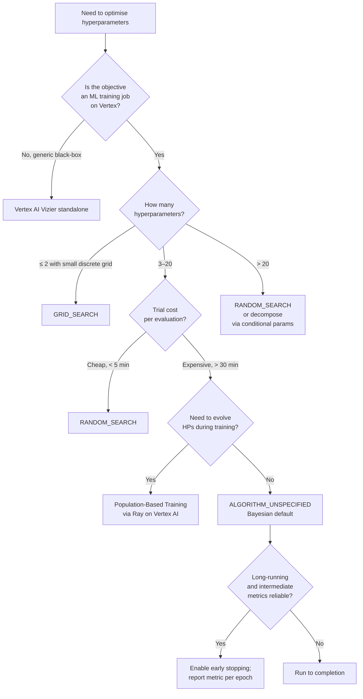

# Hyperparameter Tuning on Vertex AI

**Audience:** PMLE v3.1 candidates (math-strong, no GCP production experience)
**Exam section:** Section 3 — Scaling prototypes into ML models (~18% weight). §3.2 covers hyperparameter tuning explicitly.
**Last updated:** 2026-04-26

The exam treats hyperparameter tuning as a routine operational decision: pick the right algorithm, budget the trials, wire the metric back. The math-strong learner can collapse most of this into one question — "how expensive is each trial, and how many dimensions am I searching?" — and choose accordingly. The Vertex AI service-specific knobs are the rest.

> **Note on naming:** the Apr 22, 2026 rebrand renamed Vertex AI to Gemini Enterprise Agent Platform. The PMLE v3.1 exam guide and Skills Boost still use "Vertex AI Vizier" and "Vertex AI HyperparameterTuningJob". Treat them as identical to the post-rebrand "Agent Platform Vizier". Sources below cite both `cloud.google.com/...` (301-redirects to `docs.cloud.google.com/...`) and the new docs path.

---

## 1. Vertex AI Vizier — what it is, what it isn't

**Vizier is Google's black-box optimization service.** It maximises (or minimises) any function `f(θ)` you can evaluate, even if `f` has no closed form. The function does not have to be an ML metric — Google explicitly markets it for things like UI layout tuning and recipe ingredient optimisation.

> "Vertex AI Vizier is a tool for optimizing any system with configurable parameters where evaluating any given parameter settings is an expensive task."
> — Vertex AI Vizier overview, https://docs.cloud.google.com/vertex-ai/docs/vizier/overview (fetched 2026-04-26)

> "Hyperparameter tuning for custom training is a built-in feature that uses Vertex AI Vizier for training jobs."
> — same source

That is the single most useful sentence to memorise: **HyperparameterTuningJob is a thin wrapper around Vizier.** Same algorithms, same `StudySpec`, but the wrapper handles trial dispatch into Vertex AI custom training and metric collection from your code via the `cloudml-hypertune` library.

| Capability | Vertex AI Vizier (standalone) | Vertex AI HyperparameterTuningJob |
|---|---|---|
| Black-box optimisation of any objective | yes | only via training-job code |
| Runs the trial workload for you | no — you call `addMeasurement` from outside | yes — spawns Vertex AI custom training trials |
| Supports off-Vertex / multi-cloud trial workers | yes | no |
| Supports `measurement_selection_type` (BEST/LAST) | yes | no — currently Vizier-only |
| Conditional parameter specs | yes | yes |
| ALGORITHM_UNSPECIFIED / GRID_SEARCH / RANDOM_SEARCH | yes | yes |

Sources: Vertex AI Vizier overview (https://docs.cloud.google.com/vertex-ai/docs/vizier/overview, fetched 2026-04-26); StudySpec REST reference, `measurement_selection_type` field — "Currently only supported by the Vertex AI Vizier service. Not supported by HyperparameterTuningJob or TrainingPipeline." (https://cloud.google.com/vertex-ai/docs/reference/rest/v1/StudySpec, fetched 2026-04-26).

The default algorithm in both products is the **Vizier Gaussian Process Bandit** algorithm:

> "When `ALGORITHM_UNSPECIFIED`… Vertex AI chooses the best search algorithm between Gaussian process bandits, linear combination search, or their variants."
> — Overview of hyperparameter tuning, https://docs.cloud.google.com/vertex-ai/docs/training/hyperparameter-tuning-overview (fetched 2026-04-26)

The published description of the algorithm is in Song et al., "The Vizier Gaussian Process Bandit Algorithm", arXiv:2408.11527 (Aug 2024, https://arxiv.org/abs/2408.11527, fetched 2026-04-26). It is a GP-UCB / TuRBO-flavoured Bayesian optimiser with sublinear cumulative regret.

---

## 2. Search algorithms — the math intuition

Treat the objective as `f: Θ → ℝ` where `Θ ⊂ ℝ^d × ℕ^k × C` is a mixed search space. You get a finite budget `N` of evaluations and want `argmax_θ f(θ)`. Every algorithm below is a different prior over how to spend that budget.

### Grid search
Evaluate the Cartesian product of fixed level sets per axis. Cost: `Π_i k_i`, multiplicative in `d`. Discovers global optimum *only* if it lies on the grid; otherwise it converges to the nearest grid point. Variance of returned best is zero across reruns. Use it for ≤2 hyperparameters with a small set of plausible values, or when reproducibility on a finite mesh matters.

### Random search
Sample `θ_n ~ U(Θ)` independently. Bergstra & Bengio (2012) is the foundational result.

> "We show empirically and theoretically that randomly chosen trials are more efficient for hyper-parameter optimization than trials on a grid."
> — Bergstra & Bengio, "Random Search for Hyper-Parameter Optimization", JMLR 13:281–305, 2012, https://www.jmlr.org/papers/volume13/bergstra12a/bergstra12a.pdf (fetched 2026-04-26)

Intuition: if `f` depends strongly on only `k ≪ d` axes (the "low effective dimensionality" assumption), grid wastes evaluations on the irrelevant axes; random search projects every sample onto every axis, so each trial is informative on the axes that matter. **This is a 2012 paper — pre-2023 cutoff but it remains the canonical justification cited in current Google docs.** Flag for awareness, not for outdatedness.

### Bayesian optimisation (Vertex AI default)
Maintain a probabilistic surrogate `p(f | D_n)` — Gaussian Process is canonical, alternatives include Tree-structured Parzen Estimators (TPE) and random forests. Pick the next point by maximising an acquisition function over the surrogate:

- **Expected Improvement (EI):** `α(θ) = E[max(0, f(θ) − f*)]`
- **Upper Confidence Bound (UCB):** `α(θ) = μ(θ) + β σ(θ)`
- **Thompson sampling:** draw `f̃ ~ p(f | D_n)`, then `argmax f̃`.

The math-strong reading: this is just sequential decision-making under a posterior. EI is greedy on the mean of the truncated improvement; UCB is the bandit framing. Vizier's algorithm is closer to GP-UCB with TuRBO-style trust regions — see arXiv:2408.11527.

Bayesian optimisation **dominates when**: (a) trials are expensive (>30 minutes each); (b) the search space is low- to moderate-dimensional (`d ≲ 20`); (c) parallelism is moderate (the optimiser exploits sequential information).

It **degrades when**: (a) `d` is large (GP fitting is `O(n³)` in observations, prior covariance is hard to set in high `d`); (b) parallelism is very high (a 50-wide batch of "next" trials must be picked before any of them return, which forces fallback to quasi-random batching).

### Population-Based Training (PBT)
Evolutionary. Train `P` workers in parallel; periodically (every few thousand steps) clone the weights of the top quartile into the bottom quartile and perturb each clone's hyperparameters (e.g. multiply `learning_rate` by 0.8 or 1.25). Mutates hyperparameters *during* training rather than between trials.

> "PBT starts by training many neural networks in parallel with random hyperparameters… exploitation and exploration… mutates hyperparameters during training time. This enables very fast hyperparameter discovery and also automatically discovers good annealing schedules."
> — Ray Tune, "A Guide to Population Based Training with Tune", https://docs.ray.io/en/latest/tune/examples/pbt_guide.html (fetched 2026-04-26)

**Vertex AI does not natively expose PBT** in HyperparameterTuningJob or Vizier. The supported pattern is **Ray on Vertex AI** (Ray clusters on Vertex managed VMs, with `PopulationBasedTraining` as a Tune scheduler) or hand-rolled orchestration via Vertex AI Pipelines. On the exam, "we want to evolve hyperparameters during training" → PBT, and the Vertex-specific path is **Ray on Vertex AI**.

### Bandit-style early stopping (Hyperband / ASHA / BOHB) — context only
These methods aggressively kill trials whose intermediate metrics under-perform. Vertex AI's HyperparameterTuningJob supports **early stopping** via `enable_early_stopping`, which is a similar idea (decay-curve / median-stopping rule) but is not literally Hyperband. The exam-relevant point: **enable early stopping when training is long-running and intermediate metrics are reliable**. Source: Li et al., "Hyperband", JMLR 2017, https://www.jmlr.org/papers/volume18/16-558/16-558.pdf (pre-2023, foundational reading only).

---

## 3. Configuring a Vertex AI HyperparameterTuningJob

The configuration surface is the `StudySpec` plus a few job-level fields. From the Overview of hyperparameter tuning (https://docs.cloud.google.com/vertex-ai/docs/training/hyperparameter-tuning-overview, fetched 2026-04-26) and the StudySpec REST reference (https://cloud.google.com/vertex-ai/docs/reference/rest/v1/StudySpec, fetched 2026-04-26):

### Metrics
List of one or more `MetricSpec` entries:
- `metric_id` — a string tag (e.g. `accuracy`, `val_rmse`).
- `goal` — `MAXIMIZE` or `MINIMIZE`.

Vizier supports **multi-objective** optimisation, but exam questions almost always involve a single metric.

### Parameters
A list of `ParameterSpec` entries. Each picks one of four types:

| Type | Spec | Notes |
|---|---|---|
| `DOUBLE` | `DoubleValueSpec(minValue, maxValue)` | Use for `learning_rate`, `dropout_rate`. Pair with `UNIT_LOG_SCALE` for learning rate. |
| `INTEGER` | `IntegerValueSpec(minValue, maxValue)` | `n_layers`, `batch_size` if you want a continuous range. |
| `CATEGORICAL` | `CategoricalValueSpec(values=[...])` | `optimizer` ∈ {`adam`, `sgd`, `rmsprop`}. |
| `DISCRETE` | `DiscreteValueSpec(values=[64, 128, 512])` | Ascending list. Use when only specific values are valid (e.g. valid batch sizes that fit in TPU memory). |

Scaling for `DOUBLE` and `INTEGER`:
- `UNIT_LINEAR_SCALE` — feasible space mapped linearly to [0, 1]. Default for "additive" parameters like dropout.
- `UNIT_LOG_SCALE` — feasible space mapped logarithmically. Default for learning rate, weight decay, regularisation strength.
- `UNIT_REVERSE_LOG_SCALE` — densifies near the upper bound. Use for parameters where "near 1" is more interesting than "near 0", e.g. momentum, decay factors.

Source: https://docs.cloud.google.com/vertex-ai/docs/training/hyperparameter-tuning-overview (fetched 2026-04-26).

### Conditional parameters
`ConditionalParameterSpec` lets a child parameter exist only when a parent takes specific values. Example: only sweep `n_estimators` and `max_depth` when `model_type == "xgboost"`; only sweep `n_layers` and `hidden_units` when `model_type == "dnn"`. Without conditional specs, Bayesian optimisation wastes posterior probability mass on impossible combinations.

### Algorithm
`StudySpec.algorithm`:
- `ALGORITHM_UNSPECIFIED` (default) → Vizier Gaussian Process Bandit + variants.
- `GRID_SEARCH` — Cartesian product over discretised axes. Useful when "I want every combination evaluated" or `parallel_trial_count` is high enough that Bayesian degrades to random anyway.
- `RANDOM_SEARCH` — uniform sampling.

> "If you do not specify an algorithm, your job uses the default Vertex AI algorithm. The default algorithm applies Bayesian optimization to arrive at the optimal solution."
> — Overview of hyperparameter tuning, https://docs.cloud.google.com/vertex-ai/docs/training/hyperparameter-tuning-overview (fetched 2026-04-26)

### measurement_selection_type
`LAST_MEASUREMENT` (use the final reported value of the metric) vs `BEST_MEASUREMENT` (use the best across all reported intermediate values). Per the StudySpec reference (fetched 2026-04-26):

- `LAST_MEASUREMENT` — choose when the metric is monotonically improving (e.g. cumulative accuracy on a held-out set with no over-fitting risk) or when measurements are noisy and `BEST` would be over-optimistic.
- `BEST_MEASUREMENT` — choose when the model can over-train (validation loss U-shape) and you want to credit the best checkpoint, not the final one.

**Currently Vizier-only**; HyperparameterTuningJob effectively uses `LAST_MEASUREMENT` semantics. This nuance is exam-fair territory.

### Trial counts
- `max_trial_count` — total upper bound.
- `parallel_trial_count` — concurrency.
- `max_failed_trial_count` — abort the study once this many trials fail (defends against a misconfigured Docker image burning the whole budget).
- `enable_early_stopping` — kill under-performing trials based on intermediate measurements.

---

## 4. Trial budgeting — the only math you actually need

### Parallelism vs sample efficiency
A Bayesian optimiser with `parallel_trial_count = 1` updates the posterior after every trial. With `parallel_trial_count = 10`, the next batch of 10 trials must be selected without seeing any of their results, so the optimiser falls back to quasi-random batching for that batch (Thompson sampling, q-EI, or vanilla diversification).

> "Increasing parallel trials reduces total job runtime but can reduce overall job effectiveness… The default tuning strategy uses results from previous trials to inform subsequent trial assignments."
> — "Distributed training and Hyperparameter tuning with TensorFlow on Vertex AI", https://cloud.google.com/blog/topics/developers-practitioners/distributed-training-and-hyperparameter-tuning-tensorflow-vertex-ai (fetched 2026-04-26)

Rule of thumb: `parallel_trial_count ≈ √max_trial_count`. With `max=64`, run 8 in parallel — the optimiser sees ~8 sequential "rounds" of feedback while still finishing in 1/8 the wall time.

### How many trials in total
Heuristic: **10–30× the number of hyperparameters** for Bayesian optimisation. With 5 hyperparameters, `max_trial_count = 50–150` is defensible. For random search, double that. For grid search, the count is fully determined by the grid.

### Cost estimate
Total cost ≈ `max_trial_count × avg_trial_hours × machine_cost_per_hour`. Wall time ≈ that, divided by `parallel_trial_count` (modulo queueing). A Vertex-AI-priced `n1-standard-4` + 1×V100 trial that takes 1 hour, run 100 times, costs ≈100 × $2.48 ≈ $248 regardless of parallelism, but a 1-parallel run takes 100 hours of wall time vs 10 hours at 10-parallel.

---

## 5. Reporting metrics from training code

Install `cloudml-hypertune` in your training container, then call:

```python
import hypertune

hpt = hypertune.HyperTune()
hpt.report_hyperparameter_tuning_metric(
    hyperparameter_metric_tag='accuracy',
    metric_value=hp_metric,
    global_step=epoch)
```

Source: "Distributed training and Hyperparameter tuning with TensorFlow on Vertex AI", https://cloud.google.com/blog/topics/developers-practitioners/distributed-training-and-hyperparameter-tuning-tensorflow-vertex-ai (fetched 2026-04-26).

Two practical notes for the exam:

1. The string passed to `hyperparameter_metric_tag` **must match** `MetricSpec.metric_id` exactly. Mismatch → no measurements arrive → all trials report as failed.
2. To enable early stopping or `BEST_MEASUREMENT`, call `report_hyperparameter_tuning_metric` **inside the training loop**, once per epoch (or once per `global_step` checkpoint), not just once at the end. Without intermediate measurements, early stopping has nothing to stop on.

A Keras-callback pattern:

```python
class HyperTuneCallback(tf.keras.callbacks.Callback):
    def __init__(self):
        self.hpt = hypertune.HyperTune()
    def on_epoch_end(self, epoch, logs=None):
        self.hpt.report_hyperparameter_tuning_metric(
            hyperparameter_metric_tag='accuracy',
            metric_value=logs['val_accuracy'],
            global_step=epoch)
```

---

## 6. Comparison table — the four families

| Algorithm | Best when | Sample efficiency | Parallelism friendliness | Vertex AI support |
|---|---|---|---|---|
| **Grid search** | ≤2 hyperparameters; finite, small grid; reproducibility on a fixed mesh required | Worst — cost is `Π k_i` | Embarrassingly parallel | `algorithm = GRID_SEARCH` |
| **Random search** | High `d` with low effective dimensionality; cheap-to-evaluate `f`; Bayesian overkill | Modest — beats grid in high `d` (Bergstra & Bengio 2012) | Embarrassingly parallel | `algorithm = RANDOM_SEARCH` |
| **Bayesian optimisation (Vizier default)** | Trials expensive (>30 min); `d ≲ 20`; parallelism moderate | Best for low-`d` expensive `f` | Degrades as `parallel` grows; rule-of-thumb √N | `algorithm = ALGORITHM_UNSPECIFIED` (default) |
| **Population-Based Training** | Need to evolve hyperparameters during training (LR schedules, dropout schedules); RL or large-batch deep learning | Good when wall-time is bounded; high compute | Designed for `P ≥ 8` workers | Not native; via Ray on Vertex AI |

---

## 7. Common exam confusions

| Stem cue | Wrong instinct | Correct answer |
|---|---|---|
| "We have 50 hyperparameters and a tight budget" | Default = Bayesian | **Random search** (or hierarchical/conditional decomposition) — Bayesian's GP surrogate degrades in very high `d` |
| "5 hyperparameters and each trial costs $200" | Random search to save cost | **Bayesian (default)** — sample efficiency dominates when each trial is expensive |
| "We need to know the exact best in a 4×3 grid" | Bayesian | **Grid search** — guarantees coverage of the discrete mesh |
| "We want hyperparameters to evolve during training" | Bayesian or random | **Population-Based Training**, via Ray on Vertex AI |
| "We have a non-ML business optimisation problem" | HyperparameterTuningJob | **Vertex AI Vizier** standalone — black-box optimisation, not tied to a training job |
| "Validation loss U-shapes (over-trains)" | Default measurement | Set `measurement_selection_type = BEST_MEASUREMENT` (Vizier only) |
| "Each trial takes 8 hours; how do we save money on bad ones?" | Reduce `max_trial_count` | Set `enable_early_stopping = True` and report intermediate metrics every epoch |
| "Trial scheduler must run on GKE / multi-cloud" | HyperparameterTuningJob | **Vertex AI Vizier** standalone (it does not run the trial workload itself) |

---

## 8. Decision flowchart



---

## 9. Sample exam-style questions (JSONL)

```jsonl
{"id": 1, "mode": "single_choice", "question": "A team is training a deep learning model with 5 hyperparameters. Each trial takes about 4 hours on an n1-standard-8 with a single A100 and costs roughly $40. They have a budget for ~80 trials. Which Vertex AI configuration is BEST?", "options": ["A. HyperparameterTuningJob with algorithm=GRID_SEARCH and max_trial_count=80", "B. HyperparameterTuningJob with algorithm=RANDOM_SEARCH and parallel_trial_count=40", "C. HyperparameterTuningJob with the default algorithm (Bayesian), max_trial_count=80, parallel_trial_count=8", "D. Vertex AI Vizier standalone with parallel_trial_count=80"], "answer": 2, "explanation": "C is correct. Five hyperparameters with $40 trials is the canonical Bayesian-optimisation regime: low-to-moderate dimensionality and expensive evaluations make sample efficiency dominate. parallel=8 ≈ √80 is the documented rule-of-thumb that lets the GP-bandit surrogate update between batches without falling back to quasi-random. A is wrong because grid is multiplicative in 5 dims and needs the levels to be specified — 80 trials cannot exhaustively cover a 5-dimensional grid in a useful way. B is wrong on two counts: random search wastes the per-trial cost when Bayesian would converge faster, and parallel=40 collapses the optimiser into a single half-batch with zero feedback. D is technically possible but the question describes a Vertex training job; HyperparameterTuningJob is the wrapper that handles trial dispatch, while standalone Vizier needs you to wire the trial workload yourself.", "ml_topics": ["hyperparameter tuning", "Bayesian optimization"], "gcp_products": ["Vertex AI", "Vertex AI Vizier", "HyperparameterTuningJob"], "gcp_topics": ["training", "scaling prototypes"]}
{"id": 2, "mode": "single_choice", "question": "An ML platform team needs to optimise the hyperparameters of a CTR-prediction model with 47 hyperparameters spread across feature embeddings, attention heads, and optimiser settings. Each trial takes about 2 minutes on a small TPU pod. Which approach BEST balances sample efficiency and the high dimensionality?", "options": ["A. Default Bayesian optimisation with max_trial_count=200", "B. RANDOM_SEARCH with max_trial_count=2000 and parallel_trial_count=50", "C. Population-Based Training via Ray on Vertex AI", "D. Vertex AI Vizier standalone with measurement_selection_type=BEST_MEASUREMENT"], "answer": 1, "explanation": "B is correct. With 47 hyperparameters, the GP surrogate behind the default Bayesian algorithm degrades — fitting a covariance kernel across 47 axes from a few hundred observations is unreliable. Bergstra & Bengio (2012) and the Vizier docs both flag random search as the right call when dimensionality is high and the objective has low effective dimensionality. The 2-minute trial cost makes 2000 evaluations cheap. A is the trap: the default is Bayesian, but Bayesian's sample-efficiency edge collapses in high d. C is overkill — PBT is for evolving HPs during long training, not for a 2-minute trial. D would work for the optimisation but does not address the dimensionality issue and inherits the same default Bayesian algorithm unless you change it.", "ml_topics": ["hyperparameter tuning", "random search", "high-dimensional optimization"], "gcp_products": ["Vertex AI", "HyperparameterTuningJob"], "gcp_topics": ["training", "scaling prototypes"]}
{"id": 3, "mode": "single_choice", "question": "A reinforcement-learning team wants the learning rate, exploration epsilon, and entropy coefficient to *change during* a single 48-hour training run rather than be fixed per trial. They want to discover annealing schedules automatically. What is the right Vertex AI fit?", "options": ["A. HyperparameterTuningJob with default Bayesian and enable_early_stopping=True", "B. HyperparameterTuningJob with GRID_SEARCH over schedules", "C. Population-Based Training using Ray on Vertex AI", "D. Vertex AI Vizier standalone with conditional parameter specs"], "answer": 2, "explanation": "C is correct. PBT mutates hyperparameters during a single training run by cloning weights from top performers and perturbing the clone's HPs — this discovers annealing schedules automatically, exactly as the Ray Tune PBT documentation describes. Vertex AI exposes PBT through Ray on Vertex AI, not natively in HyperparameterTuningJob. A is wrong: Bayesian + early stopping picks one HP setting per trial and runs each to completion; it cannot evolve HPs mid-run. B is wrong because grid over schedules grows combinatorially and still picks a fixed schedule per trial. D is wrong: Vizier conditional params handle hierarchical HP relationships across trials, not within-trial mutation.", "ml_topics": ["hyperparameter tuning", "Population-Based Training", "annealing schedules"], "gcp_products": ["Vertex AI", "Ray on Vertex AI"], "gcp_topics": ["training", "scaling prototypes"]}
{"id": 4, "mode": "single_choice", "question": "Your Vertex AI HyperparameterTuningJob trains a model that exhibits classic over-training: validation accuracy peaks around epoch 30 and degrades by epoch 60. You report `val_accuracy` once per epoch via `cloudml-hypertune`. Which configuration ensures Vizier credits each trial with its peak performance rather than its final epoch?", "options": ["A. Set `study_spec.measurement_selection_type = BEST_MEASUREMENT` on a Vertex AI Vizier study", "B. Set `enable_early_stopping = False` to keep all measurements", "C. Increase `parallel_trial_count` so each trial is independent", "D. Switch to `algorithm = RANDOM_SEARCH`"], "answer": 0, "explanation": "A is correct. BEST_MEASUREMENT picks the highest reported intermediate metric across the trial's epochs — exactly what an over-training objective requires. Per the StudySpec REST reference, this is currently a Vizier-only feature; HyperparameterTuningJob effectively uses LAST_MEASUREMENT semantics. The right path is therefore a standalone Vizier study (or the workaround of explicitly logging the best epoch in code and reporting only that). B is wrong: enable_early_stopping does not change which measurement is credited; it changes whether trials are killed. C is unrelated to measurement selection. D is unrelated; the algorithm chooses next trials, not how the current trial's metric is summarised. The exam-trap here is that candidates who only know HyperparameterTuningJob will pick B or D because BEST_MEASUREMENT is missing from the wrapper.", "ml_topics": ["hyperparameter tuning", "over-training", "measurement selection"], "gcp_products": ["Vertex AI Vizier", "HyperparameterTuningJob"], "gcp_topics": ["training"]}
{"id": 5, "mode": "single_choice", "question": "A team configures a HyperparameterTuningJob and finds that no trials produce any metric — every trial is marked as INFEASIBLE. The training code logs `val_loss` to TensorBoard and ends with `print(val_loss)`. They have NOT installed `cloudml-hypertune`. What is the BEST fix?", "options": ["A. Add a Vertex AI Model Monitoring job to scrape the prints", "B. Install `cloudml-hypertune` and call `HyperTune().report_hyperparameter_tuning_metric` with a tag matching `MetricSpec.metric_id`", "C. Switch the algorithm to GRID_SEARCH so measurements are not required", "D. Increase `max_failed_trial_count` to ignore the failed trials"], "answer": 1, "explanation": "B is correct. Vertex AI HyperparameterTuningJob only sees a metric value when training code calls `cloudml-hypertune`'s `report_hyperparameter_tuning_metric` with a `hyperparameter_metric_tag` that matches the `MetricSpec.metric_id` you configured on the study. Print statements and TensorBoard scalars are not channels Vertex reads. A is wrong: Model Monitoring is for serving-time skew/drift, not training-trial metric reporting. C is wrong: every algorithm requires measurements to compare trials; GRID_SEARCH still needs a metric to identify the winner. D is the trap — it suppresses the symptom (failures) without fixing the cause (no metric ever reported), producing a study with no information at all.", "ml_topics": ["hyperparameter tuning", "metric reporting"], "gcp_products": ["Vertex AI", "HyperparameterTuningJob", "cloudml-hypertune"], "gcp_topics": ["training", "MLOps"]}
```

---

## 10. Confidence + decay risk

**Confidence (high):** Vizier and HyperparameterTuningJob have been stable products since the AI Platform → Vertex AI rebrand in 2022, and their `StudySpec` schema has been backwards-compatible across SDK versions. The default-Bayesian / GRID_SEARCH / RANDOM_SEARCH triad is unchanged in 2024–2026 docs. The `cloudml-hypertune` integration pattern is the same across the official codelab, the GoogleCloudPlatform/vertex-ai-samples notebooks, and the 2024 Google Cloud blog post.

**Confidence (medium):** The `measurement_selection_type` Vizier-only restriction is fetched from the current StudySpec REST reference (April 2026) but Google has flagged this as something they may extend to HyperparameterTuningJob in the future. PBT is "available via Ray on Vertex AI" rather than a first-party feature; the integration is documented but the exam may treat this as out-of-scope.

**Decay risk (watch):**
- **Rebrand:** Vertex AI → Gemini Enterprise Agent Platform (Apr 22, 2026). The new docs path `docs.cloud.google.com/gemini-enterprise-agent-platform/machine-learning/vizier/overview` exists; the old path still resolves and contains the same content. PMLE v3.1 still uses the Vertex AI naming.
- **Vizier algorithm churn:** the Aug 2024 arXiv paper (2408.11527) describes the *current* GP-Bandit. Google sometimes ships algorithm changes silently; treat "Bayesian by default" as the stable answer rather than memorising specific GP kernel choices.
- **PBT first-party support:** if Google ships native PBT in HyperparameterTuningJob (rumoured for 2026), the "Ray on Vertex AI" answer to question 3 could become outdated.
- **Pre-2023 sources:** Bergstra & Bengio 2012 is cited above as historical justification for random search; this is foundational and not subject to decay, but flag it as the only pre-2023 citation in this report.

**Word count:** ~2,250.
