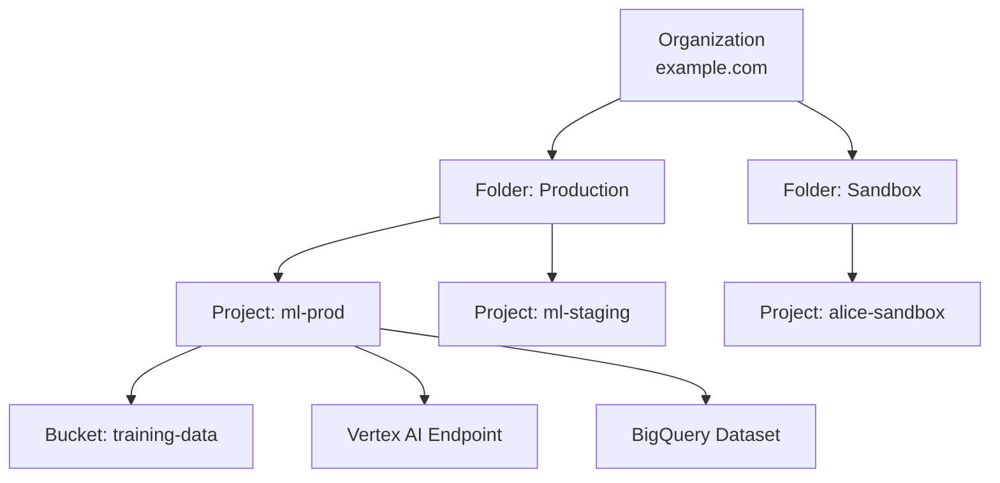
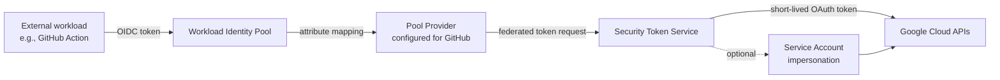

# IAM for ML on Vertex AI

**Audience:** PMLE v3.1 candidates (math-strong, no GCP production experience)
**Exam sections:** §2 Collaborating across teams (~14%), §4 Serving and scaling (~20%), §6 Monitoring AI solutions (~13%)
**Last updated:** 2026-04-26

IAM is the spine that runs through every ML system on Google Cloud. The exam will rarely ask you "what is a service account" — it will hide IAM inside scenario questions about pipelines that fail mysteriously ("the training job can't read the GCS bucket — fix it"), about regulated workloads ("PHI must never leave a perimeter"), or about CI runners outside GCP ("the GitHub Action authenticates without a key — how?"). This report is dense on Vertex-AI-specific roles, service agents, VPC-SC, Private Service Connect, and Workload Identity Federation, because that is where v3.1 questions live.

A note on the April 2026 rebrand: Vertex AI was renamed **Gemini Enterprise Agent Platform** on April 22, 2026. Every IAM role and service agent below still uses the `aiplatform.*` namespace — the rename has not yet propagated to IAM. Translate function-first if a question uses the new name.

---

## 1. IAM primitives — beginner refresher

### Principals

A **principal** is the "who" in any IAM policy. Five types matter:

| Type | Example | When you'll see it on the exam |
|---|---|---|
| Google Account | `alice@example.com` | Human users running notebooks, viewing dashboards |
| Google Group | `data-scientists@example.com` | Granting roles to teams without listing each member |
| Service Account | `vertex-trainer@PROJECT.iam.gserviceaccount.com` | Workloads — training jobs, pipelines, prediction services |
| Workforce Identity | A federated user from Okta / Azure AD | Enterprises bringing their existing IdP to GCP |
| Workload Identity | A federated workload from AWS / GitHub Actions / on-prem K8s | CI/CD without service-account JSON keys |

Source: IAM overview, https://docs.cloud.google.com/iam/docs/overview (fetched 2026-04-26).

### Roles and permissions

A **permission** is a single action like `aiplatform.endpoints.predict` or `storage.objects.get`. Permissions are *never* granted directly — you grant a **role**, which is a bundle of permissions. Three role kinds:

| Role kind | Examples | When to use |
|---|---|---|
| **Predefined** | `roles/aiplatform.user`, `roles/storage.objectViewer` | Default. Maintained by Google. Permissions adjust as services evolve. |
| **Custom** | `roles/myorg.mlPipelineRunner` | When predefined roles bundle too much. You own maintenance forever. |
| **Basic** (legacy) | `roles/owner`, `roles/editor`, `roles/viewer` | **Never in production.** Each is thousands of permissions wide. Use only for personal sandboxes. |

Source: IAM overview, https://docs.cloud.google.com/iam/docs/overview (fetched 2026-04-26). Google's own docs flag basic roles as "highly permissive...useful only for testing, not production."

### Resource hierarchy and policy inheritance



Allow policies attach at any level; descendants **inherit** ancestor allow policies. Two consequences the exam loves:

1. **Policy is union, not intersection.** If you grant `roles/aiplatform.admin` at the org level, you cannot scope it down to "only one project" by adding a more restrictive policy at the project. Lower levels can only *add* permissions, not subtract.
2. **The "effective allow policy"** for any resource is the union of the policies attached to it, plus every ancestor's policy. To audit access on `bucket: training-data`, you must read the bucket policy, the project policy, the folder policy, and the org policy.

Source: IAM overview, https://docs.cloud.google.com/iam/docs/overview (fetched 2026-04-26). Quote: "descendant resources effectively inherit their ancestor resources' allow policies."

### Allow vs Deny policies

If allow policies can only widen access, how do you carve out exceptions? **Deny policies** (GA **November 16, 2022**, per Google Cloud blog "Introducing IAM Deny", https://cloud.google.com/blog/products/identity-security/introducing-iam-deny, fetched 2026-04-26).

| Aspect | Allow policy | Deny policy |
|---|---|---|
| Default state | Empty (no access) | Empty (no denials) |
| Effect | Grants permissions to principals | Blocks permissions for principals |
| Evaluation order | Checked **after** deny | Checked **first** |
| Override | A more-specific allow does not override a deny | Deny **always wins** over allow |
| Typical use | Day-to-day access grants | Guardrails: "no one can delete production buckets, even owners" |

A deny policy lets you implement breakglass restrictions — e.g., "no service account in the prod folder may use `iam.serviceAccounts.create`" — without auditing every existing allow grant. Source: IAM Deny policies overview, https://docs.cloud.google.com/iam/docs/deny-overview (fetched 2026-04-26).

---

## 2. Service accounts

### User-managed vs default

| Type | Created by | Email format | Default permissions |
|---|---|---|---|
| **User-managed** | You | `NAME@PROJECT.iam.gserviceaccount.com` | None — you grant explicitly |
| **Default Compute Engine SA** | Auto on project creation | `PROJECT_NUMBER-compute@developer.gserviceaccount.com` | **`roles/editor`** at project level (a basic role — wide!) |
| **Default App Engine SA** | Auto when App Engine is enabled | `PROJECT_ID@appspot.gserviceaccount.com` | `roles/editor` at project level |
| **Service Agents** (Google-managed) | Auto when an API is enabled | `service-PROJECT_NUMBER@gcp-sa-SERVICE.iam.gserviceaccount.com` | Service-specific role (e.g., `roles/aiplatform.serviceAgent`) |

The default Compute Engine SA gets `roles/editor` automatically — Google itself flags this as a security concern and recommends disabling automatic role grants. Source: Service accounts overview, https://docs.cloud.google.com/iam/docs/service-account-overview (fetched 2026-04-26).

**Exam heuristic:** if an answer choice says "use the default Compute Engine service account for the training job," it is almost always wrong. The right answer is "create a custom user-managed service account with only the permissions the job needs."

### Service account keys — the discouraged path

A service account key is a JSON file containing a private RSA key. The application signs a JWT with it and exchanges that for an OAuth access token. The problem: keys are **long-lived credentials** that, if leaked from a CI runner or a laptop, grant full access until manually rotated. Google's current documentation explicitly states: "Service account keys are a security risk if not managed correctly...choose a more secure alternative whenever possible." Source: https://docs.cloud.google.com/iam/docs/service-account-overview (fetched 2026-04-26).

Alternatives, in order of preference:

1. **Attached service accounts** (workload runs *on* GCP — Compute Engine, GKE, Cloud Run, Cloud Build): the metadata server hands out short-lived tokens automatically.
2. **Service account impersonation** (human user temporarily acting as an SA): grant `roles/iam.serviceAccountTokenCreator`, then use `gcloud auth print-access-token --impersonate-service-account=...`. Tokens last 1 hour.
3. **Workload Identity Federation** (workload runs *outside* GCP — see §7): no key, federated identity from AWS/Azure/GitHub.

### Two roles you must memorize

| Role | What it lets the principal do | Common scenario |
|---|---|---|
| `roles/iam.serviceAccountUser` | "Attach" an SA to a resource so the resource runs as that SA. | A user submitting a Vertex AI training job that runs as `vertex-trainer@...`. The user needs this role on the SA. |
| `roles/iam.serviceAccountTokenCreator` | Mint short-lived tokens on behalf of the SA (impersonation). | A pipeline orchestrator that programmatically generates tokens for downstream jobs; or a developer running locally. |

Granting either of these org-wide is a ~big~ red flag. Both belong on the *target* service account at the SA-resource level.

---

## 3. Predefined IAM roles for ML

Memorize this table. Roughly half of v3.1 IAM-flavored questions resolve to "which of these roles is the least-privilege fit?"

| Role | What it grants | Typical user |
|---|---|---|
| `roles/aiplatform.admin` | Full Vertex AI control — create/delete datasets, models, endpoints, pipelines | ML platform admin |
| `roles/aiplatform.user` | Broad Vertex AI usage — train, predict, manage own jobs | ML engineer / data scientist |
| `roles/aiplatform.viewer` | Read-only on Vertex AI resources | Auditor, dashboard viewer |
| `roles/aiplatform.modelUser` | Predict on a deployed model only | A consuming application that just calls `endpoints.predict` |
| `roles/aiplatform.serviceAgent` | Auto-granted to the Vertex AI Service Agent — do not grant to humans | Google-managed SA |
| `roles/aiplatform.customCodeServiceAgent` | Auto-granted to the Custom Code Service Agent | Google-managed SA |
| `roles/bigquery.dataViewer` | Read BQ table data | Training jobs reading features from BQ |
| `roles/bigquery.jobUser` | Run BQ queries (the training job *runs* a query, not just reads a table) | Training jobs that do `SELECT ... FROM` server-side |
| `roles/storage.objectViewer` | Read objects in a GCS bucket | Training jobs reading TFRecords from GCS |
| `roles/storage.objectAdmin` | Read/write/delete objects in a bucket | Training jobs writing model artifacts to GCS |
| `roles/iam.serviceAccountUser` | Attach SA to a resource | User submitting a job that runs as a custom SA |
| `roles/notebooks.runner` | Use a Vertex AI Workbench instance | Data scientist on Workbench |

Sources: Vertex AI access control, https://docs.cloud.google.com/vertex-ai/docs/general/access-control (fetched 2026-04-26); IAM service-account overview (fetched 2026-04-26); Workbench access control, https://docs.cloud.google.com/vertex-ai/docs/workbench/instances/manage-access (fetched 2026-04-26).

**Workbench gotcha:** "Granting a principal full access to a Vertex AI Workbench instance doesn't grant the ability to use the instance's JupyterLab interface." JupyterLab access is configured separately at the instance level. Source: Workbench manage-access doc (fetched 2026-04-26).

---

## 4. Vertex AI Service Agents (Google-managed)

When you enable the Vertex AI API, Google auto-creates **service agents** — service accounts owned by Google that perform actions on your behalf. Two are exam-critical:

| Service Agent | Email | Auto-granted role | Purpose |
|---|---|---|---|
| Vertex AI Service Agent | `service-PROJECT_NUMBER@gcp-sa-aiplatform.iam.gserviceaccount.com` | `roles/aiplatform.serviceAgent` | First-party Vertex actions — managing endpoints, accessing Model Registry |
| Custom Code Service Agent | `service-PROJECT_NUMBER@gcp-sa-aiplatform-cc.iam.gserviceaccount.com` | `roles/aiplatform.customCodeServiceAgent` | Runs your custom training containers when no per-job SA is specified |
| Fine Tuning Agent | `service-PROJECT_NUMBER@gcp-sa-aiplatform-ft.iam.gserviceaccount.com` | Vertex AI Service Agent role | Foundation-model fine-tuning |
| Reasoning Engine Agent | `service-PROJECT_NUMBER@gcp-sa-aiplatform-re.iam.gserviceaccount.com` | Reasoning Engine Service Agent role | Vertex AI Agent Engine workloads |

Source: IAM Service Agents documentation, https://docs.cloud.google.com/iam/docs/service-agents (fetched 2026-04-26).

**CMEK interaction (exam-relevant for §6 model security):** if you enable **Customer-Managed Encryption Keys** on Vertex AI resources (training jobs, datasets, models, endpoints, batch prediction, Featurestore, Vector Search Index, Pipelines, MetadataStore, Colab Enterprise runtimes, Agent Engine — 16+ resources total), the Vertex AI Service Agent must be granted `roles/cloudkms.cryptoKeyEncrypterDecrypter` on the KMS key. Without this grant, jobs fail with permission errors that look like data-access bugs. Source: CMEK for Vertex AI, https://docs.cloud.google.com/vertex-ai/docs/general/cmek (fetched 2026-04-26).

**Note on CC SA scope:** if you launch a custom training job *without* specifying `service_account`, the container runs as the Custom Code Service Agent, which "has broad BigQuery and Cloud Storage access by default." That is the exam trap — broad access is convenient and **wrong for production**. Source: Vertex AI custom service account doc, https://docs.cloud.google.com/vertex-ai/docs/general/custom-service-account (fetched 2026-04-26).

### Per-job service accounts — the right pattern

Specify `serviceAccount` on every long-running Vertex AI resource:

| Resource | Field |
|---|---|
| `CustomJob` | `jobSpec.serviceAccount` |
| `HyperparameterTuningJob` | `trialJobSpec.serviceAccount` |
| `TrainingPipeline` (no tuning) | `trainingTaskInputs.serviceAccount` |
| `TrainingPipeline` (with tuning) | `trainingTaskInputs.trialJobSpec.serviceAccount` |
| `PipelineJob` (Vertex AI Pipelines) | `serviceAccount` at the top level |

The submitting user needs `iam.serviceAccounts.actAs` (bundled in `roles/iam.serviceAccountUser`) on the target SA. If the SA lives in another project, also grant the Vertex AI Service Agent `roles/iam.serviceAccountTokenCreator` on it. Source: custom service account doc (fetched 2026-04-26).

---

## 5. VPC Service Controls (VPC-SC)

VPC-SC is a **service perimeter** — a virtual fence around a set of GCP projects and the APIs they use. Inside the perimeter, services talk freely. Crossing the perimeter requires an **ingress** or **egress** rule, evaluated independently of IAM.

### Why IAM alone is not enough

Imagine a compromised VM inside your project with `roles/storage.objectAdmin` on a sensitive training-data bucket. IAM correctly says "yes, this VM may read the bucket and may write to *any* bucket it has access to." That includes a bucket in an attacker-owned project. Result: data exfiltration with zero IAM violations.

VPC-SC blocks this by saying "no data may leave perimeter X to a destination outside perimeter X" — even if IAM permits it. **VPC-SC is data-exfil defense, not authentication.** Source: VPC Service Controls overview, https://docs.cloud.google.com/vpc-service-controls/docs/overview (fetched 2026-04-26). Quote: "Service perimeters allow free communication within the perimeter but, by default, blocks all communication across the perimeter."

### Ingress / egress rules

Each rule specifies:

- **From** / **To** sources and destinations (projects, IP ranges, identities)
- **Identity type** — `ANY_IDENTITY`, `ANY_USER_ACCOUNT`, `ANY_SERVICE_ACCOUNT`, or specific principals
- **Methods/permissions** — which API operations are allowed

Practical example: "Allow service accounts in the `analytics-prod` project to read Cloud Storage objects from buckets in the `data-lake` perimeter." Anyone else, any other API, any other identity type — denied.

### Vertex AI behaviors inside a perimeter

Source: Vertex AI VPC Service Controls integration, https://docs.cloud.google.com/vertex-ai/docs/general/vpc-service-controls (fetched 2026-04-26).

- **Protected services include:** training data, AutoML and custom models, online and batch inference, Featurestore, Vector Search, Vertex AI Pipelines, Gemini models.
- **Public access is blocked** — Vertex APIs become unreachable from the public internet unless you allowlist via access levels.
- **Endpoints must be created *after* the project joins the perimeter.** Pre-existing endpoints break.
- **Vertex AI Pipelines blocks third-party API/PyPI access** during pipeline runs. Workarounds: pre-build custom containers with all dependencies, or mirror packages to Artifact Registry.
- **Workbench custom kernels** require DNS peering for `*.notebooks.googleusercontent.com`.
- **Model Garden 1-click public deployments are unsupported** inside VPC-SC; use private endpoints.
- **Request/response logging becomes unavailable** with VPC-SC enabled.

These pitfalls are common exam material — particularly "endpoint created before perimeter joined" and "pipeline can't pip install."

---

## 6. Private endpoints — Private Service Connect (PSC) and VPC peering

A default Vertex AI online prediction endpoint is **public** — it has an internet-routable URL. For regulated workloads, you want the endpoint to be reachable only from inside your VPC.

| Mechanism | How it works | When to choose |
|---|---|---|
| **Public endpoint** | Internet-routable URL, IAM-protected | Default; no internal-only requirement |
| **VPC Network Peering (Private Services Access)** | Reserve a `/21+` IP range, peer your VPC with Google's services VPC | Legacy. Still works. New deployments should use PSC unless they have peering already in place. |
| **Private Service Connect (PSC) endpoint** | A forwarding rule with a private IP inside *your* VPC; consumers reach Vertex AI through this IP | **Recommended.** No IP-range reservation conflicts; works with on-prem connectivity (Cloud VPN / Interconnect); composes cleanly with VPC-SC. |

Sources: VPC peering for Vertex AI, https://docs.cloud.google.com/vertex-ai/docs/general/vpc-peering (fetched 2026-04-26); IAM service account overview (fetched 2026-04-26). Google's own guidance: "Consider migrating from Vertex AI with Private Services Access to Vertex AI with Private Service Connect" if IP allocation becomes constrained.

### Public vs PSC vs VPC-SC perimeter — what each protects against

| Mechanism | Protects against | Setup complexity | Recommended for |
|---|---|---|---|
| **Public endpoint** | Unauthorized API callers (IAM does the work) | Low | Internal experimentation; non-regulated APIs |
| **Private Service Connect endpoint** | Internet exposure of the endpoint URL; unencrypted-transit risks | Medium — VPC, subnet, forwarding rule | Regulated workloads requiring on-prem connectivity; defense-in-depth |
| **VPC-SC perimeter** | Data exfiltration even when IAM allows it; insider/compromised-VM exfil | High — Access Context Manager, ingress/egress rules, allowlists | HIPAA / PCI / FedRAMP workloads; multi-project data lakes with sensitive data |

PSC and VPC-SC are **complementary**, not alternatives — production regulated ML stacks usually combine both.

---

## 7. Workload Identity Federation (WIF)

The problem: your CI/CD runs on **GitHub Actions** (AWS-hosted), or your training cluster is on **AWS EKS**, or your data pipeline runs on **on-prem Kubernetes**. None of these are inside GCP, so they can't get tokens from a metadata server. Historically you'd download a service-account JSON key and stash it as a CI secret. Two problems: keys leak, and keys are long-lived.

WIF eliminates the key by trusting the external identity provider directly.



### Components

- **Workload Identity Pool** — a container for federated identities. Best practice: one pool per environment (dev, staging, prod).
- **Pool Provider** — describes the trust relationship: "GitHub OIDC issuer at `token.actions.githubusercontent.com` is trusted; the `repo:my-org/my-repo:ref:refs/heads/main` claim must match." Supports AWS, Azure, GitHub, GitLab, Kubernetes, Okta, Microsoft Entra ID, AD FS, OIDC, SAML 2.0.
- **Attribute mapping / conditions** — translates IdP claims (`sub`, `aud`) to Google attributes (`google.subject`, `google.groups`); CEL conditions can scope which external identities can authenticate.
- **Access model** — either grant the federated identity roles directly on resources, or grant `roles/iam.workloadIdentityUser` on a service account so the federated identity can impersonate it.

Source: Workload Identity Federation overview, https://docs.cloud.google.com/iam/docs/workload-identity-federation (fetched 2026-04-26).

### Workload Identity for GKE — same name, different feature

For workloads running *inside* GKE, "Workload Identity Federation for GKE" maps a Kubernetes service account (KSA) to a GCP service account (GSA). The GKE metadata server intercepts metadata-server calls from pods and exchanges KSA JWTs for short-lived GCP tokens. Pods cannot talk to the underlying node's Compute Engine metadata server, so the node SA's permissions don't leak into the pod.

For **Kubeflow Pipelines on GKE** (which the v3.1 exam blueprint calls out under §3 and §5), this is the standard auth pattern: each pipeline component runs in a pod with a KSA bound to a per-pipeline GSA. Source: Workload Identity for GKE, https://docs.cloud.google.com/kubernetes-engine/docs/concepts/workload-identity (fetched 2026-04-26).

---

## 8. Best-practice patterns

These patterns appear repeatedly as the "best fit" answer on §2/§4/§6 IAM scenario questions.

1. **One per-pipeline service account per environment.** Never share a SA between dev/staging/prod. Never let prod jobs run as the default Compute Engine SA.
2. **Custom user-managed SAs over default SAs.** The default Compute Engine SA's auto-granted `roles/editor` is project-wide. Disable automatic role grants org-wide; create per-purpose SAs.
3. **Least privilege for human users.** Data scientists rarely need `aiplatform.admin`. `aiplatform.user` is enough for training and prediction.
4. **CMEK for regulated workloads.** Grant the Vertex AI Service Agent `roles/cloudkms.cryptoKeyEncrypterDecrypter` and configure CMEK on training jobs, models, datasets, batch prediction, Featurestore, Vector Search, Pipelines.
5. **Workload Identity Federation, not JSON keys, in CI.** GitHub Actions, Jenkins on AWS, on-prem Tekton — all should use WIF.
6. **Audit logs.** `aiplatform.googleapis.com` Data Access logs are **off by default** (volume-control). Turn them on for prod ML projects so model-prediction calls are auditable; ADMIN_READ logs are always on.
7. **Combine PSC + VPC-SC for HIPAA/PCI/FedRAMP.** PSC blocks the URL from being internet-routable; VPC-SC blocks data egress even if IAM allows it.
8. **Never grant `roles/owner` to a service account.** Ever. Never grant `roles/iam.serviceAccountUser` org-wide — it lets the holder run jobs as *every* SA in the org.
9. **Tag-based deny policies for breakglass.** Mark prod resources with a tag and deny destructive permissions on tagged resources to specific groups; this scales better than per-resource conditions.

---

## 9. Common exam traps

The PMLE v3.1 has a small library of IAM distractors that recur across question banks. Recognize them on sight.

| Trap distractor | Why it's wrong | What's right |
|---|---|---|
| "Run the training job as the default Compute Engine service account." | Default CE SA has `roles/editor` org-wide — over-privileged. | Create a custom user-managed SA scoped to the job's data sources. |
| "Grant `roles/owner` to the pipeline service account so it can do everything it needs." | Owner = thousands of permissions including IAM. Worst case for a pipeline. | Bundle of predefined roles: `aiplatform.user` + `bigquery.dataViewer` + `storage.objectAdmin` on specific buckets. |
| "Embed a service-account JSON key in the GitHub Actions secret." | Long-lived key, CI breach risk. | Workload Identity Federation with GitHub OIDC. |
| "Use VPC Service Controls to authenticate the prediction client." | VPC-SC is data-exfil defense, not auth. IAM authenticates. | IAM (`roles/aiplatform.modelUser`) for auth; VPC-SC for the perimeter. |
| "Grant `roles/iam.serviceAccountUser` at the org level." | Lets the holder act-as every SA in the org. | Grant on the specific target SA only. |
| "Increase the threshold to suppress the permission-denied alert." | Hides the bug. | Diagnose: is it a missing role binding, a deny policy, a VPC-SC perimeter, or a CMEK encrypter/decrypter grant? |
| "Use VPC peering for new private prediction endpoints." | Legacy approach; PSC is the current recommendation. | Private Service Connect endpoint. |
| "The Vertex AI Service Agent role can be granted to humans for least-privilege admin." | `roles/aiplatform.serviceAgent` is reserved for the Google-managed SA. | `roles/aiplatform.user` or a custom role for humans. |

---

## 10. Sample exam-style questions (JSONL)

```jsonl
{"id": 1, "mode": "single_choice", "question": "A data engineering team submits Vertex AI custom training jobs from a CI pipeline that runs on a Compute Engine VM. The VM uses the default Compute Engine service account, which has roles/editor at the project level. The team wants to follow least-privilege best practices without disrupting the existing CI pipeline. What is the BEST change to make?", "options": ["A. Grant the default Compute Engine service account roles/aiplatform.admin and remove roles/editor", "B. Create a user-managed service account with only the roles required for training (aiplatform.user, storage.objectAdmin on the training bucket, bigquery.dataViewer/jobUser on the source dataset), grant the CI submitter roles/iam.serviceAccountUser on it, and submit jobs with that service_account specified", "C. Grant the default Compute Engine service account roles/owner so it can manage its own resources", "D. Remove the default Compute Engine service account entirely and rely on user credentials"], "answer": 1, "explanation": "B is correct. The standard least-privilege pattern is a per-purpose user-managed service account specified via the job's serviceAccount field; the submitting principal needs roles/iam.serviceAccountUser (which contains iam.serviceAccounts.actAs) on the target SA. This is exactly the pattern documented at https://docs.cloud.google.com/vertex-ai/docs/general/custom-service-account. A is wrong because aiplatform.admin is still broader than the job needs, and leaving the default CE SA active means future jobs can still inherit it. C grants owner — the textbook anti-pattern. D breaks the unattended CI pipeline (user credentials require interactive login).", "ml_topics": ["service accounts", "least privilege"], "gcp_products": ["Vertex AI Custom Training", "IAM", "Compute Engine"], "gcp_topics": ["security", "MLOps"]}
{"id": 2, "mode": "single_choice", "question": "A healthcare ML team must ensure that even if a compromised VM inside their production project gains broad IAM permissions, training data containing PHI cannot be copied to a Cloud Storage bucket in an external project. Which control achieves this?", "options": ["A. Add roles/storage.objectAdmin to the project's deny policy", "B. Configure a VPC Service Controls perimeter around the production project with no egress rule allowing copy operations to external projects", "C. Use IAM Conditions to require the principal email match the corporate domain", "D. Rotate service account keys every 24 hours"], "answer": 1, "explanation": "B is correct. VPC-SC is purpose-built data-exfiltration defense: it blocks cross-perimeter API calls (including gcloud storage cp) regardless of IAM grants. The Vertex AI VPC-SC integration doc explicitly covers this scenario. A is wrong: a deny policy on roles/storage.objectAdmin would also block legitimate internal use, and deny policies act on permissions, not destinations. C is wrong because IAM Conditions evaluate the caller's identity, not the destination of a copy. D is unrelated — keys rotated daily still allow exfil during their valid window. The core insight: IAM authenticates and authorizes; VPC-SC restricts where data can flow once authorized.", "ml_topics": ["data security", "PHI handling"], "gcp_products": ["VPC Service Controls", "Cloud Storage", "IAM"], "gcp_topics": ["security", "VPC-SC"]}
{"id": 3, "mode": "single_choice", "question": "A Vertex AI online prediction endpoint serves a fraud-detection model. The endpoint must be reachable from an on-premises data center over Cloud Interconnect, never from the public internet, and the team plans to expand into a VPC-SC perimeter later. Which endpoint configuration is BEST?", "options": ["A. Public Vertex AI endpoint with IAM allowlist of corporate IP ranges via roles/aiplatform.modelUser", "B. Vertex AI endpoint exposed via VPC Network Peering (Private Services Access) with a /21 reserved IP range", "C. Vertex AI endpoint exposed via Private Service Connect, with the consumer forwarding rule in the corporate VPC reachable from on-prem over Cloud Interconnect", "D. Public Vertex AI endpoint with VPC Service Controls perimeter enabled to block public access"], "answer": 2, "explanation": "C is correct. Private Service Connect is the current recommended mechanism for private Vertex AI prediction endpoints (see https://docs.cloud.google.com/vertex-ai/docs/general/vpc-peering, which itself recommends migrating from PSA to PSC). PSC composes cleanly with on-prem connectivity and with VPC-SC. A is wrong because IAM does not restrict by network — a leaked credential from anywhere on the internet still works. B is the legacy approach and Google's own docs recommend PSC for new deployments. D mixes concerns: VPC-SC blocks data exfiltration but does not change the endpoint URL from public to private; the endpoint itself remains internet-addressable until you also use PSC.", "ml_topics": ["model serving", "private networking"], "gcp_products": ["Vertex AI Online Prediction", "Private Service Connect", "Cloud Interconnect"], "gcp_topics": ["serving", "security"]}
{"id": 4, "mode": "single_choice", "question": "A data science team uses GitHub Actions to run nightly Vertex AI training jobs. Currently the workflow authenticates by reading a service-account JSON key from a GitHub secret. Security has flagged this as unacceptable. What is the BEST replacement?", "options": ["A. Rotate the service-account key weekly via a scheduled Cloud Function", "B. Configure Workload Identity Federation: create a workload identity pool with a GitHub OIDC provider, grant the federated identity roles/iam.workloadIdentityUser on the target service account, and use google-github-actions/auth in the workflow", "C. Move the JSON key to Secret Manager and have the GitHub Action fetch it at runtime", "D. Switch the workflow to use a personal-access token tied to a developer's account"], "answer": 1, "explanation": "B is correct. Workload Identity Federation is the documented Google Cloud solution for keyless authentication from external identity providers, including GitHub Actions. The federated identity from GitHub's OIDC issuer impersonates the target service account, producing short-lived tokens. See https://docs.cloud.google.com/iam/docs/workload-identity-federation. A reduces but does not eliminate the leaked-key window — a one-week-old key in a public log is still bad. C still leaves a long-lived JSON key in Secret Manager and the GitHub Action still pulls it; the key just lives in a different store. D is worse: a developer's PAT is a personal credential, the workflow stops if they leave, and PATs are not designed for service-to-service auth.", "ml_topics": ["CI/CD security", "service accounts"], "gcp_products": ["IAM Workload Identity Federation", "GitHub Actions", "Vertex AI Custom Training"], "gcp_topics": ["security", "MLOps"]}
{"id": 5, "mode": "single_choice", "question": "A regulated finance team enables CMEK on a Vertex AI training pipeline. They configure their KMS key correctly. The next training run fails with a permission error referencing the KMS key. What is the most likely cause and fix?", "options": ["A. The submitter is missing roles/cloudkms.admin; grant it on the project", "B. The Vertex AI Service Agent (service-PROJECT_NUMBER@gcp-sa-aiplatform.iam.gserviceaccount.com) is missing roles/cloudkms.cryptoKeyEncrypterDecrypter on the KMS key; grant it on the key", "C. CMEK is incompatible with Vertex AI Pipelines; disable CMEK", "D. The default Compute Engine service account needs roles/owner; grant it"], "answer": 1, "explanation": "B is correct. CMEK on Vertex AI requires the Vertex AI Service Agent — the Google-managed service account at service-PROJECT_NUMBER@gcp-sa-aiplatform.iam.gserviceaccount.com — to hold the Cloud KMS CryptoKey Encrypter/Decrypter role on the specific KMS key. This is documented at https://docs.cloud.google.com/vertex-ai/docs/general/cmek. A is wrong: the submitter doesn't encrypt the data; the service agent does. C is wrong: Vertex AI Pipelines is in the supported-resource list for CMEK. D is the textbook anti-pattern — granting owner anywhere is wrong, and the default CE SA isn't even involved in CMEK encrypt/decrypt operations for Vertex AI.", "ml_topics": ["data encryption", "regulated workloads"], "gcp_products": ["Vertex AI Pipelines", "Cloud KMS", "IAM Service Agents"], "gcp_topics": ["security", "CMEK"]}
```

---

## 11. Confidence + Decay risk

**Confidence (high):** IAM primitives (principals, roles, permissions, hierarchy, allow vs deny), the major predefined `aiplatform.*` roles, the per-job-SA pattern, the VPC-SC vs IAM distinction, Workload Identity Federation mechanics, and the public-vs-PSC-vs-perimeter trade-offs are stable across 2022–2026 and verbatim in Google's docs. The deny-policy GA date (Nov 16, 2022) is a single canonical citation.

**Confidence (medium):** Specific role *contents* (which permissions exactly are bundled into `roles/aiplatform.user` vs `roles/aiplatform.editor`) drift quietly as Vertex AI ships new resources monthly. Memorize the role names and their *intent*, not their permission-by-permission contents.

**Decay risk (watch):**

- **The April 22, 2026 Vertex → Gemini Enterprise Agent Platform rebrand** has not yet propagated to IAM role names; `roles/aiplatform.*` and the `gcp-sa-aiplatform*` agent emails are unchanged as of 2026-04-26. If the IAM namespace ever rebrands, expect a multi-quarter compatibility window.
- **VPC peering for Vertex AI** is officially "consider migrating to PSC" — at some point Google may deprecate PSA for new deployments. Re-check Vertex AI release notes before the exam.
- **Default Compute Engine SA `roles/editor`** auto-grant: Google has been hinting at flipping the default to "no auto-grant" for new orgs. Currently still on by default.
- **Model Monitoring v2 + IAM**: v2's external-model support (Cloud Run, GKE, multi-cloud) introduces new IAM patterns for the Vertex AI Service Agent reaching outside the project; if v2 hits GA, expect new exam questions on cross-project agent grants.
- **Documentation hostname:** `cloud.google.com/...` 301-redirects to `docs.cloud.google.com/...` as of April 2026. Both URLs cited above resolve to the same content; prefer `docs.` for fresh fetches.

**Word count:** ~2,400.
