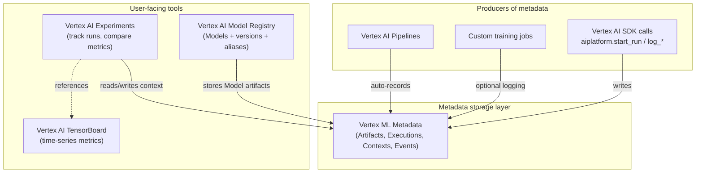
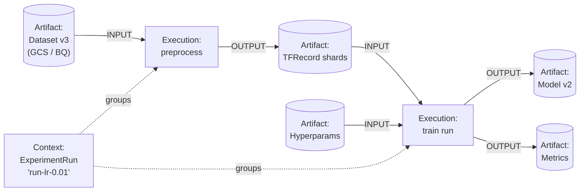

# Metadata, Lineage, Experiments, and Versioning on Vertex AI

**Audience:** PMLE v3.1 candidates (math-strong, no GCP production experience)
**Exam section:** §5 Pipelines + automation (~22%, the heaviest section); §5.3 specifically on metadata, dataset versioning, model versioning, lineage. Vertex AI Experiments also surfaces in §2 (~14%, collaboration).
**Last updated:** 2026-04-26

The exam loves to swap "Experiments" for "ML Metadata" in distractors, and "Model" for "Model version" or "Endpoint." This file gives precise definitions for each, the SDK shape, the lineage flow, and the MLflow-vs-native trade-off — then five practice questions.

---

## 1. The four-object mental model

Memorise the layered picture before anything else:



> "Vertex AI Experiments is a context in Vertex ML Metadata where an experiment can contain *n* experiment runs in addition to *n* pipeline runs."
> — *Introduction to Vertex AI Experiments*, https://docs.cloud.google.com/vertex-ai/docs/experiments/intro-vertex-ai-experiments (fetched 2026-04-26)

That single sentence resolves most "Experiments vs ML Metadata" exam confusion: **Experiments is a *Context* row inside ML Metadata.** ML Metadata is the storage layer; Experiments is one user-facing client of that storage.

---

## 2. Vertex AI Experiments

### What it is

> "Vertex AI Experiments [is] a tool that helps you track and analyze different model architectures, hyperparameters, and training environments."
> — https://docs.cloud.google.com/vertex-ai/docs/experiments/intro-vertex-ai-experiments (fetched 2026-04-26)

An **experiment** groups multiple **experiment runs**. Each run logs:

- **Parameters** (e.g., `learning_rate=0.01`) — scalar configuration that controls behaviour.
- **Summary metrics** (e.g., `accuracy=0.93`) — single-value scalar outputs.
- **Time-series metrics** (per-step training loss, per-epoch validation accuracy) — stored in **Vertex AI TensorBoard**, with the Experiment holding a reference.
- **Vertex AI resources** — a CustomJob, PipelineJob, model artifact.

> "Time series metrics are stored in Vertex AI TensorBoard. Vertex AI Experiments stores a reference to the Vertex TensorBoard resource."
> — same source.

### SDK shape (memorise)

```python
from google.cloud import aiplatform

# 1. Initialise — binds session to an experiment + optional TensorBoard
aiplatform.init(
    experiment="fraud-baseline",
    experiment_description="LR sweep over fraud features",
    experiment_tensorboard=tb_resource_name,
    project=PROJECT, location="us-central1",
)

# 2. Open a run
aiplatform.start_run("run-lr-0.01")

# 3. Log
aiplatform.log_params({"learning_rate": 0.01, "n_estimators": 10})
aiplatform.log_metrics({"accuracy": 0.93, "auc": 0.97})
aiplatform.log_time_series_metrics({"loss": 0.12}, step=5)
aiplatform.log_classification_metrics(labels=["pos","neg"], matrix=[[40,2],[5,53]])

# 4. Close run
aiplatform.end_run()
```

Source for method names and signatures: https://docs.cloud.google.com/vertex-ai/docs/experiments/log-data and https://docs.cloud.google.com/vertex-ai/docs/experiments/create-experiment (fetched 2026-04-26).

### Autologging (one-line variant)

> "Vertex AI SDK autologging uses MLFlow's autologging in its implementation."
> — Google Cloud Blog, *Effortless tracking of your Vertex AI model training*, April 3, 2023, https://cloud.google.com/blog/products/ai-machine-learning/effortless-tracking-of-your-vertex-ai-model-training (fetched 2026-04-26).

```python
aiplatform.autolog()        # Then call sklearn / XGBoost / Keras / PyTorch Lightning .fit()
```

This is exam-fair trivia: the Vertex SDK uses MLflow's autolog hooks under the hood for non-TensorFlow frameworks, but the metadata still lands in Vertex ML Metadata, not in an MLflow tracking server.

### Pipeline integration

> "One or more Vertex PipelineJobs can be associated with an experiment where each PipelineJob is represented as a single run."
> — https://docs.cloud.google.com/vertex-ai/docs/experiments/intro-vertex-ai-experiments (fetched 2026-04-26).

Practical effect: when you submit a `PipelineJob`, you can pass `experiment="fraud-baseline"`, and the pipeline run shows up alongside hand-written runs on the Experiments page so you can diff hyperparameters across both.

---

## 3. Vertex ML Metadata

### Definition

> "Vertex ML Metadata lets you record the metadata and artifacts produced by your ML system and query that metadata to help analyze, debug, and audit the performance of your ML system or the artifacts that it produces."
> — https://docs.cloud.google.com/vertex-ai/docs/ml-metadata/introduction (fetched 2026-04-26).

> "Vertex ML Metadata builds upon the open source ML Metadata (MLMD) library that was developed by Google's TensorFlow Extended team."
> — same source.

### Schema

| Type | What it is | Examples |
|---|---|---|
| **Artifact** | A tangible thing produced or consumed | Dataset, Model, Metrics blob, hyperparameter set, GCS path |
| **Execution** | A processing step | "Train run", "Evaluate", "Preprocess BigQuery → TFRecord" |
| **Context** | A logical grouping | An Experiment, an ExperimentRun, a PipelineRun |
| **Event** | A typed edge connecting an Execution to an Artifact | `INPUT` (artifact consumed) / `OUTPUT` (artifact produced) |
| **MetadataSchema** | A type definition under namespace `system` | `system.Dataset`, `system.Model`, `system.Metrics`, `system.Artifact` |

Sources:
- Introduction (above) for the four primary entities.
- *System schemas*, https://docs.cloud.google.com/vertex-ai/docs/ml-metadata/system-schemas (fetched 2026-04-26): `system.Artifact`, `system.Dataset`, `system.Model`, `system.Metrics`.

### What lineage actually is

Lineage is a graph query against ML Metadata: starting from a Model artifact, walk backwards along OUTPUT edges to the Execution that produced it, then along that Execution's INPUT edges to the Dataset and parameter artifacts, then optionally further back through earlier Executions.



This is what the Console renders when you click an artifact's lineage graph (see §5).

---

## 4. Dataset versioning

### Vertex AI Managed Datasets

Managed datasets are first-party Vertex resources for **image, video, text, tabular, and document** data. They store labels, schema, and a `display_name`, and they integrate with AutoML and Custom Training. They are persisted as artifacts in ML Metadata, so any training job that consumes them gets a lineage edge for free. Source: https://docs.cloud.google.com/vertex-ai/docs/datasets/datasets (fetched 2026-04-26).

For the exam, the important property is: **Managed Datasets are the only "first-class" dataset object in Vertex.** They are required for AutoML; they are optional but lineage-friendly for custom training.

### GCS / BigQuery as source-of-truth (the production pattern)

Most teams keep raw data in GCS or BigQuery and version it there, because Managed Datasets do not version raw bytes. Conventions:

- **GCS folder per version**: `gs://my-bucket/fraud/v=2026-04-01/...` — immutable folder per snapshot date or semantic version.
- **BigQuery snapshots**: `CREATE SNAPSHOT TABLE ... CLONE ...` or partitioned tables with `_PARTITIONTIME`. Documented in BigQuery docs (out of scope here).
- **Dataplex / Data Catalog tags** for cross-bucket discoverability.

When training, log the **GCS URI** or **BQ table+snapshot ID** as an Artifact in ML Metadata. That is what makes the lineage edge meaningful — the artifact must point to an immutable address.

---

## 5. Model versioning (Vertex AI Model Registry)

### How it works

> "Model versioning lets you create multiple versions of the same model."
> — https://docs.cloud.google.com/vertex-ai/docs/model-registry/versioning (fetched 2026-04-26).

A **Model** in the registry is a parent resource with a stable `model_id`. Each upload (training run output or `Model.upload()` call) becomes a new **model version** with a numeric `version_id` (1, 2, 3, …).

You reference versions in three ways:

| Reference style | Resource path | When to use |
|---|---|---|
| Implicit (uses default alias) | `projects/.../models/{model_id}` | Quick experimentation; production should never depend on this |
| Explicit version ID | `projects/.../models/{model_id}@2` | Reproducibility, audits, rollback to a specific version |
| Alias | `projects/.../models/{model_id}@production` | Deployments and CI/CD; promote by re-pointing the alias |

### Aliases

> "[An alias is a] mutable, named reference to a model version unique within a model resource."
> — https://docs.cloud.google.com/vertex-ai/docs/model-registry/model-alias (fetched 2026-04-26).

Rules to memorise:

- The **first version** of a model automatically receives the alias `default`.
- There is **always exactly one** `default` alias per model.
- Custom aliases match `[a-z][a-z0-9-]{0,126}[a-z0-9]` and must be **non-numeric** (so they cannot collide with version IDs).
- "If you apply an existing alias that is used in another model version, the alias is removed from that version" — aliases move atomically.
- If you delete the version that holds `default`, the alias automatically transfers to the next most recent version.

Mental model: **aliases are Git branches; version IDs are commit SHAs.**

### Endpoints, deployed models, traffic split

A Vertex AI **Endpoint** is a serving resource that hosts one or more **deployed models**. Deploying a Model version to an Endpoint produces a `deployedModelId` (distinct from `model_id` and `version_id`) plus a `trafficSplit` map. Two Model versions of the same Model can share an Endpoint with `{"deployed_model_id_A": 90, "deployed_model_id_B": 10}` — that is the canonical Vertex A/B test pattern. Source: cross-referenced in https://docs.cloud.google.com/vertex-ai/docs/model-registry/versioning and https://docs.cloud.google.com/vertex-ai/docs/predictions/overview (fetched 2026-04-26).

---

## 6. Pipeline lineage

> "When you run a pipeline using Vertex AI Pipelines, the artifacts and parameters of your pipeline run are stored using Vertex ML Metadata."
> — https://docs.cloud.google.com/vertex-ai/docs/pipelines/lineage (fetched 2026-04-26).

This is **automatic** — no `log_*` calls are needed in pipeline component code. The Vertex AI Pipelines runtime emits Artifacts (one per `Output[Dataset]`, `Output[Model]`, `Output[Metrics]` annotation in the component signature), Executions (one per task), and Events.

### Viewing lineage

**Console:**
1. Navigate to **Vertex AI → Metadata** (in the left nav).
2. Pick the region (lineage is regional — same as the producing pipeline).
3. Click an Artifact's display name → the **lineage graph** view renders backward and forward edges.
4. Click any node for properties (URI, schema, custom key-value metadata).

**SDK:**
```python
from google.cloud import aiplatform
aiplatform.init(project=PROJECT, location="us-central1")

models = aiplatform.Artifact.list(
    filter='schema_title="system.Model" AND display_name="fraud-prod"',
)
for m in models:
    print(m.uri, m.metadata)
```

Source for `Artifact.list`: https://docs.cloud.google.com/vertex-ai/docs/ml-metadata/tracking (fetched 2026-04-26).

### Why lineage matters (exam-grade reasons)

- **Reproducibility:** "Which dataset and hyperparameters produced this model?" is one click in the Console.
- **Audit / governance:** Regulated industries need a full chain from prod model back to source data version. Lineage is the artifact you hand the auditor.
- **Retraining traceability:** When prod metrics regress, lineage tells you whether dataset v3 vs v4 caused it, or whether only the hyperparameters changed.
- **Cross-organization data discovery:** Knowledge Catalog (formerly Data Catalog) ingests Vertex lineage events when the **Data Lineage API** is enabled, surfacing Vertex training as an upstream of any BigQuery table that consumes its predictions.

---

## 7. MLflow on GCP — when to choose it instead

MLflow can be self-hosted on Cloud Run or GKE, with a **Cloud SQL Postgres** backend store and a **GCS artifact store**. The Vertex AI SDK even uses MLflow's autologging internals for non-TF frameworks (per the April 3, 2023 blog, cited in §2).

When does the exam expect MLflow?

- **Multi-cloud / hybrid:** model training runs partly on AWS or on-prem; you need a single tracking surface.
- **Pre-existing MLflow ecosystem:** Databricks teams migrating to GCP, or a data-science team with thousands of runs already in MLflow.
- **No Vertex AI tie-in needed:** for a pure tracking-store use case where you don't want pipeline lineage rollup or Vertex IAM.

When does the exam **not** want MLflow?

- "Everything stays in Vertex AI" / "use a managed Google Cloud service" / "minimal operational overhead" — the answer is **Vertex AI Experiments**.
- The scenario mentions Vertex AI Pipelines, Vertex AI Model Registry, or Vertex AI TensorBoard — these integrate natively with Experiments, not with MLflow.

Decision rule: if a single answer choice mentions a **managed** Vertex tool that solves the exact stated problem and another mentions self-hosted MLflow on Cloud Run + Cloud SQL, pick the Vertex one. Google's preferred answer is the native option.

---

## 8. Three-way comparison (memorise)

| Aspect | Vertex AI Experiments | Vertex ML Metadata | MLflow (self-hosted on GCP) |
|---|---|---|---|
| **Layer** | User-facing tracker UI + SDK | Storage / lineage backend | Both layers in one product |
| **Primary unit** | Experiment → ExperimentRun | Artifact / Execution / Context / Event | Experiment → Run |
| **Persistence** | Managed (lives inside Vertex) | Managed (per-region MLMD store) | You host: Postgres on Cloud SQL, artifacts on GCS |
| **Auto-population** | Manual `log_*` or `aiplatform.autolog()` | **Auto** from Vertex Pipelines, Vertex Experiments, custom training | Manual `mlflow.log_*` or framework autologgers |
| **Lineage graph** | Inherited from ML Metadata, visible in Console | First-class — this *is* the lineage system | Limited; runs link to artifacts but no graph view |
| **TensorBoard integration** | Native (time-series metrics handed off to Vertex AI TensorBoard) | N/A | Manual; users typically run TB themselves |
| **Multi-cloud** | No — GCP only | No — GCP only | Yes — provider-agnostic |
| **Operational overhead** | None | None | You patch and back up the tracking server |
| **IAM** | Native Vertex/GCP IAM | Native | You implement (often via IAP / Cloud Run auth) |
| **Recommended exam answer when…** | "Track ML experiments on Vertex AI", "compare hyperparameter runs", "minimal infra" | "Audit which dataset produced this model", "lineage graph", "metadata store" | Multi-cloud, Databricks migration, "team already uses MLflow" |

---

## 9. Common confusions (and the disambiguation)

### Experiments vs ML Metadata
**Experiments** is the user-facing tracker. **ML Metadata** is the storage and lineage system underneath. An ExperimentRun is literally a *Context* row in ML Metadata. You can use ML Metadata directly without ever creating an Experiment (e.g., a custom training job that logs Artifacts and Executions). You can also use Experiments without thinking about ML Metadata. They are not alternatives — Experiments is built on top of ML Metadata.

### Model vs Model version vs Endpoint vs Deployed model
- **Model** — a parent resource in Model Registry, identified by `model_id`.
- **Model version** — a numbered child of a Model (`@1`, `@2`, …); also addressable by alias (`@default`, `@production`).
- **Endpoint** — a serving resource with its own URL and traffic-split map.
- **Deployed model** — a (Model version × Endpoint) binding with its own `deployedModelId` and a percentage of the Endpoint's traffic split.

Deploying creates a deployed model. **Deploying does not create a Model version** — versions are created by `Model.upload(parent_model=…)` or by training-pipeline output.

### Lineage vs provenance
Used interchangeably in Google docs. **Lineage** is the more common term in Vertex AI documentation. **Provenance** appears in Knowledge Catalog / Data Catalog contexts. Same concept: a directed graph of executions and artifacts.

### Artifact vs Model artifact
**Artifact** = any node in ML Metadata (dataset, hyperparams, metrics blob). **Model artifact** = the specific GCS path containing serialized model weights (`saved_model.pb`, `model.bst`, etc.) registered in Model Registry. The Model Registry record *is* an Artifact in ML Metadata under the `system.Model` schema.

### TensorBoard vs Experiments
TensorBoard stores **time-series scalars and visualizations**. Experiments stores **summary parameters/metrics + references to TensorBoard runs**. If a question mentions "per-epoch loss curves", the answer is Vertex AI TensorBoard. If it mentions "compare 12 hyperparameter trials at a glance", it's Vertex AI Experiments.

---

## 10. Sample exam-style questions (JSONL)

```jsonl
{"id": 1, "mode": "single_choice", "question": "Your team runs Vertex AI Pipelines for nightly training. An auditor asks: 'For the model currently serving production traffic, which exact training dataset version was used and what hyperparameters were applied?' Which capability answers this with the LEAST custom engineering?", "options": ["A. Export Cloud Audit Logs to BigQuery and join them against Cloud Storage object versions", "B. Open Vertex AI Metadata in the Console and view the lineage graph for the production Model artifact", "C. Re-run the most recent pipeline with verbose logging enabled and inspect the logs", "D. Query the Vertex AI Endpoints API for the deployedModelId and inspect Cloud Logging"], "answer": 1, "explanation": "B is correct. Vertex AI Pipelines automatically writes Artifacts, Executions, and Events to Vertex ML Metadata; the Console's lineage graph lets you click the Model artifact and walk backwards to the Dataset artifact and hyperparameter set in one view. This is exactly what the docs describe at https://docs.cloud.google.com/vertex-ai/docs/pipelines/lineage. A is wrong because Cloud Audit Logs do not capture ML lineage relationships; you would have to reconstruct them from object access events. C is wrong because re-running cannot reveal what an *already-completed* run did, and verbose logs do not produce a lineage graph. D is wrong because deployedModelId tells you which version is serving but not what produced it.", "ml_topics": ["lineage", "auditing", "metadata"], "gcp_products": ["Vertex AI Pipelines", "Vertex ML Metadata"], "gcp_topics": ["MLOps", "lineage", "pipelines"]}
{"id": 2, "mode": "single_choice", "question": "A data scientist wants to track parameters and summary metrics for 30 hyperparameter trials of an XGBoost model trained outside Vertex AI Pipelines, and to compare them on a single screen. The team already has Vertex AI TensorBoard provisioned. Which approach is BEST?", "options": ["A. Stand up an MLflow tracking server on Cloud Run with a Cloud SQL backend", "B. Use Vertex AI Experiments via aiplatform.init(experiment=...), then aiplatform.start_run/log_params/log_metrics for each trial", "C. Append rows to a BigQuery table from the training script and build a Looker Studio dashboard", "D. Save metrics as JSON files in Cloud Storage and inspect them by hand"], "answer": 1, "explanation": "B is correct. Vertex AI Experiments is the native, managed answer for tracking and comparing trials, integrates directly with the team's existing Vertex AI TensorBoard, and requires no infrastructure. The SDK calls aiplatform.start_run / log_params / log_metrics are exactly the right primitives per https://docs.cloud.google.com/vertex-ai/docs/experiments/log-data. A is wrong because the team is staying inside GCP with Vertex tooling already provisioned — adding a self-hosted MLflow server creates needless ops overhead, and the exam prefers managed Google answers. C is technically possible but requires custom dashboarding to do what Experiments does for free. D loses the comparison UI entirely.", "ml_topics": ["experiment tracking", "hyperparameter tuning"], "gcp_products": ["Vertex AI Experiments", "Vertex AI TensorBoard"], "gcp_topics": ["MLOps", "experiments"]}
{"id": 3, "mode": "single_choice", "question": "Your team deploys models to Vertex AI Endpoints via CI/CD. The pipeline must promote the latest validated model to production without changing the Endpoint URL or any client code. Which Model Registry feature should you use?", "options": ["A. Update the Endpoint's display_name to point to the new version", "B. Reassign the 'production' alias on the Model to the new version_id; deploy that aliased reference", "C. Rename the new model version's version_id from '7' to 'production'", "D. Create a new Endpoint for each version and update DNS"], "answer": 1, "explanation": "B is correct. Per https://docs.cloud.google.com/vertex-ai/docs/model-registry/model-alias, an alias is a 'mutable, named reference to a model version unique within a model resource'; reassigning the alias moves it atomically and removes it from the previous version. CI/CD references model_id@production and the Endpoint URL is unchanged. A is wrong because display_name is a human label, not a routing mechanism. C is wrong because version_ids are immutable system identifiers and aliases must be non-numeric anyway. D defeats the requirement that the Endpoint URL stays stable.", "ml_topics": ["model versioning", "deployment", "CI/CD"], "gcp_products": ["Vertex AI Model Registry", "Vertex AI Endpoints"], "gcp_topics": ["MLOps", "deployment"]}
{"id": 4, "mode": "single_choice", "question": "A team running Vertex AI Pipelines wants to associate each pipeline run with an existing experiment so they can compare pipeline-run metrics alongside notebook-run metrics. What is the correct mechanism?", "options": ["A. Manually copy metrics out of pipeline outputs into Vertex AI Experiments via the SDK after each run", "B. Pass the experiment name when submitting the PipelineJob; each PipelineJob is then represented as a single experiment run", "C. Pipeline runs cannot share a comparison view with notebook-driven runs; build a custom Looker Studio dashboard", "D. Use Cloud Composer to call MLflow log_metric inside each pipeline component"], "answer": 1, "explanation": "B is correct. The Vertex AI Experiments docs state directly: 'One or more Vertex PipelineJobs can be associated with an experiment where each PipelineJob is represented as a single run' (https://docs.cloud.google.com/vertex-ai/docs/experiments/intro-vertex-ai-experiments). The SDK accepts an experiment argument when submitting a PipelineJob. A reinvents what the platform does for free. C is factually wrong — Experiments is designed exactly for this. D adds two unnecessary tools (Composer, MLflow) when the native integration exists.", "ml_topics": ["experiment tracking", "pipelines"], "gcp_products": ["Vertex AI Experiments", "Vertex AI Pipelines"], "gcp_topics": ["MLOps", "pipelines"]}
{"id": 5, "mode": "single_choice", "question": "You are auditing how Vertex ML Metadata represents an ML workflow. Which statement is MOST accurate?", "options": ["A. ExperimentRuns and PipelineRuns are stored as Artifacts; Models are stored as Executions", "B. Artifacts represent data and models; Executions represent processing steps; Events are typed edges (input/output) connecting Executions to Artifacts; Contexts group related items", "C. Vertex ML Metadata is a separate product from Vertex AI Pipelines and must be enabled per project before Pipelines can write to it", "D. Lineage in Vertex ML Metadata is computed from Cloud Audit Logs at query time"], "answer": 1, "explanation": "B is correct and matches the schema documented at https://docs.cloud.google.com/vertex-ai/docs/ml-metadata/introduction: Artifacts are tangible outputs (datasets, models), Executions are processing steps, Contexts are logical groupings, Events are the relationships (inputs/outputs) between Executions and Artifacts. A reverses Artifact and Execution and is wrong: Runs are Contexts, not Artifacts, and Models are Artifacts, not Executions. C is wrong because Vertex AI Pipelines auto-populates ML Metadata with no opt-in step required ('When you run a pipeline using Vertex AI Pipelines, the artifacts and parameters of your pipeline run are stored using Vertex ML Metadata'). D is wrong because lineage is materialized in the MLMD store via Events at write time, not reconstructed from audit logs.", "ml_topics": ["metadata", "lineage", "MLMD"], "gcp_products": ["Vertex ML Metadata", "Vertex AI Pipelines"], "gcp_topics": ["MLOps", "lineage"]}
```

---

## 11. Confidence and Decay-risk

**Confidence (high):** Definitions of Experiments, ML Metadata schema (Artifact / Execution / Context / Event), Model Registry versioning + aliases, and Pipelines auto-lineage are stable across 2023–2026 docs. The MLMD library (TFX origin) and the SDK names (`aiplatform.start_run`, `log_metrics`, `log_params`) have not changed since GA. The exam is unlikely to swing on these.

**Confidence (medium):** The "Experiments uses MLflow autolog internals" detail is from an April 2023 blog post; the implementation could be refactored without warning, but the *user-facing* `aiplatform.autolog()` call is stable.

**Decay-risk (watch):**
- **Vertex AI → Gemini Enterprise Agent Platform (Apr 22, 2026):** the rebrand renamed several Vertex AI sub-products. As of 2026-04-26 the Experiments / ML Metadata / Model Registry pages still use the Vertex AI names; the v3.1 exam guide does too. If product UIs flip during your study window, translate function-first: an ExperimentRun is still an ExperimentRun whatever the marketing layer calls it.
- **Knowledge Catalog (formerly Data Catalog):** the Data Lineage integration with Vertex was renamed during 2025; the underlying Vertex lineage data is unchanged.
- **Docs hostname:** prefer `docs.cloud.google.com/...`; the older `cloud.google.com/...` 301-redirects.
- **Default-alias auto-transfer behaviour:** documented today; if Google ever changes deletion semantics, the answer to "what happens to `default` when you delete the holding version?" could shift.
- **Managed Datasets product surface:** Google has been deprecating some classical (image/video) AutoML pathways in favour of Model Garden + foundation-model fine-tuning. Managed Datasets as a *concept* persists for AutoML and lineage tagging, but specific SDK endpoints could move.

**Word count:** ~2,330.
