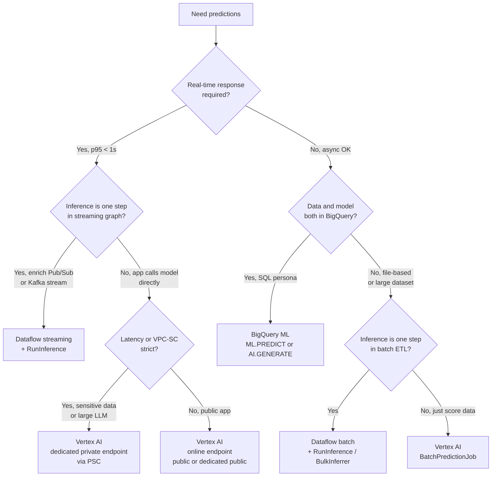

# Serving and Scaling on Google Cloud — PMLE v3.1 Deep-Dive

**Audience:** PMLE candidates (math-strong, no GCP production experience)
**Exam section:** Section 4 — Serving and scaling models (~20% of the exam, second-highest weight)
**Last updated:** 2026-04-26
**Access date for all citations:** 2026-04-26

The exam guide for §4 covers four serving paths, A/B testing, the Model Registry, throughput / latency / memory tuning, public-vs-private endpoints, multi-framework serving, and cost. This document hits each in order, ends with five sample exam questions, and closes with confidence and decay-risk notes.

The exam guide language predates the Apr 22, 2026 rebrand of **Vertex AI → Gemini Enterprise Agent Platform**; both names map to the same underlying APIs. The doc hostname `cloud.google.com/...` 301-redirects to `docs.cloud.google.com/...`; both URL forms below are valid.

---

## 1. The four serving paths — when each wins

Every PMLE serving question begins with a forced choice between online prediction, batch prediction, in-pipeline Dataflow inference, and in-warehouse BigQuery ML inference. Pattern-match the **request shape**, not the model: latency target, request volume, where the input data physically lives, and whether inference is the only step or one transform in a larger graph.

### 1a. Vertex AI online prediction

A `Model` resource is registered in the Model Registry, deployed as a `DeployedModel` to an `Endpoint`, and synchronous REST/gRPC calls return predictions in milliseconds. The endpoint can be public, dedicated public, or dedicated private (PSC). Autoscaling adjusts the replica count between `minReplicaCount` and `maxReplicaCount` based on CPU / accelerator-duty-cycle / request-count signals. Source: [Vertex AI predictions overview](https://docs.cloud.google.com/vertex-ai/docs/predictions/overview), accessed 2026-04-26.

**Wins when:** an end-user-facing app needs sub-second responses, traffic is bursty, the model fits on a single (or small set of) replicas, and you do not want to manage Kubernetes manifests yourself.

### 1b. Vertex AI batch prediction

You submit a `BatchPredictionJob` against a `Model` (no endpoint, no deployment). Vertex AI partitions the input across worker replicas, runs inference, and writes results to Cloud Storage or BigQuery. Billing is per replica node-hour with about 5 minutes of startup overhead, and Google explicitly recommends only running jobs that will last at least 10 minutes to amortize that overhead. Source: [Get batch inferences from a custom trained model](https://docs.cloud.google.com/vertex-ai/docs/predictions/get-batch-predictions), accessed 2026-04-26.

**Wins when:** scoring an entire database / data lake (millions to billions of rows) on a schedule, no real-time SLA, and you would otherwise need to keep an online endpoint warm pointlessly. There is no autoscaling — you set `starting_replica_count` up front and "scaling horizontally by increasing the number of replicas improves throughput more linearly" than picking a beefier machine ([batch predictions docs](https://docs.cloud.google.com/vertex-ai/docs/predictions/get-batch-predictions), accessed 2026-04-26).

### 1c. Dataflow inference (Apache Beam `RunInference`, TFX `BulkInferrer`)

Apache Beam ≥ 2.40 ships a `RunInference` PTransform wrapping a model handler (PyTorch, TensorFlow, scikit-learn, Hugging Face, vLLM, Gemma, or a Vertex AI endpoint). It runs on Dataflow as one step inside a streaming or batch pipeline, with batching via `BatchElements` and shared model loading. Source: [Dataflow ML overview](https://docs.cloud.google.com/dataflow/docs/machine-learning), accessed 2026-04-26.

The **TFX `BulkInferrer`** is the TFX-pipeline equivalent: consumes a SavedModel + unlabelled `tf.Example`s, produces `PredictionLog` protos. Source: [TFX BulkInferrer guide](https://www.tensorflow.org/tfx/guide/bulkinferrer), accessed 2026-04-26.

**Wins when:** inference is one transform inside a larger ETL graph — e.g. enriching a Pub/Sub click stream with a fraud score before writing to BigQuery. Avoids the round-trip cost of moving data out to a Vertex endpoint.

### 1d. BigQuery ML inference (`ML.PREDICT`, `AI.GENERATE`)

When model and data both live in BigQuery, `ML.PREDICT` is a SQL function — no export, no infra. Model can be BigQuery-trained (linear, logistic, boosted trees, DNN, ARIMA+, k-means, matrix factorization), an imported SavedModel / ONNX / XGBoost, or a remote model pointing to a Vertex endpoint. The `AI.GENERATE` family (`AI.GENERATE_TEXT`, `AI.GENERATE_TABLE`, `AI.EMBED`, `AI.CLASSIFY`, `AI.SCORE`) wraps Gemini for SQL-callable generative inference. Source: [ML.PREDICT inference functions](https://docs.cloud.google.com/bigquery/docs/reference/standard-sql/bigqueryml-syntax-predict), accessed 2026-04-26.

**Wins when:** SQL persona, data already in BigQuery, offline/scheduled scoring.

### 1e. Decision flowchart



---

## 2. A/B testing on Vertex AI endpoints

A single `Endpoint` resource can host multiple `DeployedModel`s simultaneously. The endpoint maintains a `trafficSplit` map from each `DeployedModel` ID to an integer percentage that sums to 100, and Vertex AI forwards each incoming request to one of the deployed models stochastically according to those weights. Source: [Deploy a model to an endpoint](https://docs.cloud.google.com/vertex-ai/docs/general/deployment), accessed 2026-04-26.

```python
endpoint.deploy(
    model=new_model,
    deployed_model_display_name="ranker-v3-canary",
    traffic_split={"OLD_DEPLOYED_MODEL_ID": 90, "0": 10},  # "0" = the new one
    machine_type="n2-standard-4",
    min_replica_count=1,
    max_replica_count=4,
)
```

### 2a. Rollout patterns mapped to `trafficSplit`

| Pattern | Purpose | Typical `trafficSplit` shape | Risk profile |
|---|---|---|---|
| **Canary** | Probe a new version with a tiny slice of real traffic before committing | 95 / 5 → 80 / 20 → 50 / 50 → 0 / 100 over hours/days | Lowest blast radius; small population sees the new model. |
| **Blue/green** | Cut over instantly with instant rollback. Both versions stay deployed for the rollback window. | 100 / 0 → 0 / 100 in one step (then keep blue warm) | Latency-friendly rollback (no cold start); 2× compute cost during the overlap window. |
| **Gradual / progressive rollout** | A canary that keeps walking the percentage up only if business metrics hold | 90 / 10 → 70 / 30 → 30 / 70 → 0 / 100 with a hold step at each stage | Cheaper than blue/green; needs decent telemetry to gate each step. |
| **Shadow traffic** | Send the new model real traffic but never serve its responses to users | Not via `trafficSplit` — duplicate requests in the application or a sidecar; production endpoint stays at 100 / 0 | Zero user-impact risk; needs custom plumbing because Vertex `trafficSplit` is mutually exclusive (each request goes to exactly one model). |

Sources: [Deploy a model to an endpoint](https://docs.cloud.google.com/vertex-ai/docs/general/deployment), accessed 2026-04-26; [endpoints.deployModel REST reference](https://cloud.google.com/vertex-ai/docs/reference/rest/v1/projects.locations.endpoints/deployModel), accessed 2026-04-26.

### 2b. When Vertex AI Experiments enters the picture

`trafficSplit` answers "how does the request get routed?" but says nothing about "which model won?" That is what **Vertex AI Experiments** is for. Each `DeployedModel` writes its prediction logs (request payload + response + label join from downstream systems) into BigQuery; an Experiment run aggregates the winner. The exam loves to swap these two — `trafficSplit` does the routing, Experiments does the comparison.

---

## 3. Model Registry patterns

The Vertex AI **Model Registry** is the single source of truth for models inside a project. It supports four artifact paths: custom-trained models, AutoML models, BigQuery ML models (without export), and imported framework artifacts (TensorFlow SavedModel, scikit-learn, XGBoost, PyTorch). Source: [Model Registry introduction](https://docs.cloud.google.com/vertex-ai/docs/model-registry/introduction), accessed 2026-04-26.

### 3a. One Model with many ModelVersions vs. multiple Models

| Pattern | When to use it | Example |
|---|---|---|
| **One Model, many ModelVersions** | Same architecture / same input schema / same task, you are iterating | `fraud-ranker` v1 → v2 → v3, all take the same 47-feature input vector and produce one score |
| **Multiple Models** | Fundamentally different architectures or different tasks | Separate `fraud-ranker` (XGBoost tabular) and `fraud-text-classifier` (PyTorch transformer over chat logs) |
| **Aliases** | Decouple "what's deployed" from "which version" so you do not need to redeploy when you cut over | `default` → v3 today, point it at v4 tomorrow without changing the endpoint config; custom aliases like `production`, `champion`, `challenger` are allowed |

Aliases are the mechanism that turns a Model Registry into a CD target: the endpoint deployment references a model by alias, and promoting a candidate is just a `set-version-alias` call. Source: [Model Registry introduction](https://docs.cloud.google.com/vertex-ai/docs/model-registry/introduction), accessed 2026-04-26.

### 3b. Importing existing artifacts

| Framework | Path | Container |
|---|---|---|
| TensorFlow SavedModel | `aiplatform.Model.upload(artifact_uri="gs://.../saved_model")` | Prebuilt TF Serving container; pick the version that matches the SavedModel TF version |
| scikit-learn | `aiplatform.Model.upload_scikit_learn_model_file(model_file_path=...)` | Prebuilt scikit-learn container |
| XGBoost | `aiplatform.Model.upload_xgboost_model_file(model_file_path=...)` | Prebuilt XGBoost container |
| PyTorch | Custom container (TorchServe), or recently a prebuilt PyTorch container for common cases | TorchServe `.mar` archive or a custom Dockerfile |
| JAX / Flax | Custom container | Bring your own |
| Hugging Face | Either Model Garden one-click deploy (managed) or a custom container with `transformers` | Often `vllm` or `text-generation-inference` for LLMs |

Source: [Configure compute resources for inference](https://docs.cloud.google.com/vertex-ai/docs/predictions/configure-compute), accessed 2026-04-26.

The rule of thumb: use prebuilt containers if your framework and version are listed; switch to custom containers the moment you need a custom op, a server-side preprocessing step, or a serving runtime like TorchServe / Triton / vLLM that the prebuilt does not provide.

---

## 4. Throughput, latency, and memory tuning

This is the section the exam tests with concrete numbers and machine-type names.

### 4a. Machine type selection

| Workload | Recommended | Notes |
|---|---|---|
| Tabular AutoML serving | `n1-standard` or `n2-standard` (CPU) | Google explicitly states "GPUs are not recommended for use with AutoML tabular models" and the console blocks GPU specification for them ([configure-compute](https://docs.cloud.google.com/vertex-ai/docs/predictions/configure-compute), accessed 2026-04-26). |
| Small classical ML (sklearn / XGBoost) | `n2-standard` or `c3-standard` | Vertex reserves ~1 vCPU per replica for system processes, so single-core machines effectively act as 2-core. |
| Mid-size deep learning, real-time | **L4** (G2 family) | Cost-effective serving GPU, 24 GB VRAM, common default for vision / NLP < 10 B params. |
| Mid-size deep learning, budget | **T4** (N1 + GPU attach) | Older but still common for cheap real-time serving. |
| Large LLM (10–70 B) low latency | **A100 80 GB** (A2) or **H100** (A3) | A3 family supports H100 / H200; A4 supports B200; A4X supports GB200 (minimum 18 replicas required). |
| Large LLM, throughput-bound, JAX/TF | **TPU v5e** (`ct5lp-hightpu-{1t,4t,8t}`) or **v6e** (`ct6e-standard`) | v5e is the cost-efficient inference TPU; v6e (Trillium) is the current generation. |

Source: [Configure compute resources for inference](https://docs.cloud.google.com/vertex-ai/docs/predictions/configure-compute), accessed 2026-04-26.

### 4b. Autoscaling parameters

| Knob | Default | What it controls |
|---|---|---|
| `dedicatedResources.minReplicaCount` | 1 (must be ≥ 1 for GA; can be 0 with v1beta1 Scale-to-Zero preview) | Floor for replica count. Setting `>= 1` eliminates cold starts. |
| `dedicatedResources.maxReplicaCount` | If unset, falls back to `minReplicaCount` (i.e. autoscaling effectively off) | Ceiling for replica count. |
| `autoscalingMetricSpecs[].metricName = aiplatform.googleapis.com/prediction/online/cpu/utilization` | Target **60%** | The default scaling signal for CPU-only deployments. |
| `autoscalingMetricSpecs[].metricName = .../accelerator/duty_cycle` | Target **60%** | GPU duty-cycle metric; system uses whichever signal hits target first. |
| Request-count metric, vLLM KV cache, vLLM requests-waiting (Preview), Pub/Sub queue (Preview) | Custom targets | Newer signals optimized for LLM serving. |
| `idle_scaledown_period` (Scale-to-Zero) | 1 hour | Idle window before scaling to 0 replicas; Scale-to-Zero is single-model-per-endpoint only. |

Sources: [Scale inference nodes by using autoscaling](https://docs.cloud.google.com/vertex-ai/docs/predictions/autoscaling), accessed 2026-04-26; [DedicatedResources REST reference](https://cloud.google.com/vertex-ai/docs/reference/rest/v1/DedicatedResources), accessed 2026-04-26.

The scaling formula, verbatim: `target replicas = Ceil(current replicas × (current utilization / target utilization))`. Recalculation happens every 15 seconds over a 5-minute observation window. Scale-up happens fast (within 15 s); scale-down is sticky (waits for the highest target across the 5-minute window) to prevent oscillation.

### 4c. Concurrency, queuing, and cold starts

- **Concurrent requests per replica** — prebuilt containers cap simultaneous requests; custom containers control this via the server you ship (TorchServe `--workers`, vLLM `--max-num-seqs`, gRPC `--max_concurrent_streams`).
- **Cold starts** — keep `minReplicaCount >= 1` to avoid the 30-second-to-several-minute container-pull-and-warm penalty. Scale-to-Zero accepts that cold start in exchange for $0 idle cost (returns 429 while warming).
- **Request batching** — for GPU-bound serving, server-side dynamic batching is the cheapest throughput uplift. TorchServe / Triton / vLLM do continuous batching; prebuilt TF Serving exposes `--enable_batching`.

### 4d. AutoML tabular footgun

- AutoML **tabular** — CPU only, GPUs not recommended.
- AutoML **image / text / video** — GPUs are valid and beneficial.
- BigQuery ML models, when registered to the Model Registry, can also be deployed for online or batch inference.

---

## 5. Public vs. private endpoints

There are now four endpoint flavors in Vertex AI online prediction, and the exam will phrase the choice as a security / network requirement. Source: [Reliable AI with Vertex AI Prediction Dedicated Endpoints (Google Cloud blog, May 5, 2025)](https://cloud.google.com/blog/products/ai-machine-learning/reliable-ai-with-vertex-ai-prediction-dedicated-endpoints), accessed 2026-04-26 and [Use dedicated private endpoints based on Private Service Connect](https://docs.cloud.google.com/vertex-ai/docs/predictions/private-service-connect), accessed 2026-04-26.

| Endpoint type | Network path | When to use | Limits / notes |
|---|---|---|---|
| **Shared public endpoint** | Internet → Google front-end (multi-tenant) | Default, lowest setup cost, fine for small payloads | Smaller request size limit, shared tenancy, less suitable for streaming GenAI. **Tuned Gemini models can ONLY be deployed to shared public endpoints.** |
| **Dedicated public endpoint** | Internet → isolated single-tenant infra | Production GenAI / large payloads / streaming. GA. | Up to 10 MB request size, up to 1-hour timeout, gRPC + `streamRawPredict` + OpenAI-compatible chat completion API supported. |
| **Dedicated private endpoint via Private Service Connect (PSC)** | Caller VPC → PSC forwarding rule → Vertex service attachment, never traverses public internet | Highest security tier; required for VPC-SC perimeters; lowest latency variability because the path is short and single-tenant. GA. | Two ports (443 with TLS, 80 plaintext). gRPC requires `x-vertex-ai-endpoint-id` header. PSC service automation is in Preview for teams without networking permissions. |
| **Private services access (PSA) endpoint** | Caller VPC peered to Google's producer VPC | Older private-networking mechanism; still documented but PSC is the recommended forward path | PSC is "recommended" over PSA for new deployments per the [Reliable AI blog](https://cloud.google.com/blog/products/ai-machine-learning/reliable-ai-with-vertex-ai-prediction-dedicated-endpoints) (May 5, 2025), accessed 2026-04-26. |

### 5a. The VPC-SC connection

A VPC Service Controls perimeter blocks data exfiltration to the public internet by default. If your project sits inside a VPC-SC perimeter and you need online prediction, you cannot use a shared public endpoint without the request crossing the perimeter boundary — so the exam-correct answer is a **dedicated private endpoint via PSC** with the Vertex AI service in the perimeter's allowed services list.

### 5b. The exam cue words

| If the question says... | Pick |
|---|---|
| "Cannot expose model to the internet" / "VPC Service Controls perimeter" / "private network only" / "regulated data" | **Dedicated private endpoint via PSC** |
| "Streaming generative AI responses" / "OpenAI-compatible chat" / "10 MB payloads" / "predictable single-tenant performance" | **Dedicated public endpoint** |
| "Tuned Gemini model" | **Shared public endpoint** (only option) |
| "Quick demo" / "default" / "no networking constraints" | **Shared public endpoint** |

---

## 6. Multi-framework serving

Vertex AI's serving plane is intentionally framework-agnostic. The exam-relevant rule: any model that ships an HTTP `/predict` endpoint and a `/health` check can be served via a custom container, including JAX, PyTorch with custom CUDA kernels, and proprietary inference servers.

| Framework | Artifact | Container |
|---|---|---|
| TensorFlow ≥ 2.x | SavedModel directory in GCS | Prebuilt TF Serving (version-matched). Default path. |
| PyTorch | TorchScript or `state_dict` + handler | Prebuilt PyTorch container or custom **TorchServe**. |
| scikit-learn | `joblib` pickle | Prebuilt scikit-learn container. |
| XGBoost | `bst.save_model(...)` | Prebuilt XGBoost container. |
| JAX / Flax | FastAPI wrapper or `jax-serve` | Custom container only (no prebuilt as of 2026-04). |
| Hugging Face | Checkpoints in GCS / HF Hub | Custom container (`text-generation-inference`, `vllm`, DJL) or one-click **Model Garden**. |
| ONNX | `.onnx` | Custom container (Triton + ONNX Runtime). |

Source: [Configure compute resources for inference](https://docs.cloud.google.com/vertex-ai/docs/predictions/configure-compute), accessed 2026-04-26.

---

## 7. Cost model

| Mode | Billing unit | Right-sizing rule |
|---|---|---|
| **Online prediction** | Replica node-second; you pay every second every replica is up, even at zero QPS | `minReplicaCount × machine cost` is your floor. Lower for spiky traffic (or Scale-to-Zero); raise for SLA traffic. |
| **Batch prediction** | Replica node-hour with ~5 min startup overhead | Run ≥ 10 minutes per job; scale horizontally with more replicas, not bigger machines ([batch predictions docs](https://docs.cloud.google.com/vertex-ai/docs/predictions/get-batch-predictions), accessed 2026-04-26). |
| **Dataflow inference** | Dataflow worker billing (vCPU-hour + memory + accelerator) | Co-locate inference in the transform graph; avoid round-trips to a separate Vertex endpoint. |
| **BigQuery ML inference** | BQ slot time / on-demand bytes | Free of extra infrastructure if data is already in BQ. |

**Spot VMs** discount online and batch in exchange for preemption risk. **Reservations** guarantee accelerator capacity for predictable peak QPS. Source: [configure-compute](https://docs.cloud.google.com/vertex-ai/docs/predictions/configure-compute), accessed 2026-04-26.

---

## 8. Worked sizing example: 1B-parameter LLM at 100 QPS, p95 < 500 ms

Decoder-only 1B-parameter model (~2 GB BF16). Targets: 100 QPS, p95 < 500 ms, prompt 256 / completion 128 tokens.

| Decision | Choice | Rationale |
|---|---|---|
| Machine type | `g2-standard-12` with 1× NVIDIA L4 (24 GB) per replica | 1B fits comfortably on L4 in BF16 with KV-cache headroom; L4 is the cost-effective inference GPU per [configure-compute](https://docs.cloud.google.com/vertex-ai/docs/predictions/configure-compute), accessed 2026-04-26. A100/H100 are overkill. |
| Serving runtime | vLLM (continuous batching) in a custom container | Continuous batching is the difference between ~5 QPS and ~30 QPS per L4 at this size. |
| Per-replica throughput | ~25 QPS (back-of-envelope) | 100 / 25 = 4 replicas at peak. |
| `minReplicaCount` / `maxReplicaCount` | 4 / 8 | Floor avoids cold starts at peak; 2× headroom absorbs spikes. SLA p95 < 500 ms rules out Scale-to-Zero. |
| Autoscaling signal | `accelerator/duty_cycle` target 60%; add `vLLM requests waiting` (Preview) if available | GPU duty cycle is the bottleneck, not CPU. |
| Endpoint type | Dedicated public endpoint, or PSC private if VPC-SC | Streaming completion needs gRPC `streamRawPredict`, which is dedicated-only. |

The exam asks "what GPU for cost-efficient real-time inference of a 1B-parameter LLM?" Answer: **L4**, not A100/H100.

---

## 9. Sample exam questions

Five single-choice questions in the project's question schema. Each explanation states why the right answer wins **and** why each wrong answer is a trap.

```jsonl
{"id": 1, "mode": "single_choice", "question": "A retail data team needs to score 200 million customer rows nightly with a custom-trained scikit-learn churn model. The data lives in BigQuery and the predictions must land in BigQuery for the BI team. There is no real-time SLA. Which serving path minimizes ops overhead and cost?", "options": ["A. Deploy the model to a Vertex AI online endpoint with min_replica_count=10 and have a Cloud Function loop through the table.", "B. Submit a Vertex AI BatchPredictionJob with a BigQuery input source and a BigQuery output destination.", "C. Build an Apache Beam pipeline on Dataflow with RunInference and a sklearn model handler.", "D. Export the model and run it inside a Cloud Run job that paginates BigQuery."], "answer": 1, "explanation": "B wins because BatchPredictionJob accepts BigQuery as a native input and output destination, requires no endpoint to keep warm, and bills only for the replica node-hours of the job (per the get-batch-predictions docs). A is wasteful: a per-row online endpoint pays for an idle replica between bursts and adds REST latency to every row, plus it is the wrong shape for nightly scoring. C works but adds Dataflow operational overhead with no benefit because there is no other transform in the pipeline; choose Dataflow inference only when inference is one step in a larger graph. D rebuilds what BatchPredictionJob already provides and costs developer time.", "ml_topics": ["Batch prediction", "Model deployment"], "gcp_products": ["Vertex AI", "BigQuery", "Dataflow"], "gcp_topics": ["Batch prediction", "Model serving"]}
{"id": 2, "mode": "single_choice", "question": "Your team wants to roll out a new fraud-detection model to production but only after observing real-traffic performance against the current model. You want 5% of live traffic to hit the new model with zero application-code changes, and the ability to revert instantly. What is the simplest Vertex AI mechanism?", "options": ["A. Create two endpoints and put a custom load balancer in front that routes 5% of requests to the new endpoint.", "B. Deploy both models to the same Vertex AI endpoint and set trafficSplit to {old: 95, new: 5}.", "C. Use Vertex AI Experiments to send 5% of requests to the new model.", "D. Train both models with Vertex AI Pipelines and pick the winner offline."], "answer": 1, "explanation": "B wins because a single Vertex AI endpoint can host multiple DeployedModels and the trafficSplit map (sums to 100) is exactly the canary primitive — flip it back to 100/0 to revert. A reinvents what trafficSplit gives you for free and changes the application's URL. C is a category error: Vertex AI Experiments tracks training-run metadata and lets you compare model performance offline; it does not route prediction traffic. D is offline evaluation, not a production canary, and does not satisfy the 'real-traffic' requirement.", "ml_topics": ["A/B testing", "Model deployment", "Canary deployment"], "gcp_products": ["Vertex AI"], "gcp_topics": ["Model deployment", "Traffic splitting"]}
{"id": 3, "mode": "single_choice", "question": "A regulated insurer must serve a fraud model from a project inside a VPC Service Controls perimeter. Predictions cannot traverse the public internet, and the compliance team requires single-tenant network paths. Which endpoint type satisfies all three constraints?", "options": ["A. Shared public endpoint with TLS termination.", "B. Dedicated public endpoint with custom domain.", "C. Dedicated private endpoint based on Private Service Connect (PSC).", "D. Vertex AI batch prediction with a BigQuery output table."], "answer": 2, "explanation": "C wins because PSC routes traffic from the caller's VPC through a forwarding rule to the Vertex AI service attachment without ever touching the public internet, gives single-tenant infrastructure, and is the explicitly recommended option for VPC-SC perimeters per the private-service-connect docs. A traverses the public internet (TLS encrypts but does not isolate). B is single-tenant but still public-internet-routable, which a VPC-SC perimeter blocks. D abandons the online requirement implied by 'serve a fraud model' — batch prediction is asynchronous and has no real-time path.", "ml_topics": ["Model serving", "Network security"], "gcp_products": ["Vertex AI", "Private Service Connect", "VPC Service Controls"], "gcp_topics": ["Private endpoints", "Model deployment"]}
{"id": 4, "mode": "single_choice", "question": "You deployed an AutoML tabular regression model to a Vertex AI endpoint. Latency is acceptable but throughput is half what you need. Which change is most likely to improve throughput?", "options": ["A. Add an NVIDIA T4 GPU to the machine spec.", "B. Switch from n1-standard-4 to n2-standard-8 and raise max_replica_count.", "C. Convert the model to TensorRT and host on H100.", "D. Move the endpoint to a TPU v5e single-host slice."], "answer": 1, "explanation": "B wins because Google explicitly states 'GPUs are not recommended for use with AutoML tabular models' (configure-compute docs) — they provide no worthwhile performance benefit on tabular AutoML. The right lever is more / bigger CPU and more replicas, plus letting autoscaling spin out under load. A directly violates that recommendation. C compounds A by paying for an H100 that AutoML tabular cannot exploit, plus AutoML tabular models cannot be re-exported to TensorRT. D is even more extreme: TPUs are matrix-compute ASICs aimed at deep learning, not AutoML tabular tree-ensemble inference.", "ml_topics": ["AutoML", "Throughput tuning"], "gcp_products": ["Vertex AI", "AutoML"], "gcp_topics": ["Machine type selection", "Autoscaling"]}
{"id": 5, "mode": "single_choice", "question": "Your team serves a 1B-parameter open-source LLM behind a Vertex AI online endpoint and currently keeps min_replica_count=1, max_replica_count=4 on g2-standard-12 (1× L4). Engineers report intermittent 30-second cold-start spikes during morning traffic ramp-up that violate the 1-second p95 SLA. Which single change addresses the cold-start spikes most directly?", "options": ["A. Switch the endpoint to Scale-to-Zero so it scales up faster from idle.", "B. Raise min_replica_count so at least the morning baseline of replicas stays warm.", "C. Lower target CPU utilization from 60% to 30% to scale up earlier.", "D. Switch from L4 to A100 80GB to shorten model load time."], "answer": 1, "explanation": "B wins because cold starts come from spinning up a brand-new replica (container pull + model load), and the only way to eliminate that latency for predictable baseline traffic is to keep enough warm replicas online — exactly what min_replica_count buys you. A is the opposite of correct: Scale-to-Zero deliberately accepts a cold start as the cost of zero idle billing and even returns 429 while warming up. C helps with steady-state scale-up reactiveness but does not help with the very first replica that has to come up from cold; it just makes that cold start happen sooner. D buys faster GPU compute but model load time is dominated by container pull and weights transfer, which an A100 does not improve, and it costs ~5x more per hour with no SLA benefit.", "ml_topics": ["Latency tuning", "Cold start mitigation", "Autoscaling"], "gcp_products": ["Vertex AI"], "gcp_topics": ["Online prediction", "Autoscaling"]}
```

---

## 10. Confidence and decay-risk

| Claim | Confidence |
|---|---|
| Four serving paths + request-shape decision rule | **High** — direct from current docs, stable for years. |
| `trafficSplit` semantics | **High** — stable since GA of Vertex Endpoints. |
| Default autoscaling target = 60% CPU; scaling formula `Ceil(current × util/target)`; 15 s / 5 min cadence | **High** — verbatim in the [autoscaling docs](https://docs.cloud.google.com/vertex-ai/docs/predictions/autoscaling). |
| AutoML tabular: GPUs not recommended | **High** — verbatim in configure-compute. |
| Tuned Gemini limited to shared public endpoints | **Medium** — true Apr 2026; expected to relax. |
| L4 = right answer for cost-efficient 1B-LLM serving | **High** — Google positions L4 as the inference-class GPU. |
| PSC recommended over PSA | **Medium-High** — stated in May 2025 blog; PSA still tested. |
| Scale-to-Zero defaults (1 h idle, single-model-per-endpoint) | **Medium** — Preview, defaults will move. |
| ~25 QPS per L4 for 1B model with vLLM | **Low** — order-of-magnitude only. |
| `BulkInferrer` as TFX-native batch component | **High** — canonical TFX guide. |

### Decay-risk

Fastest-moving items in §4 likely to drift before April 2027:

- **Endpoint taxonomy.** Four flavors (shared public, dedicated public, PSC private, PSA) is the Apr 2026 lineup; expect consolidation.
- **Scale-to-Zero.** Pre-GA, so `idle_scaledown_period` defaults and single-model restriction will change at GA.
- **LLM autoscaling signals.** vLLM-specific signals (KV cache, requests-waiting) are Preview; will become default for LLM endpoints.
- **Naming.** Apr 22, 2026 rebrand (Vertex AI → Gemini Enterprise Agent Platform) will migrate URLs and SDK names over 6–12 months. Function-first mapping stays stable.
- **Hardware roster.** A4 (B200), A4X (GB200), G4 (RTX PRO 6000), Ironwood TPU appear in current docs but may not be in v3.1 questions. Memorize L4 / T4 / A100 / H100 / TPU v5e / v6e first.
- **Tuned Gemini surface.** Shared-public-only restriction expected to lift.

Refresh from `docs.cloud.google.com/vertex-ai/docs/predictions/{configure-compute,autoscaling,private-service-connect,get-batch-predictions}` before the exam — those four URLs cover ~80% of §4.
