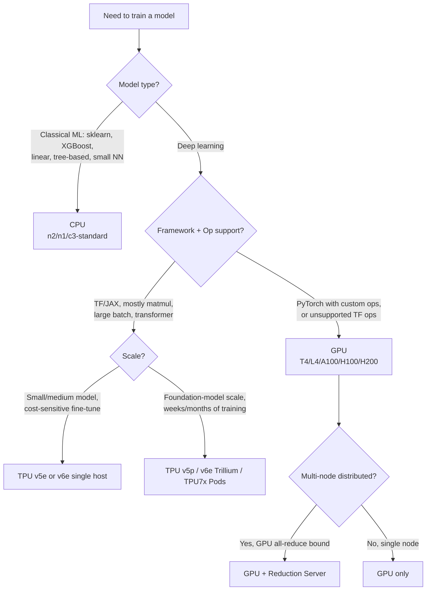
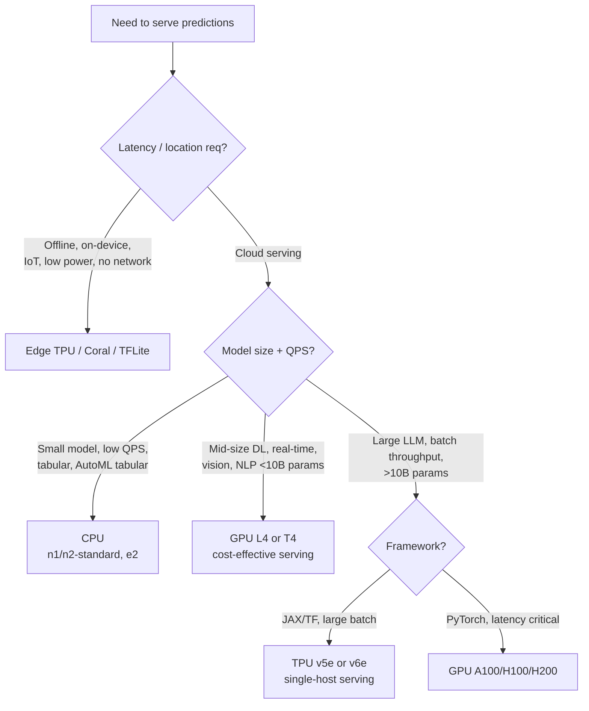

# Compute Hardware Selection for ML on Google Cloud — PMLE v3.1 Decision-Tree Study Guide

**Audience:** PMLE candidates (April 2025+ exam, v3.1) preparing for §3.3 (training hardware) and §4.2 (serving hardware).
**Access date for all citations:** 2026-04-24.

---

## 1. Quick Decision Flowcharts

### 1a. Training Hardware (§3.3)



### 1b. Inference / Serving Hardware (§4.2)



---

## 2. CPU — When It Wins

CPUs are still the default for non-deep-learning ML and very small or low-traffic inference. Per Google's official TPU docs, **CPUs are best for "rapid prototyping requiring flexibility, simple models with brief training times, and implementations with custom TensorFlow C++ operations."** [https://docs.cloud.google.com/tpu/docs/intro-to-tpu, accessed 2026-04-24].

**Pick CPU when:**
- Training scikit-learn / XGBoost / LightGBM models without GPU acceleration. Classical ML libraries are CPU-optimized for models with millions (not billions) of parameters [https://www.thepurplestruct.com/blog/cpu-vs-gpu-vs-tpu-vs-npu-ai-hardware-architecture-guide-2025, accessed 2026-04-24].
- Linear/logistic regression, SVMs, decision trees, random forests — workloads that don't benefit from massively parallel matmul.
- Low-traffic batch inference where startup time and cost dominate.
- AutoML tabular serving — Google explicitly says "GPUs are not recommended for use with AutoML tabular models" [https://docs.cloud.google.com/vertex-ai/docs/predictions/configure-compute, accessed 2026-04-24].
- Data preprocessing, feature engineering, and pipeline orchestration steps.
- Custom TensorFlow C++ ops not supported on TPU.

**On Vertex AI, CPU machine families:** E2 (cheapest), N1 (legacy, GPU-attachable), N2 / N2D, C2 / C3 (compute-optimized), M1 (memory-optimized up to 624 GB) [https://docs.cloud.google.com/vertex-ai/docs/training/configure-compute, accessed 2026-04-24].

---

## 3. GPU — When It Wins

GPUs are the **default for deep learning** in PyTorch and for any workload that doesn't slot cleanly into TPU's matmul-dominated, large-batch sweet spot.

**Pick GPU when:**
- Training deep learning models in **PyTorch** (the dominant DL research framework). Per Google: GPUs are best for "custom PyTorch/JAX operations, models using TensorFlow operations unsupported on Cloud TPU, and medium-to-large models with moderate batch sizes" [https://docs.cloud.google.com/tpu/docs/intro-to-tpu, accessed 2026-04-24].
- Computer vision, video, image generation (Stable Diffusion-class models).
- Mixed-precision (FP16/BF16) training where NVIDIA Tensor Cores shine — H100/H200 are optimized for mixed-precision [https://www.thepurplestruct.com/blog/cpu-vs-gpu-vs-tpu-vs-npu-ai-hardware-architecture-guide-2025, accessed 2026-04-24].
- Recommendation systems with custom embedding lookups.
- Generative-model fine-tuning (LoRA, full FT) where ecosystem maturity (Hugging Face, DeepSpeed, FSDP) matters.
- Real-time low-latency serving of mid-size DL models — L4 is the cost-effective serving GPU [https://docs.cloud.google.com/vertex-ai/docs/predictions/configure-compute, accessed 2026-04-24].

**Vertex AI GPU lineup (April 2026):** GB200, B200, H200, H100 MEGA, H100, A100 (40 GB / 80 GB), L4, T4, V100, P100, P4 — 14 GPU types in total. A2/A3/A4 machine families are GPU-fixed; G2 (L4) and G4 (RTX PRO 6000) are also fixed-GPU; N1 supports optional GPU attachment [https://docs.cloud.google.com/vertex-ai/docs/training/configure-compute, accessed 2026-04-24].

**Networking features to know for the exam:**
- **GPUDirect-TCPXO** on `a3-megagpu-8g` — up to 200 Gbps per secondary NIC.
- **GPUDirect-RDMA** on `a3-ultragpu-8g` and `a4-highgpu-8g` — up to 3200 Gbps GPU-to-GPU bandwidth [https://docs.cloud.google.com/vertex-ai/docs/training/configure-compute, accessed 2026-04-24].

---

## 4. TPU — When It Wins

TPUs are Google-designed ASICs with a **systolic-array** matrix unit. Per the architecture docs, "thousands of multiply-accumulators connect directly to form a large physical matrix, eliminating memory access bottlenecks during matrix operations" [https://docs.cloud.google.com/tpu/docs/system-architecture-tpu-vm, accessed 2026-04-24].

**Pick TPU when (Google's official guidance):**
- "Models dominated by matrix computations."
- Training that runs for "weeks or months."
- Large models requiring substantial batch sizes.
- "Advanced ranking and recommendation systems with massive embeddings" (especially v5p / v6e with SparseCore) [https://docs.cloud.google.com/tpu/docs/intro-to-tpu, accessed 2026-04-24].
- Workloads in **JAX or TensorFlow** (PyTorch on TPU works via PyTorch/XLA but is less mature).

**Avoid TPU when:**
- The workload requires "frequent branching" or "high-precision arithmetic" [https://docs.cloud.google.com/tpu/docs/intro-to-tpu, accessed 2026-04-24].
- You rely on custom TF ops unsupported on TPU, or PyTorch-only kernels.

### TPU generations cheat-sheet (April 2026)

| Gen | Best for | Max single-slice (training) | Notable feature |
|---|---|---|---|
| **v2 / v3** | Legacy; small TF training | 32+ chips (Pod) | 128×128 MXU; 8 chips per host |
| **v4** | Production training of large models | Pod scale | 128×128 MXU |
| **v5e** | **Cost-efficient inference + small/medium training**, transformers, text-to-image, CNN fine-tune | 256 chips (16×16 topology) | 197 TFLOPs BF16/chip; single-host serving up to 8 chips; "training optimized for throughput, serving for latency" [https://docs.cloud.google.com/tpu/docs/v5e, accessed 2026-04-24] |
| **v5p** | **Foundation-model training** at extreme scale (Gemini-class). Embedding-heavy via 4 SparseCores/chip | 8,960-chip Pod (~4.45 ExaFLOPs) | Used to train Gemini and Claude; matmul peak performance [https://www.allied.vc/guides/cpu-vs-gpu-vs-tpu-the-ultimate-guide-to-choosing-the-right-accelerator-for-ai-and-ml, accessed 2026-04-24] |
| **v6e (Trillium)** | Dense LLMs (Gemma, Llama), MoE training, **best inference** for image diffusion + LLMs | Up to 100k chips per Jupiter fabric | 4.7× peak compute per chip vs v5e; 2.5× perf/$ training; 1.4× perf/$ inference; 256×256 MXU; 2 SparseCores/chip; trained Gemini 2.0 [https://cloud.google.com/blog/products/compute/trillium-tpu-is-ga, accessed 2026-04-24] |
| **TPU7x (Ironwood)** | Latest gen; inference-era chip | — | 256×256 MXU; advanced optimizations [https://docs.cloud.google.com/tpu/docs/system-architecture-tpu-vm, accessed 2026-04-24] |

**Single-host vs Pod hierarchy:** TPU Pod → Slice → Chip → TensorCore. A *slice* is "a collection of chips inside the same TPU Pod connected by high-speed inter-chip interconnects (ICI)" [https://docs.cloud.google.com/tpu/docs/system-architecture-tpu-vm, accessed 2026-04-24]. **Single-host** = one TPU VM (good for v5e serving up to 8 chips). **Multi-host (Pod)** = distributes across many VMs over ICI, used for large training. **Multislice** spans Pods over data-center networks.

**Vertex AI machine types for TPU:** `cloud-tpu` (v2/v3), `ct5lp-hightpu-{1t,4t,8t}` (v5e, topologies 1×1 to 16×16), `ct6e-standard` (v6e) [https://docs.cloud.google.com/vertex-ai/docs/training/configure-compute, accessed 2026-04-24].

---

## 5. Edge — When It Wins

**Pick Edge (Coral / Edge TPU / TFLite) when:**
- Inference must run **offline** or with intermittent connectivity (factories, vehicles, drones).
- Latency requirement is sub-frame (real-time camera, robotics).
- Power budget is tiny (battery-powered IoT).
- Privacy/regulatory: data must never leave device.
- Cost-per-inference at the device beats cloud round-trip.

**The pattern:** train in cloud (Vertex AI), deploy on Edge TPU. "Training a machine learning model in the cloud and running inference at the edge is a powerful pattern for IoT" [https://oneuptime.com/blog/post/2026-02-17-how-to-run-ml-inference-at-the-edge-with-google-cloud-vertex-ai-and-edge-tpu-for-iot-applications/view, accessed 2026-04-24].

**Hardware specs to remember:** Edge TPU = Google ASIC, **4 TOPS at 2 W** [https://en.wikipedia.org/wiki/Tensor_Processing_Unit, accessed 2026-04-24]. Form factors: Dev Board, SoM, USB Accelerator, M.2, mini PCI-e.

**Software pipeline:** Train in TF/Keras → convert to **TensorFlow Lite** → quantize **FP32 → INT8** (required by Edge TPU) → compile with `edgetpu_compiler` to produce `.tflite` [https://www.coral.ai/docs/edgetpu/models-intro/, accessed 2026-04-24].

**2025 update — Coral NPU:** "Designed to enable ultra-low-power, always-on edge AI applications, particularly focused on ambient sensing systems" — wearables, mobile, IoT [https://developers.googleblog.com/en/introducing-coral-npu-a-full-stack-platform-for-edge-ai/, accessed 2026-04-24].

---

## 6. Distributed-Training Options on Vertex AI (§3.3)

Vertex AI organizes distributed training into **worker pools**: `workerPoolSpecs[0]` = primary (replicaCount=1), `[1]` = workers, `[2]` = parameter servers, `[3]` = evaluators [https://docs.cloud.google.com/vertex-ai/docs/training/distributed-training, accessed 2026-04-24].

| Strategy | Sync/Async | Best for | Avoid when | Citation |
|---|---|---|---|---|
| **MultiWorkerMirroredStrategy** (TF) | Synchronous, all-reduce | Multi-machine multi-GPU, **homogeneous** workers, no parameter server. Default recommendation for data-parallel TF/Keras. | Heterogeneous workers; very large models that don't fit on one device | [tensorflow.org/guide/distributed_training, accessed 2026-04-24] |
| **ParameterServerStrategy** (TF) | **Asynchronous** | Very large models that don't fit on one device; tolerance for staleness; dealing with stragglers. Vertex AI auto-uses this when `workerPoolSpecs[2]` (parameter servers) is set. | When you need synchronous determinism; small-cluster sync training | [https://docs.cloud.google.com/vertex-ai/docs/training/distributed-training, accessed 2026-04-24] |
| **Reduction Server** | Sync, optimized all-reduce | **GPU** distributed training where gradient communication is the bottleneck. Lightweight CPU reducers aggregate gradients so workers transfer data **once** instead of twice (vs ring all-reduce) — up to **2× algorithm bandwidth**, 75% throughput gain in 8×A100 BERT/MNLI benchmark. **No code changes** required. | CPU-only or single-node training; non-NCCL frameworks | [https://cloud.google.com/blog/products/ai-machine-learning/faster-distributed-training-with-google-clouds-reduction-server, accessed 2026-04-24] |
| **Horovod** (Uber, MPI-based) | Sync, ring all-reduce | Cross-framework (TF + PyTorch + MXNet) with one API; teams already invested in MPI tooling. | Pure TF shop where MultiWorkerMirroredStrategy is simpler; when Reduction Server gives a free 75% boost on Vertex AI | [https://github.com/horovod/horovod/discussions/3285, accessed 2026-04-24] |
| **TPUStrategy** (TF) | Sync, on-chip XLA collectives | TPU training in TF/Keras | When using GPUs | [tensorflow.org/guide/distributed_training, accessed 2026-04-24] |

**Reduction Server prerequisites:** GPU-based training, NCCL 2.7+, `google-reduction-server` package, TensorFlow 2.3+ or PyTorch 1.4+. Recommended reducer machine: `n1-highcpu-16`. Match total egress bandwidth of reducer pool to worker pool [https://docs.cloud.google.com/vertex-ai/docs/training/distributed-training, accessed 2026-04-24].

---

## 7. Pricing Cheat-Sheet (us-central1, on-demand, accessed 2026-04-24)

> **Pricing decays fast — re-verify before exam day. These are order-of-magnitude anchors only.**

| Hardware | Approx $/hour | Source |
|---|---|---|
| `e2-standard-4` CPU | ~$0.13 | Google pricing pages, ~unchanged |
| `n1-standard-4` CPU (Vertex prediction) | ~$0.19–0.22 | [https://docs.cloud.google.com/vertex-ai/docs/predictions/configure-compute, accessed 2026-04-24] |
| `n1-standard-8` CPU | ~$0.38 | [https://www.nops.io/blog/vertex-ai-pricing/, accessed 2026-04-24] |
| GPU T4 (add-on) | ~$0.35 | nops.io, accessed 2026-04-24 |
| GPU L4 | ~$1.46 | spendark.com 2026, accessed 2026-04-24 |
| GPU V100 | ~$2.48 | nops.io |
| GPU A100 40 GB | ~$2.93 + $0.44 Vertex mgmt = **~$3.37** | [https://www.nops.io/blog/vertex-ai-pricing/, accessed 2026-04-24] |
| GPU A100 80 GB | ~$3.67 | nops.io |
| GPU H100 | ~$12.24 (Vertex); ~$2.20–2.50 raw rental on commit | spendark.com 2026 |
| TPU v5e | **$1.20/chip-hour** | [https://www.ainewshub.org/post/ai-inference-costs-tpu-vs-gpu-2025, accessed 2026-04-24] |
| TPU v5p | **$4.20/chip-hour** | ainewshub.org, accessed 2026-04-24 |
| TPU v6e (Trillium) | ~$2.70 on-demand → $1.89 (1y) → $1.22 (3y) /chip-hour | ainewshub.org, accessed 2026-04-24 |

**Rule of thumb (order of magnitude):**
- CPU ≈ $0.10–0.50/hr
- Mid GPU (T4/L4) ≈ $0.30–1.50/hr
- Big GPU (A100/H100) ≈ $3–12/hr
- TPU v5e ≈ same ballpark as a mid GPU; TPU v5p ≈ big GPU; Trillium beats v5e on perf/$.

**Vertex AI management fee** is added on top of the underlying compute (e.g., +$0.44/hr for A100) [https://www.nops.io/blog/vertex-ai-pricing/, accessed 2026-04-24].

---

## 8. Five Common Exam-Question Patterns

1. **"Sklearn / XGBoost / random forest on Vertex AI"** → answer is **CPU** (e.g., n1-standard-4 or e2). Trap: choosing a GPU "to make it faster." Classical ML doesn't accelerate on GPU without specific GPU-aware libraries (cuML), and PMLE expects you to know AutoML tabular and standard sklearn run on CPU.

2. **"Train a transformer / LLM at large batch size in TensorFlow/JAX, weeks of training, cost-sensitive"** → answer is **TPU** (v5p Pod for foundation-model scale; v5e/v6e for fine-tuning). Justification: TPUs win on matmul-dominated, weeks-long, large-batch jobs per Google's own guidance.

3. **"PyTorch model with custom CUDA kernels, multi-node distributed training, gradient communication is the bottleneck"** → answer is **GPU + Reduction Server**. Trap: choosing TPU (custom PyTorch ops aren't TPU-friendly) or just "more GPUs" (doesn't fix all-reduce bandwidth — Reduction Server cuts data transfer in half).

4. **"On-device inference on a battery-powered IoT camera, must work offline, sub-frame latency"** → answer is **Edge TPU / Coral** with a **quantized INT8 TFLite** model compiled by `edgetpu_compiler`. Trap: choosing Vertex AI online prediction (network round-trip violates latency + offline constraint).

5. **"Serve a small TensorFlow model with low/medium QPS at minimum cost"** → answer is **CPU prediction node** (n1-standard-2/4) with autoscaling. Trap: choosing GPU "for speed" — at low QPS the GPU sits idle and burns money. If higher QPS / mid-size DL is needed, **L4 GPU** is the cost-effective serving choice.

6. **(Bonus) "Asynchronous distributed training, model larger than one device, tolerate stragglers"** → answer is **ParameterServerStrategy** (set `workerPoolSpecs[2]`).

7. **(Bonus) "Synchronous data-parallel multi-worker TF training, no parameter servers"** → answer is **MultiWorkerMirroredStrategy**.

---

## 9. Sample Exam Questions (JSONL)

```jsonl
{"id": 1, "mode": "single_choice", "question": "Your team trains a gradient-boosted-tree model with XGBoost on a 50 GB tabular dataset on Vertex AI. Training takes 6 hours on a single n1-standard-8. Management asks you to lower cost without lengthening wall-clock time materially. What should you do first?", "options": ["A. Switch the worker to an a2-highgpu-1g (1x A100) to use GPU acceleration.", "B. Switch the worker to a ct5lp-hightpu-4t TPU v5e slice.", "C. Stay on CPU and try a compute-optimized c3-standard or larger n2 machine, or use Spot VMs.", "D. Add a Reduction Server worker pool to speed up gradient aggregation."], "answer": 2, "explanation": "XGBoost is CPU-optimized; a single A100 burns ~$3.37/hr on Vertex AI and provides little acceleration for tree-boosting unless you use cuML/RAPIDS specifically. TPU is for matmul-heavy DL, not GBT. Reduction Server only helps multi-node GPU distributed training. Staying on CPU with a faster instance class or Spot VMs is the lowest-risk cost win.", "ml_topics": ["classical ML", "gradient boosting", "compute selection"], "gcp_products": ["Vertex AI Training", "Compute Engine"], "gcp_topics": ["compute selection", "cost optimization", "Spot VMs"]}
{"id": 2, "mode": "single_choice", "question": "You are training a 70B-parameter dense transformer in JAX. You expect training to run for 6 weeks and you want the best price/performance for foundation-model-scale training on Google Cloud. Which compute should you choose?", "options": ["A. A cluster of a3-highgpu-8g (8x H100) VMs with Horovod.", "B. A TPU v5p Pod via Vertex AI custom training.", "C. A TPU v5e 16x16 (256-chip) slice.", "D. n2-highmem-96 CPU workers with ParameterServerStrategy."], "answer": 1, "explanation": "Foundation-model-scale training (weeks of matmul-heavy work in JAX, very large batch sizes) is exactly the TPU v5p Pod sweet spot. v5p was used to train Gemini and Claude; Pods reach ~4.45 ExaFLOPs across 8,960 chips. v5e is optimized for cost-efficient inference and smaller training (max 256 chips). H100 clusters work but lose to v5p on price/perf for JAX matmul-dominated FM training. ParameterServerStrategy on CPU is wrong for any DL FM-scale training.", "ml_topics": ["foundation models", "large-scale training", "transformers"], "gcp_products": ["Cloud TPU", "Vertex AI Training"], "gcp_topics": ["TPU v5p", "TPU Pods", "JAX"]}
{"id": 3, "mode": "single_choice", "question": "A team trains an image-classification model with PyTorch across 8 worker VMs, each with 8 NVIDIA A100 GPUs. Training is bound by gradient all-reduce communication time. They cannot rewrite the training script. Which Vertex AI feature should they enable?", "options": ["A. ParameterServerStrategy with 4 parameter servers.", "B. Switch to TPU v5e to skip GPU networking entirely.", "C. Add a Reduction Server worker pool of n1-highcpu-16 reducers.", "D. Increase per-GPU batch size and reduce the number of workers."], "answer": 2, "explanation": "Reduction Server is purpose-built for this scenario: it adds lightweight CPU reducer nodes that aggregate gradients, halving cross-node data transfer vs ring all-reduce. It works transparently with NCCL-based PyTorch/TF training (no code changes) and produced a documented 75% throughput gain in an 8x8-A100 BERT/MNLI benchmark. ParameterServerStrategy changes the algorithm to async and would require code changes. Switching to TPU breaks the PyTorch-custom-ops constraint.", "ml_topics": ["distributed training", "all-reduce", "deep learning"], "gcp_products": ["Vertex AI Training", "Reduction Server"], "gcp_topics": ["Reduction Server", "NCCL", "GPU networking"]}
{"id": 4, "mode": "single_choice", "question": "You deploy a model that detects defects on a manufacturing line. Cameras feed 30 fps; predictions must complete in under 33 ms; the factory has unreliable internet. Which deployment pattern should you choose?", "options": ["A. Vertex AI online prediction on an L4 GPU endpoint.", "B. Vertex AI online prediction on a TPU v5e endpoint.", "C. Train on Vertex AI, quantize to INT8 TFLite, compile with edgetpu_compiler, and run on Coral Edge TPU on-prem.", "D. Vertex AI batch prediction on n2-standard-16 nodes."], "answer": 2, "explanation": "Two hard constraints decide this: offline tolerance (unreliable internet) and sub-33 ms latency. Both rule out cloud serving. The canonical pattern is: train in Vertex AI -> convert to TFLite -> INT8 quantize (required by Edge TPU) -> compile with edgetpu_compiler -> deploy on Coral hardware. Edge TPU delivers 4 TOPS at 2 W, ideal for real-time vision on the line.", "ml_topics": ["edge ML", "computer vision", "real-time inference"], "gcp_products": ["Coral Edge TPU", "TensorFlow Lite", "Vertex AI Training"], "gcp_topics": ["Edge TPU", "TFLite", "quantization"]}
{"id": 5, "mode": "single_choice", "question": "You serve a 7B-parameter LLM for an internal chat assistant. Traffic is bursty: 50 QPS at peak, near-zero off-peak. You want the lowest cost serving option that still meets a P95 latency of ~500 ms. Which compute should you pick on Vertex AI?", "options": ["A. A pool of n1-standard-32 CPU nodes with autoscaling to zero.", "B. TPU v5p Pod always-on for guaranteed throughput.", "C. TPU v5e single-host (ct5lp-hightpu-8t) endpoint, since v5e is optimized for cost-efficient inference.", "D. A4 (8x H200) GPU node always-on."], "answer": 2, "explanation": "TPU v5e is explicitly engineered for high-performance, cost-effective inference; single-host serving up to 8 chips fits a 7B-parameter LLM. Google reports ~$0.25 per million tokens serving LLaMA2-7B on v5e. CPU cannot meet 500 ms P95 on a 7B LLM at 50 QPS. v5p is overkill (training-grade, ~3.5x the per-chip cost of v5e). An always-on A4 node wastes money during the near-zero off-peak window without offering enough speedup to justify the cost vs v5e.", "ml_topics": ["LLM serving", "inference cost", "transformers"], "gcp_products": ["Vertex AI Prediction", "Cloud TPU v5e"], "gcp_topics": ["TPU v5e", "single-host serving", "autoscaling"]}
```

---

## 10. References

- Vertex AI training compute config — https://docs.cloud.google.com/vertex-ai/docs/training/configure-compute (2026-04-24)
- Vertex AI inference compute config — https://docs.cloud.google.com/vertex-ai/docs/predictions/configure-compute (2026-04-24)
- Cloud TPU intro — https://docs.cloud.google.com/tpu/docs/intro-to-tpu (2026-04-24)
- TPU system architecture — https://docs.cloud.google.com/tpu/docs/system-architecture-tpu-vm (2026-04-24)
- TPU v5e details — https://docs.cloud.google.com/tpu/docs/v5e (2026-04-24)
- Vertex AI distributed training — https://docs.cloud.google.com/vertex-ai/docs/training/distributed-training (2026-04-24)
- Reduction Server blog — https://cloud.google.com/blog/products/ai-machine-learning/faster-distributed-training-with-google-clouds-reduction-server (2026-04-24)
- Trillium TPU GA — https://cloud.google.com/blog/products/compute/trillium-tpu-is-ga (2026-04-24)
- TPU pricing — https://cloud.google.com/tpu/pricing (2026-04-24)
- Vertex AI pricing — https://cloud.google.com/vertex-ai/pricing (2026-04-24)
- nops.io Vertex AI pricing 2026 — https://www.nops.io/blog/vertex-ai-pricing/ (2026-04-24)
- ainewshub.org TPU vs GPU inference cost — https://www.ainewshub.org/post/ai-inference-costs-tpu-vs-gpu-2025 (2026-04-24)
- Edge TPU / Coral — https://www.coral.ai/docs/edgetpu/models-intro/ (2026-04-24)
- Coral NPU launch — https://developers.googleblog.com/en/introducing-coral-npu-a-full-stack-platform-for-edge-ai/ (2026-04-24)
- Edge TPU IoT pattern — https://oneuptime.com/blog/post/2026-02-17-how-to-run-ml-inference-at-the-edge-with-google-cloud-vertex-ai-and-edge-tpu-for-iot-applications/view (2026-04-24)
- Hardware overview — https://www.thepurplestruct.com/blog/cpu-vs-gpu-vs-tpu-vs-npu-ai-hardware-architecture-guide-2025 (2026-04-24)
- Allied VC accelerator guide — https://www.allied.vc/guides/cpu-vs-gpu-vs-tpu-the-ultimate-guide-to-choosing-the-right-accelerator-for-ai-and-ml (2026-04-24)
- Horovod vs strategies discussion — https://github.com/horovod/horovod/discussions/3285 (2026-04-24)
- Tensor Processing Unit (Wikipedia) — https://en.wikipedia.org/wiki/Tensor_Processing_Unit (2026-04-24)

---

## 11. Confidence + Decay Risk

**Confidence (high → low):**
- *High*: CPU/GPU/TPU/Edge fundamental "when to use" mapping; distributed-training strategy table; Reduction Server mechanics. These are stable PMLE-relevant concepts and directly cited from Google docs.
- *High*: TPU generation lineage (v2 → v3 → v4 → v5e → v5p → v6e Trillium → TPU7x Ironwood). Confirmed against Google docs.
- *Medium*: Exact TPU v6e and TPU7x feature differentials — Google has been iterating release notes; verify the latest gen on `cloud.google.com/tpu/docs/release-notes` close to exam day.
- *Medium*: Whether "TPU7x / Ironwood" is in scope on the v3.1 PMLE exam (April 2025 onward). The exam tends to lag the latest hardware by 6–12 months; expect questions on **v5e, v5p, v6e** at minimum. v2/v3 still appear in legacy questions.

**Decay risk (highest first):**
1. **Pricing — decays fastest.** GCP changed Vertex AI pricing on 14 April 2025; further changes likely. Treat the dollar numbers in §7 as order-of-magnitude only and re-pull `cloud.google.com/vertex-ai/pricing` and `cloud.google.com/tpu/pricing` within 1 week of the exam.
2. **Newest hardware (TPU7x Ironwood, GB200, B200, H200, A4 machines).** May or may not appear on the v3.1 exam yet; Google's exam cadence trails GA by ~6–12 months. Memorize them as "exists" but don't bet on deep-detail questions.
3. **TPU v6e (Trillium) feature claims** — perf/$ numbers are quoted from Google blog posts and will move as Google publishes new benchmarks.
4. **Reduction Server prerequisites** (NCCL version, framework versions) — minimum versions usually only ratchet upward; safe to memorize the floors.
5. **Distributed-training strategy taxonomy** — extremely stable, low decay risk.
6. **Edge TPU specs (4 TOPS, 2 W)** — stable for original Coral; new Coral NPU specs are still evolving as of 2025/26.

**Word count:** ~2,300.

---

*Prepared for two PMLE candidates, April 2026. Re-pull pricing pages before exam day.*
