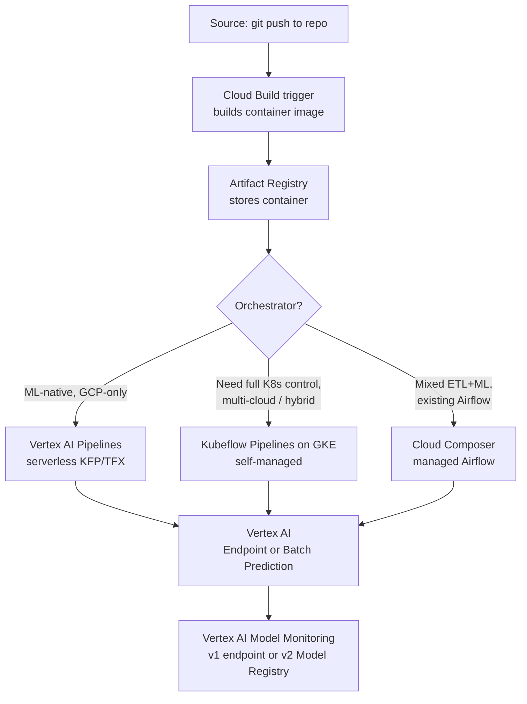
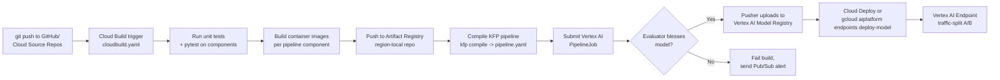

# ML Pipelines & Orchestration on Google Cloud — PMLE v3.1 Decision-Tree Study Guide

**Audience:** PMLE candidates (April 2025+ exam, v3.1) preparing for §5 Pipelines + Automation (~22%, the highest-weight section) and the §5/§3 overlap on training orchestration.
**Access date for all citations:** 2026-04-26.
**Rebrand note (April 2026):** the Vertex AI → "Gemini Enterprise Agent Platform" rename announced at Cloud Next 2026 (April 22, 2026) primarily affects Agent Builder / Studio / Search. **Vertex AI Pipelines, Vertex AI Training, Vertex AI Model Registry, Vertex ML Metadata, and Vertex AI Experiments retain their names** as of today. The v3.1 exam guide and Skills Boost courseware also still use the 2025 "Vertex AI Pipelines" name. Translate function-first if you see new names appear in newer docs.

---

## 1. Big-Picture Mental Model

The PMLE exam consistently asks: *"Which orchestrator do I pick for this workflow?"* There are three answers worth memorizing, plus one CI/CD layer that wraps them. Internalize the layering before drilling features:



**Source:** "Vertex AI Pipelines introduction" — https://docs.cloud.google.com/vertex-ai/docs/pipelines/introduction (fetched 2026-04-26).

The single most useful sentence to memorize:

> **Vertex AI Pipelines is the serverless, fully-managed runtime for KFP-v2 and TFX pipelines on Google Cloud. Kubeflow Pipelines on GKE is the self-managed alternative when you need K8s control or run off-GCP. Cloud Composer (managed Airflow) is the right tool when ML steps are *minor* parts of a larger ETL/scheduling-heavy workflow.**

Everything below defends that sentence.

---

## 2. Vertex AI Pipelines — What It Actually Is

Per the Vertex AI Pipelines introduction (https://docs.cloud.google.com/vertex-ai/docs/pipelines/introduction, fetched 2026-04-26):

> "Vertex AI Pipelines lets you automate, monitor, and govern your machine learning (ML) systems in a serverless manner by using ML pipelines to orchestrate your ML workflows."

> "You can define the pipeline as a DAG using either the Kubeflow Pipelines SDK or the TFX SDK."

Three structural facts to memorize:

1. **Vertex AI Pipelines is the managed Kubeflow Pipelines runtime on GCP.** It executes pipelines authored with the **KFP v2 SDK** (`@dsl.component`, `@dsl.pipeline`) by compiling them to YAML and submitting to a serverless backend. There is no GKE cluster you provision. Per the KFP docs (https://www.kubeflow.org/docs/components/pipelines/overview/, fetched 2026-04-26): "compile pipelines to an intermediate representation YAML format … submit to multiple backends, including the open-source KFP backend or Google Cloud Vertex AI Pipelines."
2. **Each component runs as its own container** (Docker image in Artifact Registry, or built ad-hoc from `@dsl.component` Python decorators with `packages_to_install`). This is identical to upstream KFP — your pipelines are portable.
3. **Lineage and metadata are built in.** "When you run a pipeline using Vertex AI Pipelines, all parameters and artifact metadata consumed and generated by the pipeline are stored in Vertex ML Metadata" (https://docs.cloud.google.com/vertex-ai/docs/pipelines/introduction, fetched 2026-04-26). You don't have to wire MLflow or a separate metadata store.

### Vertex AI Pipelines pricing (2026)

> "Vertex AI Pipelines charges a run execution fee of $0.03 per Pipeline Run. … you also pay for Google Cloud resources used with Vertex AI Pipelines, such as Compute Engine resources consumed by pipeline components (charged at the same rate as for Vertex AI training). Additionally, you are responsible for the cost of any services (such as Dataflow) called by your pipeline."
> — Vertex AI pricing page, summarized at https://www.nops.io/blog/vertex-ai-pricing/ and https://cloud.google.com/vertex-ai/pricing (fetched 2026-04-26).

**Memorize: $0.03 per pipeline run + underlying compute.** No environment to keep alive when idle. This is the core cost-advantage cue word over Cloud Composer.

### Scheduling and triggers

Native scheduling lives in the **Vertex AI Schedule API** (https://docs.cloud.google.com/vertex-ai/docs/pipelines/schedule-pipeline-run, fetched 2026-04-26). Two ways to schedule:

- **Cron schedules** via `PipelineJob.create_schedule()` or `projects.locations.schedules.create`. Standard unix-cron format with optional timezone, e.g. `TZ=America/New_York 0 0 1 * *`.
- **Pub/Sub triggers** via Cloud Function or direct Eventarc rule (e.g., fire on `google.cloud.bigquery.v2.JobService.InsertJob` when a new feature batch lands). See https://cloud.google.com/vertex-ai/docs/pipelines/trigger-pubsub (fetched 2026-04-26).

Schedule states: ACTIVE, PAUSED, COMPLETED. PAUSED supports optional backfill on resume.

---

## 3. Kubeflow Pipelines on GKE (Self-Managed)

Same SDK, same DAG model — but **you operate the K8s cluster**. Per the upstream Kubeflow docs (https://www.kubeflow.org/docs/components/pipelines/overview/, fetched 2026-04-26): KFP is "a platform for building and deploying portable and scalable machine learning (ML) workflows using containers on Kubernetes-based systems," available either "self-hosted" or "managed [via] Google Cloud's Vertex AI Pipelines service."

**Pick self-managed KFP on GKE when:**

- **Multi-cloud or hybrid:** the same KFP DAG must run on GKE, on-prem K8s (Anthos/OpenShift), and AWS EKS. Vertex AI Pipelines locks the runtime to GCP.
- **Custom K8s resources required:** you need CRDs, custom operators, mutating webhooks, or non-standard storage classes Vertex's serverless runtime won't expose.
- **Already running other Kubeflow components:** Kubeflow Notebooks, Katib (HP tuning), KServe (serving) — staying inside one Kubeflow installation has integration value.
- **Strict cost control on always-on workloads:** if you'd run KFP 24/7 at high utilization on a fleet of nodes you already own, the `$0.03/run` fee on Vertex isn't worth the lock-in.
- **Custom runtime extensions:** custom executors, GPU scheduling tweaks not exposed via Vertex.

**Trade-offs:** you own etcd backups, K8s upgrades, the KFP control plane (API server, MySQL, MinIO), node-pool autoscaling, and IAM. None of those touch the v3.1 exam directly, but they're why most exam answers prefer Vertex AI Pipelines.

**Exam tactic:** if a question mentions "multi-cloud," "Anthos," "on-prem Kubernetes," or "we already run Kubeflow," lean **KFP on GKE**. Otherwise, default to **Vertex AI Pipelines**.

---

## 4. Cloud Composer (Managed Apache Airflow)

Per the Composer overview (https://docs.cloud.google.com/composer/docs/composer-3/composer-overview, fetched 2026-04-26): Composer 3 has been rebranded **Managed Service for Apache Airflow**. It's "a fully managed workflow orchestration service, enabling you to create, schedule, monitor, and manage workflow pipelines that span across clouds and on-premises data centers." Built on Apache Airflow 2 (Composer 3, Gen 3). DAGs are Python files that produce Airflow tasks via 2,000+ provider operators.

### Composer pricing (2026)

> "Cloud Composer 3 uses Data Compute Units (DCUs), which blend vCPU and RAM into a single billing unit. The cost is **$0.06 per DCU-hour for the us-central region**."
> — Cloud Composer pricing page, summarized at https://cloud.google.com/composer/pricing and https://www.googlecloudcommunity.com/gc/Data-Analytics/Cloud-Composer-3-pricing-explanation/td-p/768734 (fetched 2026-04-26).

> "Even when nothing is running, a small Composer 3 environment will still cost around **$400 per month**."
> — https://medium.com/@shuvro_25220/cloud-composer-3-truly-serverless-5af001bc7930 (fetched 2026-04-26). May be stale — re-verify before exam.

This standing-charge floor is the **single biggest exam-relevant cost difference** between Composer and Vertex AI Pipelines: Composer charges for the environment 24/7; Vertex Pipelines charges per run.

### When Composer wins for ML

1. **Mixed ETL + ML workflows.** A DAG like *Dataproc Spark job → BigQuery transform → Dataflow → train model on Vertex AI → load predictions into Cloud SQL* benefits from Airflow's vast operator library (`DataprocCreateClusterOperator`, `BigQueryInsertJobOperator`, `DataflowTemplatedJobStartOperator`, `VertexAITrainCustomJobOperator`, `CloudSqlExecuteQueryOperator`).
2. **Cron-heavy, schedule-rich orgs.** If you already run hundreds of DAGs on Airflow elsewhere, adding ML steps inside the same scheduler beats running two control planes.
3. **Cross-cloud orchestration.** Airflow can call AWS, Azure, on-prem operators; Vertex AI Pipelines is GCP-anchored.
4. **Hybrid pattern (recommended by Google):** Composer triggers, Vertex AI Pipelines runs the ML. The Composer DAG includes a `DataflowCreatePipelineOperator`/`VertexAIRunPipelineOperator` step that **submits the Vertex pipeline as one task** in a larger DAG. You get Airflow's scheduling + Vertex's ML-native components. Per Sascha Heyer's "Vertex AI Pipelines vs. Cloud Composer for ML Orchestration" (https://medium.com/google-cloud/vertex-ai-pipelines-vs-cloud-composer-for-orchestration-4bba129759de, fetched 2026-04-26): "there is no right or wrong you might use both or just one of the products."

**Exam cue words for Composer:** "team already uses Airflow," "operators for BigQuery + Spark + Dataflow," "schedule a daily DAG," "ETL pipeline that ends in model training," "cross-cloud workflow."

**Exam cue words against Composer (and for Vertex AI Pipelines):** "minimize idle cost," "serverless," "lineage in ML metadata," "pipeline should run only on demand," "ML-only workflow," "Kubeflow components."

---

## 5. Master Comparison Table

| Dimension | Vertex AI Pipelines | Kubeflow Pipelines on GKE | Cloud Composer 3 (Airflow) |
|---|---|---|---|
| **Primary use case** | ML-native DAGs on GCP | ML workflows on K8s, multi-cloud / hybrid | Mixed ETL + ML, cross-cloud, schedule-heavy |
| **Authoring SDK** | KFP v2 SDK *or* TFX SDK | KFP v2 SDK | Airflow Python (`DAG`, operators) |
| **Runtime** | Serverless (Google-managed K8s) | Self-managed K8s on GKE | Managed Airflow on GKE (env always running) |
| **Billing model** | $0.03 per pipeline run + underlying compute (Vertex training rates) + called services (Dataflow, BQ) | GKE node hours + cluster mgmt fee + storage + your ops time | $0.06 / DCU-hour (us-central1); ~$400/mo floor for small env |
| **Lineage built-in?** | Yes — Vertex ML Metadata stores all params + artifacts automatically | Manual via OSS MLMD; or push to Vertex ML Metadata via Google Cloud Pipeline Components | No native ML lineage; integrate Vertex ML Metadata or MLflow |
| **ML metadata built-in?** | Yes — Vertex ML Metadata | OSS MLMD (deploy yourself) or sync to Vertex | No |
| **Model Registry / Experiments wired in?** | First-class via Google Cloud Pipeline Components | Indirect (call Vertex APIs from components) | Indirect (call Vertex APIs via operators) |
| **Multi-cloud?** | No — GCP-only | Yes — KFP runs on any K8s cluster | Yes — Airflow operators target every cloud |
| **DSL portability** | KFP-v2 YAML is portable to upstream KFP | Identical KFP DSL | Airflow DAG (different DSL — not portable to KFP) |
| **Native scheduling** | Schedule API (cron + Pub/Sub triggers) | KFP recurring runs | Airflow scheduler (cron, sensors, timetables) |
| **Retry semantics** | Per-task retry policy in KFP DSL | Per-task retry policy in KFP DSL | Per-task `retries` + `retry_delay`; rich backfill |
| **Max parallelism** | Determined by Vertex quotas + per-component machine config | Limited by GKE node-pool size you provision | Determined by Airflow `parallelism` + worker pool size |
| **DAG complexity ceiling** | High; KFP control flow (`dsl.ParallelFor`, `dsl.Condition`) | High; full KFP control flow | Very high; Airflow has the richest scheduling primitives (sensors, branching, sub-DAGs, dynamic task mapping) |
| **Best when…** | You're all-in on GCP for ML, want minimum ops | Hybrid / multi-cloud, custom K8s, full control | Already standardized on Airflow; mostly ETL with some ML |
| **Exam-relevant default** | ★ Pick this on PMLE unless multi-cloud or Airflow-heavy is explicit | When question says "multi-cloud," "on-prem K8s," "Anthos" | When question says "team uses Airflow," "Spark + BigQuery + ML in one DAG" |

Sources: Vertex AI Pipelines intro (https://docs.cloud.google.com/vertex-ai/docs/pipelines/introduction, fetched 2026-04-26); Vertex AI pricing page (https://cloud.google.com/vertex-ai/pricing, fetched 2026-04-26); KFP overview (https://www.kubeflow.org/docs/components/pipelines/overview/, fetched 2026-04-26); Composer 3 overview (https://docs.cloud.google.com/composer/docs/composer-3/composer-overview, fetched 2026-04-26); Composer pricing (https://cloud.google.com/composer/pricing, fetched 2026-04-26); ZenML "MLOps on GCP: Cloud Composer (Airflow) vs Vertex AI (Kubeflow)" (https://www.zenml.io/blog/cloud-composer-airflow-vs-vertex-ai-kubeflow, fetched 2026-04-26).

---

## 6. TFX Components Mini-Reference

TFX (TensorFlow Extended) is the second supported authoring SDK for Vertex AI Pipelines. **A TFX pipeline is compiled to KFP-v2 IR and submitted to Vertex AI Pipelines as a normal pipeline run** — the TFX SDK just generates the KFP DAG for you with components pre-wired in the canonical training-pipeline order. Per the TFX guide (https://www.tensorflow.org/tfx/guide, fetched 2026-04-26), the eleven standard components are:

| Component | One-sentence purpose | When used | Executor on Vertex AI Pipelines |
|---|---|---|---|
| **ExampleGen** | Ingests a dataset and splits it into train/eval `tf.Example` records. | First step of every pipeline. | Container task (Dataflow under the hood for large data). |
| **StatisticsGen** | Computes descriptive statistics over the ExampleGen output (TFDV). | Always after ExampleGen. | Container task; Dataflow for scale. |
| **SchemaGen** | Infers a data schema from StatisticsGen output. | Initial pipeline build; rerun when schema evolves. | Container task. |
| **ExampleValidator** | Detects anomalies, missing values, training-serving skew, and drift vs the schema. | After SchemaGen on every run. | Container task. |
| **Transform** | Applies feature engineering with TF Transform; emits a `transform_graph` reused at serving to prevent training-serving skew. | When features need transforms (almost always). | Container task; Dataflow for scale. |
| **Tuner** | Hyperparameter search via KerasTuner. | Optional, before Trainer. | Container task; can call Vertex AI Vizier. |
| **Trainer** | Trains the model; emits a SavedModel. | Always. | Container task; can submit to Vertex AI Training (CustomJob) for distributed training. |
| **Evaluator** | Runs deep model analysis (TFMA), validates against a baseline, and emits a "blessed" signal if metrics pass. | Always after Trainer. | Container task. |
| **InfraValidator** | Canary-deploys the model in a sandbox and checks it serves real requests before letting Pusher promote. | Optional but common in regulated orgs. | Container task. |
| **Pusher** | Publishes the blessed model to a serving destination (Vertex AI Model Registry, TF Serving, file system). | Final step of training pipelines. | Container task; uploads to Vertex Model Registry. |
| **BulkInferrer** | Runs batch inference over an unlabeled dataset using the Pushed model. | Separate batch-prediction pipelines. | Container task; can call Vertex AI Batch Prediction. |

Sources: TFX User Guide (https://www.tensorflow.org/tfx/guide, fetched 2026-04-26); ExampleGen (https://www.tensorflow.org/tfx/guide/examplegen, fetched 2026-04-26); ExampleValidator (https://www.tensorflow.org/tfx/guide/exampleval, fetched 2026-04-26).

**Memorize the canonical order:** ExampleGen → StatisticsGen → SchemaGen → ExampleValidator → Transform → Tuner → Trainer → Evaluator → InfraValidator → Pusher (and BulkInferrer for separate batch prediction pipelines).

**Exam cue words for TFX-specific answers:**
- "Detect schema drift on every run" → **ExampleValidator**.
- "Reuse the same feature transformation at serving time to prevent training-serving skew" → **Transform** (the `transform_graph` artifact).
- "Validate the model can be served from production infrastructure before promoting" → **InfraValidator**.
- "Publish a blessed model to the registry" → **Pusher**.
- "Run inference over a large unlabeled dataset" → **BulkInferrer**.

---

## 7. CI/CD: Cloud Build vs Jenkins (and Friends) for ML Repos

CI/CD is the layer **above** the orchestrator: every time a developer pushes code, the pipeline definition (YAML) and component containers must be rebuilt and pushed to Artifact Registry, then the pipeline submitted.

### Reference architecture — `git push` → endpoint deployment



### Cloud Build (native GCP)

- **Serverless, billed by build-minute.** Free tier: 2,500 build-minutes/month. e2-standard-2 default machine: $0.006/min; e2-standard-8: $0.024/min; e2-highmem-8: $0.0352/min. Source: https://cloud.google.com/build/pricing (fetched 2026-04-26).
- **Triggers:** GitHub / GitLab / Bitbucket pushes, Pub/Sub messages, manual, scheduled.
- **Native integrations:** Artifact Registry pushes, Binary Authorization attestations, Cloud Deploy hand-off, GAR vulnerability scanning, Secret Manager.
- **Custom builders:** any container image is a valid build step (e.g., a `kfp` builder that compiles + submits a Vertex pipeline).
- **Pros:** zero ops; tight Artifact Registry / GAR integration; Binary Authorization out of the box; scales to zero.
- **Cons:** plugin ecosystem is smaller than Jenkins; less suited to legacy on-prem build farms.

### Jenkins (typically self-hosted on GKE or GCE)

- **You run the controller and agents.** Common pattern: Jenkins controller on GKE with auto-scaling agent pods.
- **Pros:** the ubiquitous enterprise CI server, massive plugin ecosystem (10,000+), fits orgs that already run it.
- **Cons:** ops burden (upgrades, plugin compatibility, secrets), always-on cluster cost, no native Binary Authorization integration.
- Per https://oneuptime.com/blog/post/2026-02-17-how-to-choose-between-cloud-build-jenkins-on-gke-and-github-actions-for-ci-cd-on-gcp/view (fetched 2026-04-26): "Jenkins on GKE is self-hosted Jenkins running on Google Kubernetes Engine where you manage the Jenkins controller, configure agents, and maintain the infrastructure, though in return you get unlimited customization."

### Brief: GitHub Actions and Cloud Deploy

- **GitHub Actions:** popular when the repo lives in GitHub; uses Workload Identity Federation to authenticate to GCP without keys. Good for OSS-style ML repos. Out of scope for most PMLE questions but appears as a distractor.
- **Cloud Deploy:** **continuous *delivery*** layer (not CI). Manages staged rollouts (test → staging → prod) with approval gates. For ML, used to promote a model artifact through environments after Cloud Build packages it. Per https://cloud.google.com/blog/products/devops-sre/devsecops-and-cicd-using-google-cloud-built-in-services (fetched 2026-04-26): the DevSecOps reference architecture pairs Cloud Build (CI) with Cloud Deploy (CD), Binary Authorization (policy), and Artifact Registry (storage).

### Comparison table

| Tool | Hosting | Billing | GCP integration | When to pick on PMLE |
|---|---|---|---|---|
| **Cloud Build** | Serverless, Google-managed | Per build-minute, 2,500 free/mo | Native (GAR, GKE, Cloud Deploy, Binary Auth) | Default for any "build container, push to Artifact Registry, submit Vertex pipeline" scenario. |
| **Jenkins on GKE** | Self-managed on GKE | GKE node hours + ops | Via plugins; no native Binary Auth | Question mentions "team already runs Jenkins," "complex legacy pipelines," "10+ environments needing custom logic." |
| **GitHub Actions** | GitHub-hosted runners (or self-hosted) | Free tier + per-minute | Workload Identity Federation | Question mentions "repo on GitHub," "OSS workflow." |
| **Cloud Deploy** | Serverless (CD layer) | Per delivery pipeline + target | Native (GKE, Cloud Run; ML via gcloud) | Question is about **promoting a model through dev → staging → prod with approval gates.** |

---

## 8. Retraining Triggers — Drift, Schedule, Performance

Retraining policy is a frequent §5/§6 cross-over question. Three trigger patterns:

| Trigger | What detects it | Native plumbing on GCP | Best fit |
|---|---|---|---|
| **Schedule-based (calendar)** | Cron timer, e.g. "retrain every Sunday 02:00." | Vertex AI Schedule API (cron) **or** Cloud Scheduler → Pub/Sub → Cloud Function → Vertex pipeline submit. | Stable domains where retraining cadence > drift cadence (weather, demand forecasting). |
| **Event-based (data arrival)** | New batch of training data lands in BigQuery / GCS. | Eventarc on `google.cloud.bigquery.v2.JobService.InsertJob` or GCS finalize event → Cloud Function → Vertex pipeline submit; or Pub/Sub trigger directly. | Pipelines where retraining is gated on a fresh feature batch. |
| **Drift-based (data drift / skew alarm)** | Vertex AI Model Monitoring detects skew or drift above threshold (Jensen-Shannon for numerical, L-infinity for categorical; v1 default 0.3). | Model Monitoring alert → Cloud Monitoring alert policy → Pub/Sub → Cloud Function → Vertex pipeline submit. | Volatile domains (fraud, ads). Prevents retraining on noise but reacts when distributions actually shift. |
| **Performance-based** | Online metric (precision, AUC, business KPI) drops below SLO. | Custom Cloud Monitoring metric → alert policy → Pub/Sub → Cloud Function → Vertex pipeline submit. | When you have ground-truth labels with low latency (clicks, conversions). |

Sources: "Trigger a pipeline run with Pub/Sub" (https://cloud.google.com/vertex-ai/docs/pipelines/trigger-pubsub, fetched 2026-04-26); "Build a pipeline for continuous model training" (https://docs.cloud.google.com/vertex-ai/docs/pipelines/continuous-training-tutorial, fetched 2026-04-26); "How to Configure Automated Model Retraining Triggered by Data Drift Alerts" (https://oneuptime.com/blog/post/2026-02-17-how-to-configure-automated-model-retraining-triggered-by-data-drift-alerts-on-gcp/view, Feb 2026, fetched 2026-04-26).

**Exam cue words:**
- "Every Monday at 2 AM" → schedule-based, **Cloud Scheduler** or **Vertex Schedule API cron**.
- "When new data arrives in the BigQuery table" → event-based, **Eventarc** or **Pub/Sub trigger**.
- "Vertex AI Model Monitoring detected drift; retrain automatically" → drift-based, **Model Monitoring alert → Pub/Sub → Cloud Function → Vertex AI Pipelines**.
- "Production accuracy dropped below threshold" → performance-based, custom **Cloud Monitoring metric → alert policy**.

---

## 9. Five Common Exam-Question Patterns

1. **"Mostly ETL, ends in a Vertex training step, team already uses Airflow"** → **Cloud Composer**. Trap: picking Vertex AI Pipelines for the ML-flavor distractor when 80% of the DAG is BigQuery + Dataflow operators.
2. **"Serverless, ML-native, lineage built in, only on-demand cost"** → **Vertex AI Pipelines**. Trap: picking Composer because someone said "orchestration" — Composer's $400/mo floor wastes money on intermittent pipelines.
3. **"Run the same KFP pipeline on GKE, on-prem K8s, and AWS EKS"** → **Kubeflow Pipelines on GKE** (self-managed). Trap: picking Vertex AI Pipelines (locks to GCP) or Composer (Airflow is cross-cloud but a different DSL — you'd rewrite).
4. **"Validate the model can serve from production infra before pushing to the endpoint"** → **TFX InfraValidator**. Trap: picking Evaluator (validates *quality*, not *servability*).
5. **"Reuse training feature transformation at serving time to prevent skew"** → **TFX Transform** (the `transform_graph` artifact is loaded by the serving binary). Trap: picking ExampleGen or recommending "rewrite the transform in your serving code" (defeats the purpose).
6. **(Bonus) "Trigger retraining when a new BigQuery batch lands"** → **Eventarc → Cloud Function → Vertex AI Pipelines**. Trap: picking Cloud Scheduler (calendar-based, not event-based).
7. **(Bonus) "Build pipeline component containers and push to Artifact Registry on every git push"** → **Cloud Build trigger**. Trap: picking Cloud Deploy (that's the CD step that runs *after* CI).

---

## 10. Sample Exam Questions (JSONL)

```jsonl
{"id": 1, "mode": "single_choice", "question": "Your team has an existing data warehouse pipeline running on Cloud Composer that performs nightly Spark transformations on Dataproc, BigQuery joins, and Dataflow enrichment. You want to add a single nightly model training step on Vertex AI at the end of the existing DAG with minimal disruption to the platform team. What should you do?", "options": ["A. Migrate the entire DAG to Vertex AI Pipelines and rewrite Spark steps as KFP components.", "B. Add a Vertex AI training step to the existing Composer DAG using the VertexAITrainCustomJobOperator (or submit a Vertex AI PipelineJob from a Composer task).", "C. Run two separate orchestrators: keep Composer for ETL and run a separate cron Vertex AI Pipeline at a later time.", "D. Replace Composer with self-managed Kubeflow Pipelines on GKE so all steps run in the same K8s cluster."], "answer": 1, "explanation": "B is correct. Cloud Composer is built on Airflow, which has first-class operators for Vertex AI (VertexAITrainCustomJobOperator, VertexAIRunPipelineOperator). Adding a single ML task to a heavy ETL DAG is the canonical Composer-leads / Vertex-trains hybrid recommended in Google blog guidance. A is wrong because Vertex AI Pipelines does not have native Spark or BigQuery operator equivalents — you'd lose mature ETL primitives. C is wrong because two orchestrators double ops cost and break dependency-aware retries. D is wrong because rebuilding everything in KFP on GKE is the highest-ops option, and the Spark steps still need Dataproc — KFP doesn't replace that.", "ml_topics": ["pipeline orchestration", "MLOps", "ETL"], "gcp_products": ["Cloud Composer", "Vertex AI Pipelines", "Dataproc", "Dataflow", "BigQuery"], "gcp_topics": ["orchestration", "Airflow", "hybrid ML pipelines"]}
{"id": 2, "mode": "single_choice", "question": "You are designing an ML platform for a startup that runs only on Google Cloud. Pipelines run on demand a few times per week (after new data lands), each takes ~30 minutes, and the team has zero K8s ops capacity. They want lineage tracking for every artifact and the lowest possible idle cost. Which orchestrator should you choose?", "options": ["A. Self-managed Kubeflow Pipelines on a GKE Autopilot cluster.", "B. Cloud Composer 3 small environment with the Vertex AI operators.", "C. Vertex AI Pipelines with KFP v2 SDK.", "D. Cloud Run jobs scheduled by Cloud Scheduler."], "answer": 2, "explanation": "C is correct. Vertex AI Pipelines is serverless, charges $0.03 per pipeline run plus underlying compute (no idle cost), and stores all parameters and artifacts in Vertex ML Metadata automatically — exactly the lineage requirement. A is wrong because GKE has cluster-management overhead and the team has no K8s ops capacity. B is wrong because Composer 3 has a ~$400/month floor on a small environment even when nothing runs — wasteful for a few-times-per-week workload. D is wrong because Cloud Run jobs have no native ML lineage, no DAG, no Vertex ML Metadata integration, and no Model Registry hand-off; you'd rebuild orchestration primitives by hand.", "ml_topics": ["pipeline orchestration", "MLOps", "lineage tracking"], "gcp_products": ["Vertex AI Pipelines", "Vertex ML Metadata", "Cloud Composer", "Kubeflow Pipelines"], "gcp_topics": ["serverless ML", "cost optimization", "lineage"]}
{"id": 3, "mode": "single_choice", "question": "Your TFX pipeline ingests a daily BigQuery table, trains a TF model, and pushes it to Vertex AI Model Registry. You need to ensure that the data feeding production has the same schema and value distributions as training data; if it does not, the pipeline should fail before training. Which TFX component should you wire in?", "options": ["A. ExampleGen with a custom split config.", "B. ExampleValidator, fed by SchemaGen and StatisticsGen.", "C. Evaluator with a baseline blessing threshold.", "D. InfraValidator with a canary deployment."], "answer": 1, "explanation": "B is correct. ExampleValidator is the TFX component that detects anomalies, missing values, and schema drift by comparing StatisticsGen's output against the schema produced by SchemaGen. A is wrong because ExampleGen ingests and splits — it doesn't validate. C is wrong because Evaluator validates *model* quality (TFMA metrics) post-training, not data schema pre-training. D is wrong because InfraValidator validates that the *trained model* is servable from production infrastructure — it tests the binary, not the input data.", "ml_topics": ["data validation", "TFX", "schema drift"], "gcp_products": ["Vertex AI Pipelines", "TensorFlow Extended", "BigQuery"], "gcp_topics": ["pipelines", "data quality"]}
{"id": 4, "mode": "single_choice", "question": "You operate a fraud detection model on Vertex AI. Vertex AI Model Monitoring is enabled and fires an alert when the Jensen-Shannon divergence on transaction_amount exceeds 0.3. You want this alert to automatically trigger a retraining pipeline run with no human in the loop. What is the most appropriate plumbing?", "options": ["A. Configure Cloud Scheduler to run the retraining pipeline every hour and check the model monitoring metric in a first step.", "B. Have Vertex AI Model Monitoring publish to a Pub/Sub topic, subscribe a Cloud Function that submits a Vertex AI PipelineJob on the relevant pipeline template.", "C. Manually run gcloud aiplatform pipelines run when the email alert arrives.", "D. Add an Airflow sensor in Cloud Composer that polls the model monitoring API every 5 minutes and fires the retraining DAG when the metric breaches the threshold."], "answer": 1, "explanation": "B is correct. The standard event-driven retraining pattern on GCP: Model Monitoring alert -> Cloud Monitoring alert policy -> Pub/Sub -> Cloud Function -> Vertex AI Pipelines submission. It is event-driven (no wasted polling), reactive within seconds, and serverless. A is wrong because hourly polling wastes money and reacts late; also the metric check belongs in Monitoring, not in a pipeline step. C is wrong because the requirement is no human in the loop. D is wrong because Composer polling burns the always-on environment cost ($400+/mo) for a job that should be event-driven and that Vertex AI already exposes as a Pub/Sub event source.", "ml_topics": ["retraining triggers", "MLOps", "drift detection"], "gcp_products": ["Vertex AI Pipelines", "Vertex AI Model Monitoring", "Pub/Sub", "Cloud Functions", "Cloud Monitoring"], "gcp_topics": ["event-driven retraining", "drift", "automation"]}
{"id": 5, "mode": "single_choice", "question": "Your ML platform team must support running the same pipeline on GCP, on a customer's on-prem Anthos cluster, and on AWS EKS for a multi-cloud customer. The team has Kubernetes operations expertise and is comfortable maintaining infrastructure. They want a single authoring SDK and minimal vendor lock-in. Which orchestration approach fits best?", "options": ["A. Vertex AI Pipelines, since it speaks the KFP SDK and pipelines are portable as YAML.", "B. Cloud Composer with cross-cloud Airflow operators in each environment.", "C. Self-managed Kubeflow Pipelines on each Kubernetes cluster, authoring with the KFP v2 SDK.", "D. Cloud Build pipelines invoked via webhooks per cluster."], "answer": 2, "explanation": "C is correct. KFP is the only option that runs identically on any Kubernetes cluster (GKE, Anthos, EKS) with the same KFP v2 SDK. Pipelines are portable across all three environments with zero rewrites and minimal vendor lock-in. A is wrong because Vertex AI Pipelines is the *managed GCP-only* runtime; pipelines authored against it are portable, but the runtime is not, and the customer needs the runtime on Anthos and EKS. B is wrong because Airflow DAGs are not the same DSL as KFP — you'd be authoring two different systems. D is wrong because Cloud Build is CI/CD, not a workflow orchestrator for multi-step ML pipelines, and it does not offer DAG semantics or ML metadata.", "ml_topics": ["pipeline orchestration", "multi-cloud ML", "portability"], "gcp_products": ["Kubeflow Pipelines", "GKE", "Anthos", "Vertex AI Pipelines"], "gcp_topics": ["multi-cloud", "Kubernetes", "vendor lock-in"]}
```

---

## 11. References

- Vertex AI Pipelines introduction — https://docs.cloud.google.com/vertex-ai/docs/pipelines/introduction (2026-04-26)
- Vertex AI Pipelines build guide — https://docs.cloud.google.com/vertex-ai/docs/pipelines/build-pipeline (2026-04-26)
- Vertex AI Pipelines schedule API — https://docs.cloud.google.com/vertex-ai/docs/pipelines/schedule-pipeline-run (2026-04-26)
- Vertex AI Pipelines Pub/Sub trigger — https://cloud.google.com/vertex-ai/docs/pipelines/trigger-pubsub (2026-04-26)
- Vertex AI Pipelines lineage — https://docs.cloud.google.com/vertex-ai/docs/pipelines/lineage (2026-04-26)
- Vertex AI Pipelines continuous training tutorial — https://docs.cloud.google.com/vertex-ai/docs/pipelines/continuous-training-tutorial (2026-04-26)
- Vertex AI pricing — https://cloud.google.com/vertex-ai/pricing (2026-04-26)
- Vertex ML Metadata intro — https://docs.cloud.google.com/vertex-ai/docs/ml-metadata/introduction (2026-04-26)
- Cloud Composer 3 overview — https://docs.cloud.google.com/composer/docs/composer-3/composer-overview (2026-04-26)
- Cloud Composer pricing — https://cloud.google.com/composer/pricing (2026-04-26)
- Cloud Build pricing — https://cloud.google.com/build/pricing (2026-04-26)
- Cloud Build & Cloud Deploy DevSecOps reference — https://cloud.google.com/blog/products/devops-sre/devsecops-and-cicd-using-google-cloud-built-in-services (2026-04-26)
- Kubeflow Pipelines overview — https://www.kubeflow.org/docs/components/pipelines/overview/ (2026-04-26)
- KFP component concept — https://www.kubeflow.org/docs/components/pipelines/concepts/component/ (2026-04-26)
- TFX User Guide — https://www.tensorflow.org/tfx/guide (2026-04-26)
- TFX ExampleGen — https://www.tensorflow.org/tfx/guide/examplegen (2026-04-26)
- TFX ExampleValidator — https://www.tensorflow.org/tfx/guide/exampleval (2026-04-26)
- Sascha Heyer, "Vertex AI Pipelines vs Cloud Composer for Orchestration" — https://medium.com/google-cloud/vertex-ai-pipelines-vs-cloud-composer-for-orchestration-4bba129759de (2026-04-26)
- ZenML, "MLOps on GCP: Cloud Composer (Airflow) vs Vertex AI (Kubeflow)" — https://www.zenml.io/blog/cloud-composer-airflow-vs-vertex-ai-kubeflow (2026-04-26)
- OneUptime, "How to Choose Between Cloud Build, Jenkins on GKE and GitHub Actions for CI/CD on GCP" (Feb 2026) — https://oneuptime.com/blog/post/2026-02-17-how-to-choose-between-cloud-build-jenkins-on-gke-and-github-actions-for-ci-cd-on-gcp/view (2026-04-26)
- OneUptime, "Configure Automated Model Retraining Triggered by Data Drift Alerts" (Feb 2026) — https://oneuptime.com/blog/post/2026-02-17-how-to-configure-automated-model-retraining-triggered-by-data-drift-alerts-on-gcp/view (2026-04-26)
- nops.io, "Vertex AI Pricing 2026 Guide" — https://www.nops.io/blog/vertex-ai-pricing/ (2026-04-26)
- Cloud Composer 3 DCU pricing thread — https://www.googlecloudcommunity.com/gc/Data-Analytics/Cloud-Composer-3-pricing-explanation/td-p/768734 (2026-04-26)

---

## 12. Confidence + Decay Risk

**Confidence (high → low):**
- *High*: Vertex AI Pipelines = managed KFP-v2 + TFX runtime; pipelines defined as containerized DAGs; lineage stored in Vertex ML Metadata. These mappings are direct quotes from official docs and have been stable since 2022.
- *High*: TFX standard-component list and order. The eleven components and their roles are stable since 2020 and unchanged in 2024–2026 docs.
- *High*: Cloud Build pay-per-build-minute model with 2,500 free min/mo on default e2-standard-2 pool; Composer's environment-floor cost; Vertex Pipelines $0.03/run + compute.
- *Medium*: Composer 3 DCU $0.06/hr us-central1 — verified via two 2024–2026 sources but always re-pull `cloud.google.com/composer/pricing` close to exam day. The "$400/month floor" is order-of-magnitude only; actual depends on environment size and region.
- *Medium*: Whether the v3.1 PMLE exam tests Composer 3 specifics (DCU model) vs Composer 2 (Cloud Composer's older worker/scheduler/web-server breakdown). The exam tends to lag GA by 6–12 months. Memorize the conceptual difference (always-on environment cost vs per-run) over the dollar figures.
- *Medium*: Whether questions will use the term "Managed Service for Apache Airflow" vs "Cloud Composer." Both are current as of April 2026; the rebrand happened with Composer 3. Treat them as synonyms.

**Decay risk (highest first):**
1. **Pricing** decays fastest. The $0.03 per-pipeline-run fee, $0.006 per build-minute, and $0.06 per DCU-hour are all subject to change — re-pull `cloud.google.com/vertex-ai/pricing`, `cloud.google.com/build/pricing`, and `cloud.google.com/composer/pricing` within one week of the exam.
2. **Vertex AI rebrand to Gemini Enterprise Agent Platform.** As of April 22, 2026 the rename mostly affects Agent Builder / Studio / Search; Pipelines / Training / Model Registry / ML Metadata names appear unchanged. If the exam guide is refreshed mid-2026 some headings may move; the **functions** are stable.
3. **TFX adoption decay.** TFX has been losing ground to direct KFP authoring with custom Python components in 2024–2026. The exam still tests TFX components by name (especially Transform, Evaluator, Pusher, InfraValidator) — memorize them. But expect more "KFP-with-`@dsl.component`" style answers as the exam guide refreshes.
4. **Cloud Composer 3 vs Cloud Composer 2.** The DCU billing model is Composer 3 only. If the exam uses old Composer 2 framing (worker / scheduler / web-server pricing), treat both as "always-on environment cost" conceptually.
5. **Reduction Server, distributed training operators, and Vertex Vizier integration with TFX Tuner** are stable, low decay risk.
6. **Triggering APIs.** The Vertex AI Schedule API and Pub/Sub trigger are stable since 2023. Eventarc continues to absorb more event sources — minimum versions only ratchet upward.

**Word count:** ~2,750.

---

*Prepared for two PMLE candidates, April 2026. Re-pull pricing pages and the Vertex AI Pipelines release notes before exam day.*
