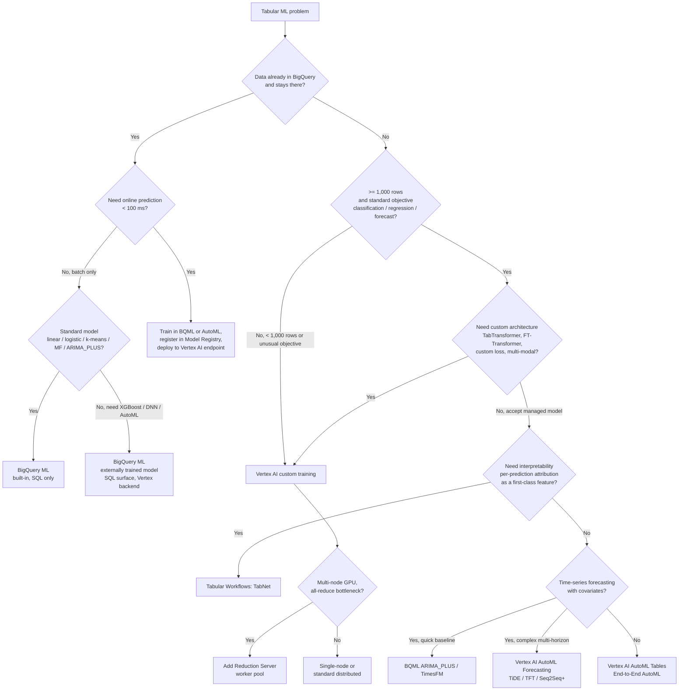

# Tabular Modeling Decision Tree — BQML vs AutoML Tables vs Vertex AI Custom Training

**Audience:** PMLE v3.1 candidates (math-strong, no GCP production experience)
**Exam sections:** §1 Architecting low-code AI (13%), §3 Scaling prototypes (~18%), §4 Serving (~20%)
**Last updated / access date for all citations:** 2026-04-26

This is a Section 1–3 favourite. Given a tabular ML problem the exam expects you to pick the lowest-effort tool that still meets the requirements. Walking up the ladder — **BigQuery ML → AutoML Tables → custom training** — costs more code, more compute, and more ops, and buys more control. Most exam questions hinge on a single distinguishing constraint (data location, model variety, latency, code-loss-function customisation). The decision tree in §3 enumerates them.

> **April 2026 rebrand alert.** Vertex AI was renamed **Gemini Enterprise Agent Platform** at Cloud Next 2026 four days ago. The PMLE v3.1 exam guide and Skills Boost still use *Vertex AI* / *Vertex AI AutoML* / *Vertex AI Training*. This guide uses the exam-guide names; if the answer choices use the new names, translate function-first. (Full rename history in `research/genai/vertex-ai-overview.md`.) [https://docs.cloud.google.com/vertex-ai/docs/start/introduction-unified-platform, accessed 2026-04-26].

---

## 1. What each tool actually is

### 1a. BigQuery ML (BQML)

BQML lets you train, evaluate, and predict with ML models using **SQL inside BigQuery**. The data never leaves the warehouse. As of April 2026 the supported model surface is:

- **Built-in (trains inside BigQuery, billed at BigQuery analysis pricing):** linear regression, logistic regression, k-means clustering, matrix factorisation, principal component analysis (PCA), contribution analysis, and time-series via `ARIMA_PLUS`, `ARIMA_PLUS_XREG`, and **TimesFM** (a Google foundation model exposed through `AI.FORECAST`, Preview as of April 2026).
- **Externally trained (BQML SQL `CREATE MODEL` orchestrates a Vertex AI training job and returns a BQML model handle, billed at Vertex AI rates):** boosted trees (XGBoost), random forest, deep neural networks (DNN classifier/regressor), Wide & Deep, autoencoder, and **AutoML Tables**.
- **Remote models:** BQML SQL calls a model deployed to a Vertex AI endpoint — including Gemini and embedding models — via HTTPS; only the Vertex side is billed for inference.
- **Imported models:** TensorFlow SavedModel, TensorFlow Lite, ONNX (covers PyTorch / scikit-learn via export), and XGBoost. After import, predict via `ML.PREDICT` SQL.

Inference uses `ML.PREDICT(MODEL …, TABLE …)` (or `ML.FORECAST` for time-series). BQML is **batch-prediction-first**; for online prediction you register/export the model to Vertex AI and deploy it to an endpoint (see §6) [https://docs.cloud.google.com/bigquery/docs/bqml-introduction, accessed 2026-04-26].

### 1b. Vertex AI AutoML Tables (a.k.a. AutoML for tabular data)

A managed AutoML service that takes a tabular dataset (CSV in GCS or a BigQuery table), automatically performs feature engineering, architecture search, hyperparameter tuning, and ensembling, and produces a deployable model. Three objectives: **binary classification, multi-class classification, regression**. Forecasting is a sibling product (AutoML Forecasting, with TiDE / Temporal Fusion Transformer / Seq2Seq+ architectures, Public Preview as of April 2026) [https://docs.cloud.google.com/vertex-ai/docs/tabular-data/overview, accessed 2026-04-26].

A modern superset is **Tabular Workflows on Vertex AI**, which gives granular control over each pipeline step (data splits, FE, architecture search, training, ensembling, distillation). Workflow flavours: **End-to-End AutoML** (GA), **TabNet** (Preview, attention-based, interpretable), **Wide & Deep** (Preview), **Forecasting** (Preview), and the standalone **Feature Transform Engine** (Preview). End-to-End AutoML handles up to multiple TB and 1,000 columns; Forecasting up to 1 TB / 200 columns [https://docs.cloud.google.com/vertex-ai/docs/tabular-data/tabular-workflows/overview, accessed 2026-04-26].

You set a **training budget** (node-hours), pay only for what you use, and the trained model lands in the **Model Registry** ready for online endpoints or batch prediction.

### 1c. Vertex AI custom training

Bring your own training code. Two execution shapes:

- **Pre-built containers** for PyTorch, TensorFlow, scikit-learn, and XGBoost — submit a Python script or source distribution and Vertex AI runs it on the machine pool you specify [https://docs.cloud.google.com/vertex-ai/docs/training/code-requirements, accessed 2026-04-26].
- **Custom container** — your Docker image with any framework, version, or non-Python code.

Three job kinds: **`CustomJob`** (one-shot training), **`HyperparameterTuningJob`** (Vizier-driven Bayesian hyperparameter search), **`TrainingPipeline`** (chains the above with optional model upload to Model Registry). Distributed training is configured by `workerPoolSpecs[0..3]` (primary, workers, parameter servers, evaluators); GPU all-reduce can use **Reduction Server** for ~75% throughput uplift on 8×A100 BERT/MNLI [https://docs.cloud.google.com/vertex-ai/docs/training/overview, accessed 2026-04-26]; [https://cloud.google.com/blog/products/ai-machine-learning/faster-distributed-training-with-google-clouds-reduction-server, accessed 2026-04-26]. Model artifacts must be exported outside the container (Cloud Storage is the canonical sink).

---

## 2. Decision criteria — comparison table

| Criterion | **BigQuery ML** | **AutoML Tables** | **Vertex AI custom training** |
|---|---|---|---|
| Primary user | SQL analyst | Citizen data scientist / quick-prototype ML | ML engineer with Python |
| Code required | SQL only | None (UI / SDK config) | Full Python (or any language in custom container) |
| Data location | Already in BigQuery (any size, even multi-PB) | BigQuery table or CSV in GCS | Anywhere (GCS, BQ via export, Bigtable, on-prem after upload) |
| Data size sweet spot | 1 GB → multi-TB inside BQ | 1 K rows minimum; up to multi-TB / 1,000 cols (E2E AutoML) | Unlimited — bounded only by your compute |
| Min rows | None enforced (but `LIMIT 1000` for any signal) | **1,000 rows minimum**; class ≥ 10× cols, regression ≥ 50× cols, forecasting ≥ 10 series/col [https://docs.cloud.google.com/vertex-ai/docs/tabular-data/bp-tabular, accessed 2026-04-26] | None enforced |
| Model variety | Linear/logistic, k-means, MF, PCA, ARIMA_PLUS, TimesFM, **+ XGBoost / Random Forest / DNN / W&D / Autoencoder / AutoML Tables via the Vertex backend** | Tree-based ensembles + NN architecture search; TabNet (Preview); Wide&Deep (Preview) | Any architecture you can express in Python — TabTransformer, FT-Transformer, custom losses, GNNs, multi-modal |
| Deep learning architecture (e.g., transformer for tabular) | DNN/W&D only; no custom layers | TabNet (Preview); no arbitrary architectures | Yes — full control |
| Custom loss / training loop | No | No | Yes |
| Auto feature engineering | Limited (`TRANSFORM` clause for declarative FE) | Yes — full automatic FE | Manual (or use Tabular Workflows' Feature Transform Engine separately) |
| Auto hyperparameter tuning | `NUM_TRIALS` option for some model types | Yes — built-in | Yes — `HyperparameterTuningJob` (Vizier, Bayesian) |
| Time-to-first-model | **Minutes** (one SQL statement) | **Hours** (1–6 hr typical training budget) | **Days** (write code + iterate) |
| Ops burden | Lowest — no infra | Low — managed | High — you own packaging, dependencies, logging |
| Cost model | BigQuery analysis pricing (TB-scanned **on-demand** or slot-time on **Editions**) for built-in models; Vertex AI rates pass-through for externally trained / AutoML | **Node-hour** training (Tables: ~$21.25/node-hr per nops.io 2026); deployed-endpoint hourly fees while up | **Machine-type-per-hour** (n1/n2/c3 CPU + GPU/TPU add-ons) for training; same for serving |
| Online prediction latency | Not native; deploy via Model Registry → endpoint | Deploy to Vertex endpoint (autoscaling, but no scale-to-zero) | Deploy to Vertex endpoint (autoscaling, no scale-to-zero) |
| Batch prediction | `ML.PREDICT` SQL — fastest path on BQ-resident data | `BatchPredictionJob` reading from BQ or GCS | `BatchPredictionJob` |
| Explainability | `ML.EXPLAIN_PREDICT`, `ML.GLOBAL_EXPLAIN` (Shapley) | Vertex Explainable AI built in (Sampled Shapley, Integrated Gradients) | Vertex Explainable AI configurable (you provide baselines) |
| Pipelines integration | `BigqueryCreateModelJobOp`, `BigqueryPredictModelJobOp` Kubeflow components | `AutoMLTabularTrainingJobRunOp` | `CustomTrainingJobOp`, custom KFP components |
| When to choose | Data already in BQ, SQL team, baseline / prototype, ARIMA_PLUS forecasting | Quick managed model, no Python, auditable repeatable workflow | Need DL architecture, custom loss, very large model, framework-specific code |
| Common pitfalls | Forgetting that DNN/XGBoost/AutoML in BQML run on **Vertex** and bill at Vertex rates; on-demand bytes-scanned can balloon on wide tables | Forgetting deployed endpoints **don't scale to zero** — a left-up classification endpoint is ~$991/month at $1.375/hr [https://www.nops.io/blog/vertex-ai-pricing/, accessed 2026-04-26]; thinking AutoML always beats custom — it doesn't on small / very specific datasets | Re-implementing a baseline AutoML would have produced for free; under-using Reduction Server on multi-node GPU jobs |

Sources for the row above include the BigQuery ML introduction, Vertex AI tabular data overview, Tabular Workflows overview, Vertex AI training overview, and Vertex AI for BigQuery users (all `docs.cloud.google.com`, accessed 2026-04-26) [https://docs.cloud.google.com/vertex-ai/docs/beginner/bqml, accessed 2026-04-26].

---

## 3. Mermaid decision flowchart



The bias of the tree: **try BQML first if the data is BQ-resident**, **AutoML next if the model is standard**, **custom training only when a constraint forces it.**

---

## 4. The "low-code → managed → custom" ladder

A useful framing for the exam: each tier exists because the tier below cannot satisfy a specific constraint.

| Tier | Tier name | Graduate up when… |
|---|---|---|
| 1 | **BQML built-in** (linear / logistic / k-means / MF / ARIMA_PLUS / TimesFM) | You need XGBoost, a DNN, or AutoML quality, OR your data must leave BQ. |
| 2 | **BQML externally trained** (XGBoost / RF / DNN / W&D / Autoencoder / AutoML Tables via SQL) | You want fine-grained control over feature engineering or want to deploy outside BigQuery as the primary serving path. |
| 3 | **Vertex AI AutoML Tables** (or Tabular Workflows: End-to-End AutoML / TabNet / W&D / Forecasting) | You need a non-AutoML architecture (transformer, GNN), a custom loss, or a custom training loop. |
| 4 | **Vertex AI custom training** (pre-built or custom container) | You hit Vertex's machine-type / region / framework-version ceilings — at which point you reach for GKE + Kubeflow, not relevant to most PMLE questions. |

**Don't skip rungs in production.** Recent passers consistently cite scenarios where the right answer is "use BQML for the baseline, then evaluate AutoML, then move to custom only if both are insufficient." A custom-training answer for a 10K-row tabular CSV is almost always wrong on the exam — AutoML or BQML wins on time-to-deploy and ops burden. Source: [https://docs.cloud.google.com/vertex-ai/docs/start/training-methods, accessed 2026-04-26].

---

## 5. Cost rules of thumb (April 2026)

> **Pricing decays fast — the GCP Vertex AI pricing change of 14 April 2025 reset many numbers; re-verify within a week of the exam.**

| Tool | Billing model | Order-of-magnitude rate |
|---|---|---|
| BQML built-in (linear/logistic, k-means, MF, ARIMA_PLUS, TimesFM) | **BigQuery analysis pricing**: on-demand at ~$6.25/TB scanned **or** slot-hour on Editions (Enterprise, Enterprise Plus). Free tier: 1 TB/month scan + 10 GB storage. Standard Edition does **not** include BQML. | $6.25 per TB scanned |
| BQML externally trained (XGBoost, DNN, W&D, AutoML Tables) | Pass-through: Vertex AI training charges for the underlying job; the BQ side bills only for the SQL `CREATE MODEL` planning bytes. | Vertex training rate (see below) |
| BQML remote model (Gemini / embeddings) | Vertex AI online prediction billed per token / per call; no BQ bytes. | Provider-rate |
| Vertex AI **AutoML Tables training** | **Node-hour** (managed training compute). | ~$21.25 per node-hour [https://www.nops.io/blog/vertex-ai-pricing/, accessed 2026-04-26]; **flag**: this is the most-quoted recent number but the official `cloud.google.com/vertex-ai/pricing` page is the authority — re-check before exam. |
| Vertex AI **AutoML Tables endpoint** | **Endpoint-hour** while deployed (charges accrue with zero traffic — no scale-to-zero). | Variable by node count; classification image endpoints are documented at $1.375/hr → ~$991/month if left up — same risk applies to Tables |
| Vertex AI **AutoML Tables batch prediction** | Node-hour for the duration of the batch job. | Lower than online endpoint cost over a comparable window |
| Vertex AI **custom training** | **Machine-type-per-hour**: e2/n1/n2/c3 CPU rates plus GPU (T4/L4/A100/H100) or TPU (v5e/v5p/v6e) add-ons. | n1-standard-4 ≈ $0.22/hr; A100 40 GB ≈ $3.37/hr w/ Vertex mgmt fee; TPU v5e ≈ $1.20 / chip-hr [details in `research/decision-trees/compute-selection.md`] |

**Three cost traps the exam loves:**

1. **AutoML deployed endpoint left up.** "We trained an AutoML model six months ago and the bill is huge." → Undeploy or move to **batch prediction**; AutoML endpoints don't scale to zero [https://www.nops.io/blog/vertex-ai-pricing/, accessed 2026-04-26].
2. **BQML on a wide table with on-demand pricing.** Querying a 5 TB table that has 800 columns will scan a lot of bytes per training run; `SELECT *` is the enemy. Right answer: project only needed columns, or move to BigQuery Editions slot-hour pricing.
3. **Custom training on an A100 for an XGBoost model.** GBT doesn't accelerate on a generic GPU without RAPIDS/cuML; the A100 burns money. Right answer: stay on a CPU machine type, or use BQML's externally trained XGBoost which auto-picks an appropriate Vertex CPU machine.

---

## 6. Integration patterns

### 6a. BQML → Vertex AI Model Registry → online endpoint

Since 2023, BQML models can be registered to Vertex AI Model Registry **without exporting**, via either:

- An option on `CREATE MODEL`: `OPTIONS(... model_registry='vertex_ai' ...)`. The model is registered under the Vertex AI Model ID once training finishes.
- The `ML.REGISTER_MODEL` SQL function on an existing BQML model.

Once registered, the model can be deployed to a Vertex AI endpoint for **online prediction** with autoscaling — BQML alone supports only batch prediction inside BigQuery [https://docs.cloud.google.com/bigquery/docs/managing-models-vertex, accessed 2026-04-26]; [https://cloud.google.com/vertex-ai/docs/model-registry/model-registry-bqml, accessed 2026-04-26].

**Exportable BQML model types** (when you must move the artifact, e.g., for offline serving): linear regression, logistic regression, boosted-tree classifier/regressor, DNN classifier/regressor, Wide & Deep, AutoML Tables, k-means. Other model types (e.g., ARIMA_PLUS) are not exportable [https://docs.cloud.google.com/bigquery/docs/export-model-tutorial, accessed 2026-04-26].

### 6b. AutoML Tables → endpoint or batch prediction

Trained AutoML Tables models land in the Model Registry automatically. Two serving paths:

- **Online**: deploy a model version to an endpoint with autoscaling. CPU-only — Google's own docs explicitly state "GPUs are not recommended for use with AutoML tabular models" [https://docs.cloud.google.com/vertex-ai/docs/predictions/configure-compute, accessed 2026-04-26].
- **Batch**: `BatchPredictionJob` reading from BigQuery or GCS, writing to BigQuery or GCS. Pay only while the job runs.

### 6c. Custom training → Model Registry → endpoint

Configure a `TrainingPipeline` with `modelToUpload` so the trained artifact lands in the Registry; or upload manually with `gcloud ai models upload`. From there, deploy to an endpoint (CPU/GPU/TPU machine types of your choice) or run batch prediction. Custom-trained models can also be served outside Vertex AI (Cloud Run, GKE) and monitored via Vertex AI Model Monitoring v2 (see `research/concepts/skew-vs-drift.md`).

### 6d. Pipelines components

In Vertex AI Pipelines (Kubeflow Pipelines under the hood), the canonical components are:

- `BigqueryCreateModelJobOp`, `BigqueryPredictModelJobOp` — wrap BQML SQL inside a pipeline step.
- `AutoMLTabularTrainingJobRunOp`, `ModelDeployOp`, `ModelBatchPredictOp` — AutoML and serving steps.
- `CustomTrainingJobOp`, `HyperparameterTuningJobRunOp` — custom-training steps.

A common pattern is **BQML for feature engineering (using `TRANSFORM` and `ML.FEATURE_INFO`) → AutoML or custom training for modelling → Vertex endpoint for serving → Model Monitoring on the endpoint**.

---

## 7. Five sample exam questions (JSONL)

```jsonl
{"id": 1, "mode": "single_choice", "question": "An analytics team owns a 4 TB BigQuery table of customer transactions and is asked to produce a churn-prediction baseline within one sprint. They are SQL-fluent but have no Python ML experience. The model needs to be evaluated against a logistic-regression baseline and only requires nightly batch scoring back into BigQuery. What is the BEST approach?", "options": ["A. Export the table to CSV in GCS and train an AutoML Tables model in Vertex AI.", "B. Build a custom training pipeline using the pre-built XGBoost container on Vertex AI, reading from BigQuery.", "C. Train a BigQuery ML logistic-regression model with CREATE MODEL and score nightly with ML.PREDICT.", "D. Deploy a Gemini-based remote model from BigQuery and prompt it for churn predictions."], "answer": 2, "explanation": "C wins on every constraint: data already lives in BigQuery (no movement), the team is SQL-fluent, the requirement is explicitly a logistic-regression baseline with batch scoring, and BQML's CREATE MODEL + ML.PREDICT is the canonical batch path. A is wrong because exporting 4 TB to GCS for AutoML is unnecessary movement and AutoML overshoots a logistic-regression baseline. B is wrong because it adds Python and infra burden the team doesn't have, and a single-sprint baseline doesn't justify custom training. D is wrong because Gemini is a generative LLM, not a churn classifier; using a remote model for tabular classification is a misapplication and burns inference cost per row.", "ml_topics": ["classical ML", "logistic regression", "tabular ML"], "gcp_products": ["BigQuery ML", "BigQuery"], "gcp_topics": ["BQML", "low-code ML", "batch prediction"]}
{"id": 2, "mode": "single_choice", "question": "You have a tabular dataset of 12 million rows and 180 columns in BigQuery. You need a high-accuracy classifier, you have no preference for model architecture, and the on-call team is two SQL analysts. The model must serve real-time predictions with P95 latency under 200 ms. What is the BEST way to build and deploy this?", "options": ["A. Train an AutoML Tables model from the BigQuery table; register it to the Vertex AI Model Registry; deploy to a Vertex AI endpoint.", "B. Train a BigQuery ML linear-regression model and call ML.PREDICT from the application.", "C. Train an AutoML Tables model and serve via BatchPredictionJob every 5 minutes.", "D. Write a custom PyTorch training loop with a TabTransformer architecture and deploy on an A100 GPU endpoint."], "answer": 0, "explanation": "A wins because AutoML Tables handles auto FE + architecture search + ensembling on a 12M-row dataset with no Python skill required, and registering to the Model Registry is the supported path to a low-latency online endpoint (autoscaling CPU nodes are sufficient — Google explicitly notes GPUs are not recommended for AutoML tabular). B is wrong: linear regression is a regressor, not a classifier, and is unlikely to be high-accuracy. C is wrong because batch prediction every 5 minutes does not meet 'real-time' P95 < 200 ms. D is wrong because it adds Python expertise the team doesn't have, custom training is unnecessary when AutoML already covers the architecture search, and an A100 endpoint is the wrong serving substrate for tabular AutoML.", "ml_topics": ["AutoML", "classification", "online serving"], "gcp_products": ["Vertex AI AutoML Tables", "Vertex AI Model Registry", "Vertex AI Prediction"], "gcp_topics": ["AutoML", "Model Registry", "online prediction"]}
{"id": 3, "mode": "single_choice", "question": "A research team needs to train a tabular model on 800,000 rows where they want to use the published TabTransformer architecture with a custom focal-loss function and weighted sampling for an imbalanced minority class. They also need to use a specific PyTorch version (2.4) that ships a fix for their tokenizer. Which Vertex AI training option is appropriate?", "options": ["A. Vertex AI AutoML Tables End-to-End AutoML.", "B. Tabular Workflows: TabNet (Preview).", "C. Vertex AI custom training using a custom container with PyTorch 2.4.", "D. BigQuery ML CREATE MODEL with model_type='dnn_classifier'."], "answer": 2, "explanation": "C wins on three independent constraints: arbitrary architecture (TabTransformer), custom loss function (focal loss), and a pinned framework version. Custom containers exist precisely for this combination. A is wrong because AutoML does architecture search and ensembling; you cannot inject TabTransformer or a custom loss. B is wrong because TabNet is its own attention-based architecture, not TabTransformer, and Tabular Workflows do not let you swap in custom losses. D is wrong because BQML DNN classifier has a fixed Keras-style architecture surface and no custom-loss hook, plus you cannot pin a PyTorch version inside BQML.", "ml_topics": ["custom training", "deep learning", "tabular transformers"], "gcp_products": ["Vertex AI Training", "custom containers"], "gcp_topics": ["custom training", "PyTorch", "TabTransformer"]}
{"id": 4, "mode": "single_choice", "question": "Your team trained an AutoML Tables model six months ago and deployed it to a Vertex AI endpoint for an internal analytics dashboard. Average traffic is 0.2 QPS during business hours and zero overnight and on weekends. The cloud bill for this endpoint alone is now $890/month. What is the MOST cost-effective fix?", "options": ["A. Migrate the endpoint to a smaller machine type and enable scale-to-zero.", "B. Switch the model to BatchPredictionJob runs triggered by Cloud Scheduler, reading from BigQuery and writing back to BigQuery.", "C. Re-train the AutoML Tables model with a smaller training budget.", "D. Move the endpoint to a region with lower compute costs."], "answer": 1, "explanation": "B is correct because Vertex AI online endpoints (including AutoML Tables) do not scale to zero — a left-up endpoint accrues hourly fees regardless of traffic. For a low-QPS analytics dashboard with no real-time requirement, batch prediction triggered on a schedule is the canonical cheap path. A is wrong because Vertex AI endpoints have no scale-to-zero option as of April 2026 (this is the documented gotcha). C is wrong because re-training does not reduce serving cost; the bill is dominated by the always-on endpoint, not training. D is wrong because regional price differences are too small to fix an order-of-magnitude problem caused by always-on serving.", "ml_topics": ["serving cost", "AutoML"], "gcp_products": ["Vertex AI AutoML Tables", "Vertex AI Prediction", "Cloud Scheduler", "BigQuery"], "gcp_topics": ["batch prediction", "cost optimization", "endpoint lifecycle"]}
{"id": 5, "mode": "single_choice", "question": "A retailer needs a 28-day daily-revenue forecast for 5,000 SKUs, with covariates for promotions, holidays, and weather. Historical data is in BigQuery (4 years, daily). The data-science team needs a quick baseline this week and may iterate on a more complex model later. Which approach should they START with?", "options": ["A. Vertex AI AutoML Forecasting with TiDE architecture, exporting the BQ table to a Vertex Dataset.", "B. BigQuery ML CREATE MODEL using model_type='ARIMA_PLUS_XREG' directly on the BigQuery table.", "C. Custom training of a Temporal Fusion Transformer in PyTorch on a 4xA100 machine.", "D. Vertex AI AutoML Tables regression with a lag-feature engineering step in BigQuery."], "answer": 1, "explanation": "B is correct. ARIMA_PLUS_XREG is BQML's univariate-with-external-regressors time-series model, runs on the BQ-resident table with a single SQL statement, and is the documented low-effort baseline (Google's own guidance: 'BigQuery ML ARIMA_PLUS is recommended if you need to perform many quick iterations of model training or if you need an inexpensive baseline'). A is a reasonable second step if the baseline is insufficient, but it requires moving the data into a Vertex AI Dataset and is a Preview workflow with longer setup. C overshoots a 'baseline this week' goal and burns A100 hours unnecessarily. D recasts forecasting as regression and abandons the time-series structure, losing the seasonality and trend decomposition that ARIMA_PLUS handles natively.", "ml_topics": ["time-series forecasting", "ARIMA", "baseline modelling"], "gcp_products": ["BigQuery ML", "Vertex AI AutoML Forecasting"], "gcp_topics": ["forecasting", "ARIMA_PLUS", "baseline"]}
```

---

## 8. Top confusion traps the exam exploits

1. **"Custom training is more powerful, so it must be the right answer."** Wrong on most §1/§3 questions. The exam rewards you for picking the **lowest-effort tool that meets the stated constraints** — usually BQML or AutoML. Custom is only correct when a specific constraint (architecture, loss, framework version, > AutoML data limits) forces it.
2. **"AutoML Tables and BQML are mutually exclusive."** They aren't — BQML can invoke AutoML Tables training via `CREATE MODEL ... model_type='AUTOML_CLASSIFIER'`. The trained model is registered in both BQML and the Vertex Model Registry.
3. **"BQML always uses BigQuery analysis pricing."** Only the **built-in** model types do. XGBoost, DNN, W&D, Random Forest, Autoencoder, and AutoML Tables in BQML run on **Vertex AI** under the hood and bill at Vertex training rates.
4. **"AutoML endpoints scale to zero."** They don't. Always-on hourly fees accrue at zero traffic [https://www.nops.io/blog/vertex-ai-pricing/, accessed 2026-04-26].
5. **"Use a GPU for AutoML Tables to speed up serving."** Google explicitly recommends against it [https://docs.cloud.google.com/vertex-ai/docs/predictions/configure-compute, accessed 2026-04-26].
6. **"BQML supports online prediction natively."** It supports **batch only** via `ML.PREDICT`. Online prediction requires Model Registry registration → Vertex AI endpoint deployment.

---

## 9. References

- BigQuery ML introduction — https://docs.cloud.google.com/bigquery/docs/bqml-introduction (2026-04-26)
- Vertex AI tabular data overview — https://docs.cloud.google.com/vertex-ai/docs/tabular-data/overview (2026-04-26)
- Tabular Workflows overview — https://docs.cloud.google.com/vertex-ai/docs/tabular-data/tabular-workflows/overview (2026-04-26)
- Tabular best practices — https://docs.cloud.google.com/vertex-ai/docs/tabular-data/bp-tabular (2026-04-26)
- Vertex AI training overview — https://docs.cloud.google.com/vertex-ai/docs/training/overview (2026-04-26)
- Vertex AI custom training code requirements — https://docs.cloud.google.com/vertex-ai/docs/training/code-requirements (2026-04-26)
- Choose a training method — https://docs.cloud.google.com/vertex-ai/docs/start/training-methods (2026-04-26)
- AutoML beginner's guide — https://docs.cloud.google.com/vertex-ai/docs/beginner/beginners-guide (2026-04-26)
- Vertex AI for BigQuery users — https://docs.cloud.google.com/vertex-ai/docs/beginner/bqml (2026-04-26)
- BigQuery ML & Model Registry — https://cloud.google.com/vertex-ai/docs/model-registry/model-registry-bqml (2026-04-26)
- Manage BQML models in Vertex AI — https://docs.cloud.google.com/bigquery/docs/managing-models-vertex (2026-04-26)
- Export BQML model — https://docs.cloud.google.com/bigquery/docs/export-model-tutorial (2026-04-26)
- Vertex AI predictions compute config — https://docs.cloud.google.com/vertex-ai/docs/predictions/configure-compute (2026-04-26)
- Reduction Server blog — https://cloud.google.com/blog/products/ai-machine-learning/faster-distributed-training-with-google-clouds-reduction-server (2026-04-26)
- Vertex AI pricing 2026 (third-party analysis) — https://www.nops.io/blog/vertex-ai-pricing/ (2026-04-26)
- BigQuery ML pricing — https://cloud.google.com/bigquery/ml/pricing (2026-04-26)

---

## 10. Confidence + decay risk

**Confidence (high):**
- The three-tier ladder (BQML → AutoML Tables → custom training) and the criteria that select each tier. These are stable PMLE concepts directly cited in Google's "Choose a training method" doc.
- BQML's built-in vs externally-trained vs remote vs imported model taxonomy. Stable since 2023, with TimesFM the only 2025 addition.
- The "no scale-to-zero" pitfall on Vertex endpoints. Documented and consistent across 2024–2026 third-party reviews.
- The "GPUs are not recommended for AutoML tabular" rule. Direct quote from `docs.cloud.google.com/vertex-ai/docs/predictions/configure-compute`.

**Confidence (medium):**
- The Tabular Workflows surface (TabNet, Wide & Deep, Forecasting, Feature Transform Engine). Many components remain in **Preview** as of April 2026 — Google may promote some to GA between this writing and exam day.
- AutoML Tables training node-hour rate of ~$21.25/node-hour. Sourced from a 2026 third-party pricing analysis (nops.io); the official `cloud.google.com/vertex-ai/pricing` is the authority and the page was inaccessible/empty at fetch time.
- TimesFM availability. Currently Preview; the `AI.FORECAST` function has been changing.

**Confidence (low):**
- Specific node-hour rates beyond order-of-magnitude. Pricing changed on 14 April 2025 and may move again before the exam.

**Decay risk (highest first):**
1. **Pricing numbers.** Re-pull `cloud.google.com/vertex-ai/pricing` and `cloud.google.com/bigquery/ml/pricing` within a week of the exam.
2. **Preview-to-GA transitions** for Tabular Workflows (TabNet, Wide & Deep, Forecasting, Feature Transform Engine) and TimesFM. If a workflow goes GA, expect new exam questions referencing it; old questions worded as "Preview" will become stale.
3. **Vertex AI rebrand fallout.** April 22, 2026 announcement renamed several products to the *Gemini Enterprise Agent Platform* family. The PMLE v3.1 exam guide and Skills Boost still use *Vertex AI* names; answer choices may use either.
4. **Docs hostname.** `cloud.google.com/...` 301-redirects to `docs.cloud.google.com/...`. Both forms work; bookmark the `docs.` form.
5. **BQML model-type catalogue.** Generally additive (TimesFM was a 2025 add). Removals are rare, so existing memorisation is safe.
6. **The fundamental three-tier framing.** Lowest decay risk — Google has used this taxonomy unchanged since 2022.

**Word count:** ~2,250.

---

*Prepared for two PMLE candidates, April 2026. Re-pull pricing pages before exam day; the rest is durable.*
